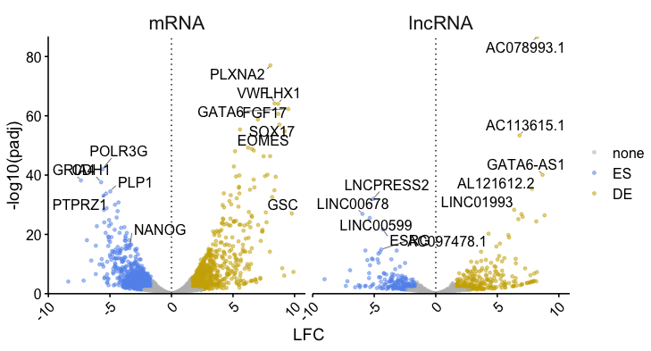
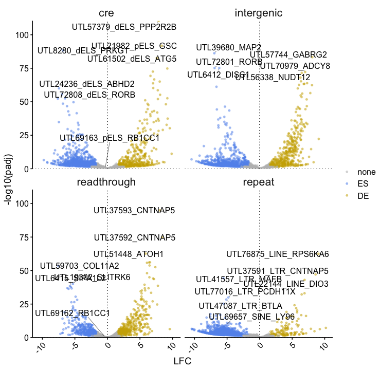
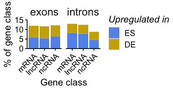
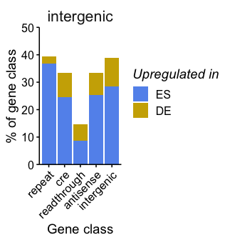

Visualization : differentially expressed caRNA
================

Load info about genes and expression

``` r
allgenes <- read_parquet(here('../rdana/genes/data-output/allgenes_final.parquet'))
exprdata <- read_parquet(here('../rdana/carnas/data-output/expression.rnacharIndep.exonsScaling.Q255Q40.with_unannotated.parquet'))
```

# Volcano plots caRNAs

``` r
plot_volcano_src <- function(data, n_rnk=7, p_enr=0.05, thr_enr=3, extranames=NULL){
x<- data %>%
  mutate(deg.char = case_when((padj.char<p_enr) & (log2FoldChange.char>log2(thr_enr))~"DE", (padj.char<p_enr) & (log2FoldChange.char<log2(1/thr_enr))~"ES", T~"none")) %>%
  group_by(deg.char, facetgrp) %>%
  arrange(padj.char) %>%
  mutate(rnk = seq(n())) %>%
  ungroup()
  
p<- x %>% ggplot(aes(x=log2FoldChange.char, y=-log10(padj.char)))+
 scale_color_manual(values=c(none='grey', ES="cornflowerblue", DE="gold3"))+
   rasterise(geom_point(aes(color=deg.char), alpha=0.5, size=1),dev = 'ragg', dpi=300)  +
  #geom_abline(intercept = 0, slope = 1, col="black", linetype="dotted")+
  geom_hline(yintercept = 0, col="black", linetype="dotted", size=0.5) +
  geom_vline(xintercept = 0, col="black", linetype="dotted", size=0.5)+

  geom_text_repel(aes(label=ifelse(((rnk<n_rnk & deg.char!="none") | (name %in% extranames)) , name, "")),

                   size=12/.pt,
                   force = 1,
                  point.padding = 0.1,
                  max.iter = 1000,
                  nudge_x = 0,
                  nudge_y = 0 ,
                   min.segment.length = 0,
                  segment.size = 0.2,
                  segment.color = 'black',
                  #color='black',
                  show.legend=FALSE,
                  max.overlaps = Inf)+
theme_publish()+
  scale_y_continuous(expand = c(0,0)) + 
  theme(legend.position = "right", legend.direction = "vertical")+
  labs(x='LFC', y="-log10(padj)", fill='', color='')+
  theme(legend.position = "right", legend.direction = "vertical", axis.text.x = element_text(angle=45, hjust=1))+
  facet_wrap(~facetgrp)#+
  #ylim(c(0,10))

return(p)

}
```

## Exons mRNAs lncRNAs

``` r
p <- plot_volcano_src (exprdata %>%
                    dplyr::filter(annotation_type=='exons') %>%
                    dplyr::filter((FPM.ES.char+FPM.DE.char)>0.2) %>%
  
    dplyr::filter(rna_type %in% c('mRNA', 'lncRNA')) %>%
    dplyr::mutate(rna_type = factor(rna_type, levels = c("mRNA","lncRNA"))) %>%
    mutate(facetgrp = rna_type),  n_rnk=6, extranames = c("SOX17", "NANOG", "GATA6", "EOMES", "GSC"))

p_fixed<- prettysave(p, here('figures/deg/volcano_src_pcANDlncRNAs.pdf'), panel.width=3, panel.height=3)
```

    ## [1] "fig.width=7.6, fig.height=4.1"

``` r
plot_grid(p_fixed)
```

<!-- -->

## UTL

``` r
extranames <-  allgenes %>% dplyr::filter(name %in% c("UTL69657","UTL69162", "UTL69163", "UTL61502")) %>% mutate(name = if_else(rna_type %in% c("cre","repeat"), paste0(name, "_", rna_subtype, "_",closest_protein), paste0(name, "_",closest_protein))) %>% pull(name)

p <- plot_volcano_src (exprdata %>%
                    dplyr::filter(annotation_type=='intergenic') %>%
                    dplyr::filter(rna_type %in% c('repeat', 'cre','readthrough','intergenic')) %>%
                       dplyr::mutate(rna_type, factor(rna_type, levels = c('repeat', 'cre','readthrough','intergenic'))) %>%
                    dplyr::filter((FPM.ES.char+FPM.DE.char)>0.2) %>%
                    inner_join(allgenes %>% dplyr::select(GeneID, annotation_type, closest_protein), by=c("GeneID","annotation_type")) %>%
    mutate(facetgrp = rna_type) %>%
    mutate(name = if_else(rna_type %in% c("cre","repeat"), paste0(name, "_", rna_subtype, "_",closest_protein), paste0(name, "_",closest_protein))) %>%
    mutate(facetgrp = rna_type),  n_rnk=4, extranames = extranames)

p_fixed<- prettysave(p, here('figures/deg/volcano_src_intergenes.pdf'), panel.width=3, panel.height=3)
```

    ## [1] "fig.width=7.7, fig.height=7.5"

``` r
plot_grid(p_fixed)
```

<!-- -->

# Fraction of DEG

``` r
plot_hist_deg <- function(edata, p_enr=0.05, thr_enr=3, lims=c(0,15)){
  edata %>%
  mutate(deg.char = case_when((padj.char<p_enr) & (log2FoldChange.char>log2(thr_enr))~"DE", (padj.char<p_enr) & (log2FoldChange.char<log2(1/thr_enr))~"ES", T~"none")) %>%
   mutate(deg.rna = case_when((padj.rna<p_enr) & (log2FoldChange.rna>log2(thr_enr))~"DE", (padj.rna<p_enr) & (log2FoldChange.rna<log2(1/thr_enr))~"ES", T~"none")) %>%
  dplyr::select(GeneID, rna_type, annotation_type, rna_subtype, deg.char, deg.rna) %>%
  pivot_longer(starts_with("deg"), names_prefix = "deg\\.", names_to = "sequencing", values_to="deg") %>%
  dplyr::count(sequencing, rna_type, annotation_type, deg) %>%
  group_by(sequencing, annotation_type, rna_type) %>%
  mutate(per = n/sum(n)*100) %>%
  ungroup() %>%
  dplyr::filter(deg!="none") %>%
  mutate(deg = factor(deg, levels = c("DE","ES")), sequencing = factor(sequencing, levels=c("char","rna"))) %>%
  dplyr::filter(sequencing=='char') %>%
  ggplot(aes(x=rna_type, y=per, fill=deg))+
    geom_col()+
    scale_fill_manual(values=c( ES="cornflowerblue", DE="gold3"))+
    theme_publish() +
    scale_y_continuous(limits = lims, expand = c(0,0)) + 
   theme(legend.position = "right", legend.direction = "vertical", axis.text.x = element_text(angle=45, hjust=1)) +
    labs(x="Gene class", y = "% of gene class", fill="Upregulated in") +
  facet_wrap(~annotation_type)->p
  
  return(p)
}
```

## Exons, Introns

``` r
p<- plot_hist_deg(
        exprdata %>%
        dplyr::filter(annotation_type %in% c('exons', 'introns')) %>%
  dplyr::filter(rna_type %in% c('mRNA', 'lncRNA',"ncRNA")) %>%
    dplyr::mutate(rna_type = factor(rna_type, levels = c("mRNA","lncRNA", "ncRNA"))) %>%
                    dplyr::filter((FPM.ES.char+FPM.DE.char)>0.2), lims=c(0,15), p_enr=0.05, thr_enr=3)

p_fixed <- prettysave(p, here('figures/deg/hist_percentdeg_exonsIntrons.pdf'), panel.width = 1.2*3/5, panel.height =2*15/50)
```

    ## [1] "fig.width=3.6, fig.height=1.9"

``` r
plot_grid(p_fixed)
```

<!-- -->

## UTL

``` r
p<- plot_hist_deg(
        exprdata %>%
        dplyr::filter(annotation_type %in% c('intergenic')) %>%
 dplyr::filter(rna_type %in% c('repeat', 'cre','readthrough','antisense','intergenic')) %>%
   dplyr::mutate(rna_type  = factor(rna_type, levels= c('repeat', 'cre','readthrough','antisense','intergenic'))) %>%
                    dplyr::filter((FPM.ES.char+FPM.DE.char)>0.2), lims=c(0,50), p_enr=0.05, thr_enr=3)#+


p_fixed <- prettysave(p, here('figures/deg/hist_percentdeg_intergenic.pdf'), panel.width = 1.2*5/5, panel.height =2*50/50)
```

    ## [1] "fig.width=3.3, fig.height=3.5"

``` r
plot_grid(p_fixed)
```

<!-- -->
