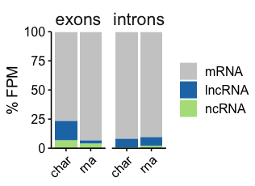
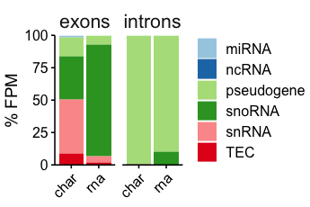
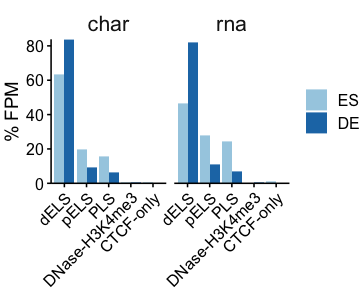
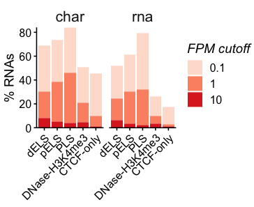
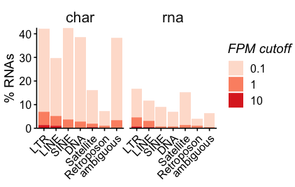
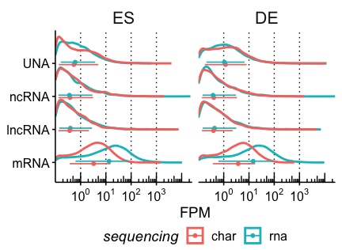
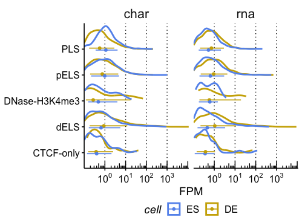

Visualization : chromatin associated RNAs basic statistics
================

Load info

``` r
allgenes <- read_parquet(here('../rdana/genes/data-output/allgenes_final.parquet'))
exprdata <- read_parquet(here('../rdana/carnas/data-output/expression.rnacharIndep.exonsScaling.Q255Q40.with_unannotated.parquet'))
```

# RNA census

## By annotation type (exons, introns, intergenic)

### exons vs introns

``` r
type_tallies <- exprdata %>%
  
dplyr::select(GeneID, annotation_type, starts_with("FPM")) %>%
  dplyr::mutate(annotation_type = factor(annotation_type, levels = c("introns","exons","intergenic"))) %>%
pivot_longer(cols=-c(GeneID, annotation_type), names_to = c("cell", "sequencing"),
names_pattern = "FPM\\.(.*)\\.(.*)",
values_to = "FPM") %>%
group_by(cell, sequencing, annotation_type) %>%
summarise(across(starts_with("FPM"), function(x) sum(x, na.rm=T))) %>%
ungroup()
```

    ## `summarise()` has grouped output by 'cell', 'sequencing'. You can override
    ## using the `.groups` argument.

``` r
p<- type_tallies %>%
  group_by(cell, sequencing) %>%
  mutate_if(is.numeric, ~./sum(., na.rm = T)*100) %>%
  ungroup() %>%
  dplyr::select(-cell) %>%
  group_by(sequencing, annotation_type) %>%
  summarise_if(is.numeric, mean) %>%
  ungroup() %>%
  ggplot(aes(x=sequencing, y=FPM, fill=annotation_type))+
  geom_col(stats="identity") +
  scale_fill_manual(values=c('#8856a7','#43a2ca','#bdbdbd'))+
  #ggsci::scale_fill_nejm()+
  #1f78b4
scale_y_continuous(expand = c(0,0)) + theme_publish()+
  
  theme(legend.position = "right", legend.direction = "vertical")+
  labs(x=NULL, y="% FPM", fill=NULL)+
  theme(legend.position = "right", legend.direction = "vertical", axis.text.x = element_text(angle=45, hjust=1))
```

    ## `mutate_if()` ignored the following grouping variables:
    ## • Columns `cell`, `sequencing`

    ## Warning: Ignoring unknown parameters: stats

``` r
p_fixed <- egg::set_panel_size(p=p, margin = unit(0, "in"), width = unit(0.1 * nrow(p$data), "in"), height = unit(1.5, "in"))
plot_grid(p_fixed)
```

<!-- -->

``` r
# 
ggsave2(here("figures/carnas/annotation_types.barplot.avg.pdf"))
```

    ## Saving 7 x 5 in image

``` r
p<- type_tallies %>%
  mutate(cell= factor(cell, levels = c("ES","DE"))) %>%
  group_by(cell, sequencing) %>%
  mutate_if(is.numeric, ~./sum(., na.rm = T)*100) %>%
  ungroup() %>%
  ggplot(aes(x=cell, y=FPM, fill=annotation_type))+
  geom_col(stats="identity") +
  scale_fill_manual(values=c('#8856a7','#43a2ca','#bdbdbd'))+
  #ggsci::scale_fill_nejm()+
  #1f78b4
scale_y_continuous(expand = c(0,0)) + theme_publish()+
  
  theme(legend.position = "right", legend.direction = "vertical")+
  labs(x=NULL, y="% FPM", fill=NULL)+
  theme(legend.position = "right", legend.direction = "vertical", axis.text.x = element_text(angle=45, hjust=1))+
  facet_wrap(~sequencing)
```

    ## `mutate_if()` ignored the following grouping variables:
    ## • Columns `cell`, `sequencing`

    ## Warning: Ignoring unknown parameters: stats

``` r
p_fixed <- egg::set_panel_size(p=p, margin = unit(0, "in"), width = unit(0.1/2 * nrow(p$data), "in"), height = unit(1.5, "in"))
plot_grid(p_fixed)
```

<!-- -->

``` r
# 
ggsave2(here("figures/carnas/annotation_types.barplot.bycell.pdf"))
```

    ## Saving 7 x 5 in image

``` r
type_tallies %>% group_by(cell, sequencing) %>%
  mutate_if(is.numeric, ~./sum(., na.rm = T)*100) %>%
  ungroup() %>%
  dplyr::select(-cell) %>%
  group_by(sequencing, annotation_type) %>%
  summarise_if(is.numeric, mean) %>%
  ungroup() 
```

    ## `mutate_if()` ignored the following grouping variables:
    ## • Columns `cell`, `sequencing`

    ## # A tibble: 6 × 3
    ##   sequencing annotation_type   FPM
    ##   <chr>      <fct>           <dbl>
    ## 1 char       introns         72.1 
    ## 2 char       exons           15.2 
    ## 3 char       intergenic      12.7 
    ## 4 rna        introns         18.4 
    ## 5 rna        exons           74.2 
    ## 6 rna        intergenic       7.42

## By rna type

### Exons, introns

``` r
types_to_plot <- c("mRNA","lncRNA","ncRNA")
type_tallies <- exprdata %>%
        dplyr::filter(annotation_type %in% c('exons','introns'), rna_type %in% types_to_plot) %>%

dplyr::select(GeneID, annotation_type, rna_type, starts_with("FPM")) %>%
  dplyr::mutate(rna_type = factor(rna_type, levels = c("mRNA","lncRNA","ncRNA"))) %>%
pivot_longer(cols=-c(GeneID, annotation_type, rna_type), names_to = c("cell", "sequencing"),
names_pattern = "FPM\\.(.*)\\.(.*)",
values_to = "FPM") %>%
group_by(cell, sequencing, annotation_type, rna_type) %>%
summarise(across(starts_with("FPM"), function(x) sum(x, na.rm=T))) %>%
ungroup()
```

    ## `summarise()` has grouped output by 'cell', 'sequencing', 'annotation_type'.
    ## You can override using the `.groups` argument.

``` r
p<- type_tallies %>%
    mutate(cell= factor(cell, levels = c("ES","DE"))) %>%
  group_by(cell, annotation_type, sequencing) %>%
  mutate_if(is.numeric, ~./sum(., na.rm = T)*100) %>%
  ungroup() %>%
  dplyr::select(-cell) %>%
  group_by(sequencing, annotation_type, rna_type) %>%
  summarise_if(is.numeric, mean) %>%
  ungroup() %>%
  ggplot(aes(x=sequencing, y=FPM, fill=rna_type))+
  geom_col(stats="identity") +
  #ggsci::scale_fill_nejm()+
  #1f78b4
  scale_fill_manual(values=c(mRNA='#cccccc', lncRNA='#1f78b4', ncRNA='#b2df8a'))+
scale_y_continuous(expand = c(0,0)) + theme_publish()+
  
  theme(legend.position = "right", legend.direction = "vertical")+
  labs(x=NULL, y="% FPM", fill=NULL)+
  theme(legend.position = "right", legend.direction = "vertical", axis.text.x = element_text(angle=45, hjust=1))+
  facet_wrap(~annotation_type)
```

    ## `mutate_if()` ignored the following grouping variables:
    ## • Columns `cell`, `annotation_type`, `sequencing`

    ## Warning: Ignoring unknown parameters: stats

``` r
p_fixed <- egg::set_panel_size(p=p, margin = unit(0, "in"), width = unit(0.7, "in"), height = unit(1.5, "in"))
plot_grid(p_fixed)
```

<!-- -->

``` r
ggsave2(here("figures/carnas/annotation_types.barplot.avg.simple.pdf"))
```

    ## Saving 7 x 5 in image

``` r
p<- type_tallies %>%
   mutate(cell= factor(cell, levels = c("ES","DE"))) %>%
  group_by(cell, annotation_type, sequencing) %>%
  mutate_if(is.numeric, ~./sum(., na.rm = T)*100) %>%
  ungroup() %>%
  ggplot(aes(x=cell, y=FPM, fill=rna_type))+
  geom_col(stats="identity") +
  #ggsci::scale_fill_nejm()+
  #1f78b4
  scale_fill_manual(values=c(mRNA='#cccccc', lncRNA='#1f78b4', ncRNA='#b2df8a'))+
scale_y_continuous(expand = c(0,0)) + theme_publish()+
  
  theme(legend.position = "right", legend.direction = "vertical")+
  labs(x=NULL, y="% FPM", fill=NULL)+
  theme(legend.position = "right", legend.direction = "vertical", axis.text.x = element_text(angle=45, hjust=1))+
  facet_wrap(~annotation_type+sequencing)
```

    ## `mutate_if()` ignored the following grouping variables:
    ## • Columns `cell`, `annotation_type`, `sequencing`

    ## Warning: Ignoring unknown parameters: stats

``` r
p_fixed <- egg::set_panel_size(p=p, margin = unit(0, "in"), width = unit(0.7, "in"), height = unit(1.5, "in"))
plot_grid(p_fixed)
```

<!-- -->

``` r
ggsave2(here("figures/carnas/annotation_types.barplot.bycell.simple.pdf"))
```

    ## Saving 8 x 5 in image

### UNAs

``` r
type_tallies <- exprdata %>%
        dplyr::filter(annotation_type=='intergenic') %>%
        dplyr::select(GeneID, starts_with("FPM")) %>%
#   dplyr::mutate(rna_type = if_else(rna_type=='protein_coding', 'mRNA', rna_type)) %>%
#   dplyr::mutate(rna_type = factor(rna_type, levels = c("mRNA","lncRNA","ncRNA", "repeat","tRNAderived", "sRNAderived", "cre","geneproximal","antisense","intergenic"))) %>%
pivot_longer(cols=-c(GeneID), names_to = c("cell", "sequencing"),
names_pattern = "FPM\\.(.*)\\.(.*)",
values_to = "FPM") %>%
  inner_join(allgenes %>%
          dplyr::select(GeneID, rna_type, rna_subtype), by=c('GeneID')) %>%
  
group_by(cell, sequencing, rna_type) %>%
summarise(across(starts_with("FPM"), function(x) sum(x, na.rm=T))) %>%
ungroup() %>%
  dplyr::mutate(rna_type = factor(rna_type, levels = c("repeat","tRNAderived", "snRNAderived", "cre","readthrough","antisense","intergenic")))
```

    ## `summarise()` has grouped output by 'cell', 'sequencing'. You can override
    ## using the `.groups` argument.

``` r
p<- type_tallies %>%
  mutate(cell = factor(cell, levels = c("ES","DE"))) %>%
  group_by(cell, sequencing) %>%
  mutate_if(is.numeric, ~./sum(., na.rm = T)*100) %>%
  ungroup() %>%
  # dplyr::select(-cell) %>%
  # group_by(sequencing, rna_type) %>%
  # summarise_if(is.numeric, mean) %>%
  # ungroup() %>%
  ggplot(aes(x=sequencing, y=FPM, fill=rna_type))+
  geom_col(stats="identity") +
  scale_fill_brewer(palette = 'Paired')+
  #1f78b4
  #scale_fill_manual(values=c(mRNA='#cccccc', lncRNA='#1f78b4', ncRNA='#b2df8a'))+
scale_y_continuous(expand = c(0,0)) + theme_publish()+
  
  theme(legend.position = "right", legend.direction = "vertical")+
  labs(x=NULL, y="% FPM", fill=NULL)+
  theme(legend.position = "right", legend.direction = "vertical", axis.text.x = element_text(angle=45, hjust=1))+
  facet_wrap(~cell)
```

    ## `mutate_if()` ignored the following grouping variables:
    ## • Columns `cell`, `sequencing`

    ## Warning: Ignoring unknown parameters: stats

``` r
p_fixed <- egg::set_panel_size(p=p, margin = unit(0, "in"), width = unit(0.7, "in"), height = unit(1.5, "in"))
plot_grid(p_fixed)
```

<!-- -->

``` r
ggsave2(here("figures/carnas/annotation_types.barplot.bysequencing.simple.INTERGENIC.pdf"))
```

    ## Saving 7 x 5 in image

``` r
# %>%
#   group_by(subtype) %>%
#   mutate(across(starts_with("FPM"), ))
```

``` r
p<- type_tallies %>%
  group_by(cell, sequencing) %>%
  mutate_if(is.numeric, ~./sum(., na.rm = T)*100) %>%
  ungroup() %>%
  mutate(cell=factor(cell, levels = c("ES","DE"))) %>%
  #dplyr::select(-cell) %>%
  #group_by(sequencing, rna_type) %>%
  #summarise_if(is.numeric, mean) %>%
  #ungroup() %>%
  ggplot(aes(x=cell, y=FPM, fill=rna_type))+
  geom_col(stats="identity") +
  scale_fill_brewer(palette = 'Paired')+
  #1f78b4
  #scale_fill_manual(values=c(mRNA='#cccccc', lncRNA='#1f78b4', ncRNA='#b2df8a'))+
scale_y_continuous(expand = c(0,0)) + theme_publish()+
  
  theme(legend.position = "right", legend.direction = "vertical")+
  labs(x=NULL, y="% FPM", fill=NULL)+
  theme(legend.position = "right", legend.direction = "vertical", axis.text.x = element_text(angle=45, hjust=1))+
  facet_wrap(~sequencing)
```

    ## `mutate_if()` ignored the following grouping variables:
    ## • Columns `cell`, `sequencing`

    ## Warning: Ignoring unknown parameters: stats

``` r
p_fixed <- egg::set_panel_size(p=p, margin = unit(0, "in"), width = unit(0.7, "in"), height = unit(1.5, "in"))
plot_grid(p_fixed)
```

<!-- -->

``` r
ggsave2(here("figures/carnas/annotation_types.barplot.bycell.simple.INTERGENIC.pdf"))
```

    ## Saving 7 x 5 in image

## By rna type

### Exons, introns

``` r
type_tallies <- exprdata %>%
        dplyr::filter(annotation_type %in% c('exons','introns'), rna_type=='ncRNA') %>%

dplyr::select(GeneID, annotation_type, rna_subtype, starts_with("FPM")) %>%
pivot_longer(cols=-c(GeneID, annotation_type, rna_subtype), names_to = c("cell", "sequencing"),
names_pattern = "FPM\\.(.*)\\.(.*)",
values_to = "FPM") %>%
group_by(cell, sequencing, annotation_type, rna_subtype) %>%
summarise(across(starts_with("FPM"), function(x) sum(x, na.rm=T))) %>%
ungroup()
```

    ## `summarise()` has grouped output by 'cell', 'sequencing', 'annotation_type'.
    ## You can override using the `.groups` argument.

``` r
p<- type_tallies %>%
  group_by(cell, annotation_type, sequencing) %>%
  mutate_if(is.numeric, ~./sum(., na.rm = T)*100) %>%
  ungroup() %>%
  dplyr::select(-cell) %>%
  group_by(sequencing, annotation_type, rna_subtype) %>%
  summarise_if(is.numeric, mean) %>%
  ungroup() %>%
  ggplot(aes(x=sequencing, y=FPM, fill=rna_subtype))+
  geom_col(stats="identity") +
  #ggsci::scale_fill_nejm()+
  #1f78b4
  scale_fill_brewer(palette='Paired')+
scale_y_continuous(expand = c(0,0)) + theme_publish()+
  
  theme(legend.position = "right", legend.direction = "vertical")+
  labs(x=NULL, y="% FPM", fill=NULL)+
  theme(legend.position = "right", legend.direction = "vertical", axis.text.x = element_text(angle=45, hjust=1))+
  facet_wrap(~annotation_type)
```

    ## `mutate_if()` ignored the following grouping variables:
    ## • Columns `cell`, `annotation_type`, `sequencing`

    ## Warning: Ignoring unknown parameters: stats

``` r
p_fixed <- egg::set_panel_size(p=p, margin = unit(0, "in"), width = unit(0.7, "in"), height = unit(1.5, "in"))
plot_grid(p_fixed)
```

<!-- -->

``` r
ggsave2(here("figures/carnas/annotation_types.barplot.avg.ncRNAsDetails.pdf"))
```

    ## Saving 7 x 5 in image

``` r
type_tallies <- exprdata %>%
        dplyr::filter(annotation_type %in% c('exons','introns')) %>%
          dplyr::filter(rna_type=='ncRNA') %>%
dplyr::select(GeneID, annotation_type, rna_subtype, starts_with("FPM")) %>%
pivot_longer(cols=-c(GeneID, annotation_type, rna_subtype), names_to = c("cell", "sequencing"),
names_pattern = "FPM\\.(.*)\\.(.*)",
values_to = "FPM") %>%
group_by(cell, sequencing, annotation_type, rna_subtype) %>%
summarise(across(starts_with("FPM"), function(x) sum(x, na.rm=T))) %>%
ungroup()
```

    ## `summarise()` has grouped output by 'cell', 'sequencing', 'annotation_type'.
    ## You can override using the `.groups` argument.

``` r
p<- type_tallies %>%
   mutate(cell= factor(cell, levels = c("ES","DE"))) %>%
  group_by(cell, annotation_type, sequencing) %>%
  mutate_if(is.numeric, ~./sum(., na.rm = T)*100) %>%
  ungroup() %>%
  ggplot(aes(x=cell, y=FPM, fill=rna_subtype))+
  geom_col(stats="identity") +
  #ggsci::scale_fill_nejm()+
  #1f78b4
  scale_fill_brewer(palette='Paired')+
scale_y_continuous(expand = c(0,0)) + theme_publish()+
  
  theme(legend.position = "right", legend.direction = "vertical")+
  labs(x=NULL, y="% FPM", fill=NULL)+
  theme(legend.position = "right", legend.direction = "vertical", axis.text.x = element_text(angle=45, hjust=1))+
  facet_wrap(~annotation_type + sequencing)
```

    ## `mutate_if()` ignored the following grouping variables:
    ## • Columns `cell`, `annotation_type`, `sequencing`

    ## Warning: Ignoring unknown parameters: stats

``` r
p_fixed <- egg::set_panel_size(p=p, margin = unit(0, "in"), width = unit(0.7, "in"), height = unit(1.5, "in"))
plot_grid(p_fixed)
```

<!-- -->

``` r
ggsave2(here("figures/carnas/annotation_types.barplot.bycell.ncRNAsDetails.pdf"))
```

    ## Saving 8 x 5 in image

Exons, introns

``` r
type_tallies <- exprdata %>%
        dplyr::filter(annotation_type %in% c('exons','introns')) %>%
        left_join(allgenes %>% dplyr::select(GeneID, rna_type_gencode)) %>%
          dplyr::filter(rna_subtype=='ncRNA', rna_type=='ncRNA') %>%
dplyr::select(GeneID, annotation_type, rna_type_gencode , starts_with("FPM")) %>%
pivot_longer(cols=-c(GeneID, annotation_type, rna_type_gencode), names_to = c("cell", "sequencing"),
names_pattern = "FPM\\.(.*)\\.(.*)",
values_to = "FPM") %>%
group_by(cell, sequencing, annotation_type, rna_type_gencode) %>%
summarise(across(starts_with("FPM"), function(x) sum(x, na.rm=T))) %>%
ungroup()
```

    ## Joining, by = "GeneID"
    ## `summarise()` has grouped output by 'cell', 'sequencing', 'annotation_type'.
    ## You can override using the `.groups` argument.

``` r
p<- type_tallies %>%
  group_by(cell, annotation_type, sequencing) %>%
  mutate_if(is.numeric, ~./sum(., na.rm = T)*100) %>%
  ungroup() %>%
  dplyr::select(-cell) %>%
  group_by(sequencing, annotation_type, rna_type_gencode) %>%
  summarise_if(is.numeric, mean) %>%
  ungroup() %>%
  ggplot(aes(x=sequencing, y=FPM, fill=rna_type_gencode))+
  geom_col(stats="identity") +
  #ggsci::scale_fill_nejm()+
  #1f78b4
  scale_fill_brewer(palette='Paired')+
scale_y_continuous(expand = c(0,0)) + theme_publish()+
  
  theme(legend.position = "right", legend.direction = "vertical")+
  labs(x=NULL, y="% FPM", fill=NULL)+
  theme(legend.position = "right", legend.direction = "vertical", axis.text.x = element_text(angle=45, hjust=1))+
  facet_wrap(~annotation_type)
```

    ## `mutate_if()` ignored the following grouping variables:
    ## • Columns `cell`, `annotation_type`, `sequencing`

    ## Warning: Ignoring unknown parameters: stats

``` r
p_fixed <- egg::set_panel_size(p=p, margin = unit(0, "in"), width = unit(0.7, "in"), height = unit(1.5, "in"))
plot_grid(p_fixed)
```

<!-- -->

``` r
ggsave2(here("figures/carnas/annotation_types.barplot.avg.ncRNAsDetails_more.pdf"))
```

    ## Saving 7 x 5 in image

### CREs

``` r
type_tallies <- exprdata %>%
        dplyr::filter(annotation_type=='intergenic') %>%
        dplyr::select(GeneID, starts_with("FPM")) %>%
#   dplyr::mutate(rna_type = if_else(rna_type=='protein_coding', 'mRNA', rna_type)) %>%
#   dplyr::mutate(rna_type = factor(rna_type, levels = c("mRNA","lncRNA","ncRNA", "repeat","tRNAderived", "sRNAderived", "cre","geneproximal","antisense","intergenic"))) %>%
pivot_longer(cols=-c(GeneID), names_to = c("cell", "sequencing"),
names_pattern = "FPM\\.(.*)\\.(.*)",
values_to = "FPM") %>%
  inner_join(allgenes %>%
          dplyr::select(GeneID, rna_type, rna_subtype), by=c('GeneID')) %>%
  
group_by(cell, sequencing, rna_type, rna_subtype) %>%
summarise(across(starts_with("FPM"), function(x) sum(x, na.rm=T))) %>%
ungroup() %>%
  #dplyr::mutate(rna_type = factor(rna_type, levels = c("repeat","tRNAderived", "snRNAderived", "cre","readthrough","antisense","intergenic"))) %>%
  dplyr::filter(rna_type=='cre') %>%
   mutate(rna_subtype = factor(rna_subtype, levels = c("dELS","pELS","PLS","DNase-H3K4me3","CTCF-only"))) 
```

    ## `summarise()` has grouped output by 'cell', 'sequencing', 'rna_type'. You can
    ## override using the `.groups` argument.

``` r
p<- type_tallies %>%
  group_by(cell, sequencing) %>%
  mutate_if(is.numeric, ~./sum(., na.rm = T)*100) %>%
  ungroup() %>%
  #dplyr::select(-cell) %>%
  group_by(sequencing, rna_subtype, cell) %>%
  summarise_if(is.numeric, mean) %>%
  ungroup() %>%
  mutate(cell=factor(cell, levels= c("ES","DE"))) %>%
  ggplot(aes(x=rna_subtype, y=FPM, fill=cell))+
  geom_col(stats="identity", position = position_dodge()) +
  #ggsci::scale_fill_nejm()+
  #1f78b4
  scale_fill_brewer(palette='Paired')+
scale_y_continuous(expand = c(0,0)) + theme_publish()+
  
  theme(legend.position = "right", legend.direction = "vertical")+
  labs(x=NULL, y="% FPM", fill=NULL)+
  theme(legend.position = "right", legend.direction = "vertical", axis.text.x = element_text(angle=45, hjust=1))+
  facet_wrap(~sequencing)
```

    ## `mutate_if()` ignored the following grouping variables:
    ## • Columns `cell`, `sequencing`

    ## Warning: Ignoring unknown parameters: stats

``` r
p_fixed <- egg::set_panel_size(p=p, margin = unit(0, "in"), width = unit(1.2, "in"), height = unit(1.5, "in"))
plot_grid(p_fixed)
```

<!-- -->

``` r
ggsave2(here("figures/carnas/annotation_types.barplot.avg.INTERGENICdetails.pdf"))
```

    ## Saving 7 x 5 in image

``` r
# %>%
#   group_by(subtype) %>%
#   mutate(across(starts_with("FPM"), ))
```

### Repeats

``` r
type_tallies <- exprdata %>%
        dplyr::filter(annotation_type=='intergenic') %>%
        dplyr::select(GeneID, rna_type, rna_subtype, starts_with("FPM")) %>%
pivot_longer(cols=-c(GeneID, rna_type, rna_subtype), names_to = c("cell", "sequencing"),
names_pattern = "FPM\\.(.*)\\.(.*)",
values_to = "FPM") %>%
group_by(cell, sequencing, rna_type, rna_subtype) %>%
summarise(across(starts_with("FPM"), function(x) sum(x, na.rm=T))) %>%
ungroup() %>%
  dplyr::filter(rna_type=='repeat') %>%
group_by(cell, sequencing, rna_subtype) %>%
summarise(across(starts_with("FPM"), function(x) sum(x, na.rm=T))) %>%
ungroup() %>%
            dplyr::mutate(rna_subtype = forcats::fct_reorder(rna_subtype, FPM, .fun=mean, .desc=F)) %>%
  mutate(cell =factor(cell, levels = c("ES","DE")))
```

    ## `summarise()` has grouped output by 'cell', 'sequencing', 'rna_type'. You can
    ## override using the `.groups` argument.
    ## `summarise()` has grouped output by 'cell', 'sequencing'. You can override
    ## using the `.groups` argument.

``` r
# type_tallies <- carnas::edataQ %>%
#         dplyr::filter(annotation_type %in% c('intergenic')) %>%
#         inner_join(myintergenes %>%
#           dplyr::select(GeneID, rna_type, rna_subtype, type_name.rep) %>%
#             dplyr::filter(rna_type=='repeat') %>%
#             dplyr::mutate(type_name.rep = case_when(stringr::str_detect(type_name.rep, "\\|") ~ "ambiguous",type_name.rep =="-1" ~ "ambiguous",type_name.rep =="Unknown" ~ "ambiguous", T ~ type_name.rep)) , by='GeneID') %>%
# dplyr::select(GeneID, type_name.rep, starts_with("FPM")) %>%
#   #mutate(rna_type = factor(rna_type, levels = c("dELS","pELS","PLS","H3K4me3","CTCF"))) %>%
# pivot_longer(cols=-c(GeneID, type_name.rep), names_to = c("cell", "sequencing"),
# names_pattern = "FPM\\.(.*)\\.(.*)",
# values_to = "FPM") %>%
# group_by(cell, sequencing, type_name.rep) %>%
# summarise(across(starts_with("FPM"), function(x) sum(x, na.rm=T))) %>%
# ungroup() %>%
#             dplyr::mutate(type_name.rep = forcats::fct_reorder(type_name.rep, FPM, .fun=mean, .desc=F)) %>%
#   mutate(cell =factor(cell, levels = c("ES","DE")))
# 
# 
p<- type_tallies %>%
  group_by(cell, sequencing) %>%
  mutate_if(is.numeric, ~./sum(., na.rm = T)*100) %>%
  ungroup() %>%
  ggplot(aes(x=cell, y=FPM, fill=rna_subtype))+
  geom_col(stats="identity") +
  #ggsci::scale_fill_nejm()+
  #1f78b4
  scale_fill_brewer(palette='Paired')+
scale_y_continuous(expand = c(0,0)) + theme_publish()+

  theme(legend.position = "right", legend.direction = "vertical")+
  labs(x=NULL, y="% FPM", fill=NULL)+
  theme(legend.position = "right", legend.direction = "vertical", axis.text.x = element_text(angle=45, hjust=1))+
  facet_wrap(~sequencing)
```

    ## `mutate_if()` ignored the following grouping variables:
    ## • Columns `cell`, `sequencing`

    ## Warning: Ignoring unknown parameters: stats

``` r
p_fixed <- egg::set_panel_size(p=p, margin = unit(0, "in"), width = unit(0.8, "in"), height = unit(1.5, "in"))
plot_grid(p_fixed)
```

<!-- -->

``` r
ggsave2(here("figures/carnas/annotation_types.barplot.reptypes.pdf"))
```

    ## Saving 7 x 5 in image

# Diversity

## Prepare data

``` r
expr_genes <- exprdata %>%
        #dplyr::select(-type) %>%
        dplyr::filter(annotation_type %in% c('exons','introns')) %>%
dplyr::select(GeneID, annotation_type, rna_type, starts_with("FPM")) %>%
pivot_longer(cols=-c(GeneID, annotation_type, rna_type), names_to = c("cell", "sequencing"),
names_pattern = "FPM\\.(.*)\\.(.*)",
values_to = "FPM")


expr_intergenes <- exprdata %>%
        dplyr::filter(annotation_type %in% c('intergenic')) %>%
        inner_join(allgenes %>%
          dplyr::select(GeneID, annotation_type, top_repeat.name) %>%
            dplyr::mutate(top_repeat.name = case_when(stringr::str_detect(top_repeat.name, "\\|") ~ "ambiguous",top_repeat.name =="-1" ~ "ambiguous",top_repeat.name =="Unknown" ~ "ambiguous", T ~ top_repeat.name)) , by=c('GeneID','annotation_type')) %>%
dplyr::select(GeneID, rna_type, top_repeat.name, starts_with("FPM")) %>%
  #mutate(rna_type = factor(rna_type, levels = c("dELS","pELS","PLS","H3K4me3","CTCF"))) %>%
pivot_longer(cols=-c(GeneID, rna_type, top_repeat.name), names_to = c("cell", "sequencing"),
names_pattern = "FPM\\.(.*)\\.(.*)",
values_to = "FPM")
```

## Percent of RNAs at threshold

``` r
g0 <- allgenes %>% dplyr::select(GeneID, annotation_type, rna_type, rna_subtype, rna_type_gencode) %>%
          dplyr::filter(annotation_type=='exons', rna_type %in% c('ncRNA','mRNA','lncRNA')) %>%
  dplyr::select(GeneID, rna_type) %>%
  dplyr::count(rna_type) %>%
  dplyr::rename(Ntotal=n) %>%
  mutate(rna_type = factor(rna_type, levels = c("mRNA","lncRNA","ncRNA")))

g0introns <- allgenes %>% 
  dplyr::filter(annotation_type=='introns', ilen>0) %>%
  dplyr::select(GeneID, rna_type, rna_subtype) %>%
          dplyr::filter(rna_type %in% c('ncRNA','mRNA','lncRNA')) %>%
  dplyr::select(GeneID, rna_type) %>%
  dplyr::count(rna_type) %>%
  dplyr::rename(Ntotal=n) %>%
  mutate(rna_type = factor(rna_type, levels = c("mRNA","lncRNA","ncRNA")))

g0intergenes <- allgenes %>%  
   dplyr::filter(annotation_type=='intergenic') %>%
  dplyr::select(GeneID, rna_type) %>%
  dplyr::count(rna_type) %>%
  dplyr::rename(Ntotal=n) %>%
   mutate(rna_type = factor(rna_type, levels = c( "repeat","tRNAderived", "snRNAderived", "cre","readthrough","antisense","intergenic")))


plot_census <- function(exprdata, g0, cmap){

exprdata %>%
  group_by(GeneID, sequencing) %>%
  summarise(rna_type = rna_type[1], FPM=max(FPM)) %>%
  ungroup() %>%
  dplyr::filter(FPM>0.1)%>%
  mutate(FPM_above=case_when(FPM>10 ~ "10", FPM>1 ~ "1", T ~ "0.1")) %>%
  dplyr::count(rna_type, sequencing, FPM_above) %>%
  inner_join(g0, by=c('rna_type')) %>%
    mutate(rna_type = factor(rna_type, levels = levels(g0$rna_type))) %>%
  mutate(nper = n/Ntotal*100) %>%
  ggplot(aes(x=rna_type, y=nper, fill=FPM_above))+
  geom_col(stats="identity") +
  #ggsci::scale_fill_nejm()+
  #1f78b4
  scale_fill_brewer(palette=cmap)+
scale_y_continuous(expand = c(0,0)) + theme_publish()+
  
  theme(legend.position = "right", legend.direction = "vertical")+
  labs(x=NULL, y="% RNAs", fill=NULL)+
  theme(legend.position = "right", legend.direction = "vertical", axis.text.x = element_text(angle=45, hjust=1))+
  facet_wrap(~sequencing) +
    labs(fill="FPM cutoff")->p
#print(p$data)
p_fixed <- egg::set_panel_size(p=p, margin = unit(0, "in"), width = unit(0.2/6*nrow(p$data), "in"), height = unit(1.5, "in"))
plot_grid(p_fixed)
}
```

### by rna type

``` r
plot_census(expr_intergenes, g0intergenes, "Reds")
```

    ## `summarise()` has grouped output by 'GeneID'. You can override using the
    ## `.groups` argument.

    ## Warning: Ignoring unknown parameters: stats

<!-- -->

``` r
ggsave2(here("figures/carnas/rnadiversity.barplot.percent.intergenic.pdf"))
```

    ## Saving 7 x 5 in image

``` r
plot_census(expr_genes %>% dplyr::filter(annotation_type=='introns'), g0introns, "Purples")
```

    ## `summarise()` has grouped output by 'GeneID'. You can override using the
    ## `.groups` argument.

    ## Warning: Ignoring unknown parameters: stats

<!-- -->

``` r
ggsave2(here("figures/carnas/rnadiversity.barplot.percent.introns.pdf"))
```

    ## Saving 7 x 5 in image

``` r
plot_census(expr_genes %>% dplyr::filter(annotation_type=='exons'), g0, "Blues")
```

    ## `summarise()` has grouped output by 'GeneID'. You can override using the
    ## `.groups` argument.

    ## Warning: Ignoring unknown parameters: stats

<!-- -->

``` r
ggsave2(here("figures/carnas/rnadiversity.barplot.percent.exons.pdf"))
```

    ## Saving 7 x 5 in image

### subtype CREs

``` r
expr_cre <-
   exprdata %>%
        dplyr::filter(annotation_type %in% c('intergenic'), rna_type=='cre') %>%
  dplyr::select(-rna_type) %>%
  dplyr::rename(rna_type = rna_subtype) %>%
dplyr::select(GeneID, rna_type, starts_with("FPM")) %>%
  #mutate(rna_type = factor(rna_type, levels = c("dELS","pELS","PLS","H3K4me3","CTCF"))) %>%
pivot_longer(cols=-c(GeneID, rna_type), names_to = c("cell", "sequencing"),
names_pattern = "FPM\\.(.*)\\.(.*)",
values_to = "FPM")

g0cre <- allgenes %>%  
  dplyr::filter(rna_type=="cre") %>%
  dplyr::select(GeneID, rna_subtype) %>%
  dplyr::rename(rna_type = rna_subtype) %>%
  dplyr::count(rna_type) %>%
  dplyr::rename(Ntotal=n) %>%
    mutate(rna_type = factor(rna_type, levels = c("dELS","pELS","PLS","DNase-H3K4me3","CTCF-only"))) 


plot_census(expr_cre, g0cre, "Reds")
```

    ## `summarise()` has grouped output by 'GeneID'. You can override using the
    ## `.groups` argument.

    ## Warning: Ignoring unknown parameters: stats

<!-- -->

``` r
ggsave2(here("figures/carnas/rnadiversity.barplot.percent.CREs.pdf"))
```

    ## Saving 7 x 5 in image

### subtype repeats

``` r
expr_rep <-
   exprdata %>%
        dplyr::filter(annotation_type %in% c('intergenic')) %>%
        inner_join(allgenes %>%
                     dplyr::filter(annotation_type=='intergenic') %>%
          dplyr::select(GeneID, top_repeat.name)) %>%
            dplyr::filter(rna_type=="repeat") %>%
            dplyr::mutate(rna_type = case_when(stringr::str_detect(top_repeat.name, "\\|") ~ "ambiguous",top_repeat.name =="-1" ~ "ambiguous",top_repeat.name =="Unknown" ~ "ambiguous", T ~ top_repeat.name))  %>%
dplyr::select(GeneID, rna_type, starts_with("FPM")) %>%
  #mutate(rna_type = factor(rna_type, levels = c("dELS","pELS","PLS","H3K4me3","CTCF"))) %>%
pivot_longer(cols=-c(GeneID, rna_type), names_to = c("cell", "sequencing"),
names_pattern = "FPM\\.(.*)\\.(.*)",
values_to = "FPM")
```

    ## Joining, by = "GeneID"

``` r
g0rep <- allgenes %>%  
  dplyr::filter(rna_type=="repeat") %>%
  dplyr::select(GeneID, top_repeat.name) %>%
   dplyr::mutate(rna_type = case_when(stringr::str_detect(top_repeat.name, "\\|") ~ "ambiguous",top_repeat.name =="-1" ~ "ambiguous",top_repeat.name =="Unknown" ~ "ambiguous", T ~ top_repeat.name)) %>%
  dplyr::count(rna_type) %>%
  dplyr::rename(Ntotal=n) %>%
    mutate(rna_type = factor(rna_type, levels = c("LTR","LINE","SINE","DNA","Satellite","Simple_repeat","rRNA","Low_complexity","Retroposon","ambiguous"))) 


plot_census(expr_rep, g0rep, "Reds")
```

    ## `summarise()` has grouped output by 'GeneID'. You can override using the
    ## `.groups` argument.

    ## Warning: Ignoring unknown parameters: stats

<!-- -->

``` r
ggsave2(here("figures/carnas/rnadiversity.barplot.percent.repeats.pdf"))
```

    ## Saving 7 x 5 in image

## Absolute number of RNAs at threshold

``` r
plot_N <- function(exprdata, g0, cmap){

s <- exprdata %>%
  group_by(GeneID, sequencing) %>%
  summarise(rna_type = rna_type[1], FPM=max(FPM)) %>%
  ungroup() %>%
  dplyr::filter(FPM>0.1)%>%
  dplyr::count(rna_type, sequencing) %>%
    dplyr::rename(Nabove = n) %>%
  inner_join(g0, by=c('rna_type')) %>%
    mutate(rna_type = factor(rna_type, levels = levels(g0$rna_type)))


   

s %>%
   dplyr::mutate(Ntotal = Ntotal-Nabove) %>%
  pivot_longer(starts_with("N"), names_prefix = "N", values_to = "N", names_to="measured") %>%
    dplyr::mutate(measured = factor(case_when(measured=="above"~"Expressed",T~"In transcriptome"), levels = c("In transcriptome", "Expressed"))) %>%
  ggplot(aes(x=rna_type, y=N, fill=measured))+
  geom_col(color = 'black', stats="identity") +
  #ggsci::scale_fill_nejm()+
  #1f78b4
  scale_fill_manual(values = c(Expressed = RColorBrewer::brewer.pal(3,cmap)[[1]], `In transcriptome` = "white"))+
scale_y_continuous(expand = c(0,0)) + theme_publish()+
  
  theme(legend.position = "right", legend.direction = "vertical")+
  labs(x=NULL, y="# RNAs", fill=NULL)+
  theme(axis.text.x = element_text(angle=45, hjust=1))+
  facet_wrap(~sequencing) ->p
#print(p$data)
p_fixed <- egg::set_panel_size(p=p, margin = unit(0, "in"), width = unit(0.2/4*nrow(p$data), "in"), height = unit(1.5, "in"))


return(list(data=s, plt=p_fixed))
}


plot_N2 <- function(exprdata, g0, cmap){

exprdata %>%
  group_by(GeneID, sequencing) %>%
  summarise(rna_type = rna_type[1], FPM=max(FPM)) %>%
  ungroup() %>%
  dplyr::filter(FPM>0.1)%>%
  mutate(FPM_above=case_when(FPM>10 ~ "10", FPM>1 ~ "1", T ~ "0.1")) %>%
  dplyr::count(rna_type, sequencing, FPM_above) %>%
  inner_join(g0, by=c('rna_type')) %>%
    mutate(rna_type = factor(rna_type, levels = levels(g0$rna_type))) %>%
  mutate(nper = n/Ntotal*100) %>%
  ggplot(aes(x=rna_type, y=nper, fill=FPM_above))+
  geom_col(stats="identity") +
  #ggsci::scale_fill_nejm()+
  #1f78b4
  scale_fill_brewer(palette=cmap)+
scale_y_continuous(expand = c(0,0)) + theme_publish()+
  
  theme(legend.position = "right", legend.direction = "vertical")+
  labs(x=NULL, y="% RNAs", fill=NULL)+
  theme(legend.position = "right", legend.direction = "vertical", axis.text.x = element_text(angle=45, hjust=1))+
  facet_wrap(~sequencing) +
    labs(fill="FPM cutoff")->p
#print(p$data)
p_fixed <- egg::set_panel_size(p=p, margin = unit(0, "in"), width = unit(0.2/6*nrow(p$data), "in"), height = unit(1.5, "in"))
plot_grid(p_fixed)
}
```

``` r
expr_genes %>% dplyr::filter(annotation_type=='exons') %>%
  group_by(GeneID, sequencing) %>%
  summarise(rna_type = rna_type[1], FPM=max(FPM)) %>%
  ungroup() %>%
  dplyr::filter(FPM>0.1)%>%
  mutate(FPM_above=case_when(FPM>10 ~ "10", FPM>1 ~ "1", T ~ "0.1")) %>%
  dplyr::count(rna_type, sequencing, FPM_above) %>%
  left_join(g0, by=c('rna_type')) %>%
    mutate(rna_type = factor(rna_type, levels = levels(g0$rna_type))) %>%
  mutate(nper = n/Ntotal*100) 
```

    ## `summarise()` has grouped output by 'GeneID'. You can override using the
    ## `.groups` argument.

    ## # A tibble: 24 × 6
    ##    rna_type sequencing FPM_above     n Ntotal  nper
    ##    <fct>    <chr>      <chr>     <int>  <int> <dbl>
    ##  1 lncRNA   char       0.1        3474  17142 20.3 
    ##  2 lncRNA   char       1          1143  17142  6.67
    ##  3 lncRNA   char       10          173  17142  1.01
    ##  4 lncRNA   rna        0.1        2580  17142 15.1 
    ##  5 lncRNA   rna        1           893  17142  5.21
    ##  6 lncRNA   rna        10          173  17142  1.01
    ##  7 mRNA     char       0.1        3292  19864 16.6 
    ##  8 mRNA     char       1          7579  19864 38.2 
    ##  9 mRNA     char       10         4143  19864 20.9 
    ## 10 mRNA     rna        0.1        2292  19864 11.5 
    ## # … with 14 more rows

### by rna type

``` r
out = plot_N(expr_genes %>% dplyr::filter(annotation_type=='exons'), g0, "Blues")
```

    ## `summarise()` has grouped output by 'GeneID'. You can override using the
    ## `.groups` argument.

    ## Warning: Ignoring unknown parameters: stats

``` r
print(out$data)
```

    ## # A tibble: 6 × 4
    ##   rna_type sequencing Nabove Ntotal
    ##   <fct>    <chr>       <int>  <int>
    ## 1 lncRNA   char         4790  17142
    ## 2 lncRNA   rna          3646  17142
    ## 3 mRNA     char        15014  19864
    ## 4 mRNA     rna         15199  19864
    ## 5 ncRNA    char         2667  20469
    ## 6 ncRNA    rna          1999  20469

``` r
plot_grid(out$plt)
```

<!-- -->

``` r
ggsave2(here("figures/carnas/rnadiversity.barplot.N.exons.pdf"))
```

    ## Saving 7 x 5 in image

``` r
out = plot_N(expr_genes %>% dplyr::filter(annotation_type=='introns'), g0introns, "Purples")
```

    ## `summarise()` has grouped output by 'GeneID'. You can override using the
    ## `.groups` argument.

    ## Warning: Ignoring unknown parameters: stats

``` r
print(out$data)
```

    ## # A tibble: 6 × 4
    ##   rna_type sequencing Nabove Ntotal
    ##   <fct>    <chr>       <int>  <int>
    ## 1 lncRNA   char         6931  12493
    ## 2 lncRNA   rna          4834  12493
    ## 3 mRNA     char        15896  18772
    ## 4 mRNA     rna         14625  18772
    ## 5 ncRNA    char          993   3774
    ## 6 ncRNA    rna          1365   3774

``` r
plot_grid(out$plt)
```

<!-- -->

``` r
ggsave2(here("figures/carnas/rnadiversity.barplot.N.introns.pdf"))
```

    ## Saving 7 x 5 in image

``` r
out = plot_N(expr_intergenes, g0intergenes, "Reds")
```

    ## `summarise()` has grouped output by 'GeneID'. You can override using the
    ## `.groups` argument.

    ## Warning: Ignoring unknown parameters: stats

``` r
print(out$data)
```

    ## # A tibble: 14 × 4
    ##    rna_type     sequencing Nabove Ntotal
    ##    <fct>        <chr>       <int>  <int>
    ##  1 antisense    char         3444  16571
    ##  2 antisense    rna          1398  16571
    ##  3 cre          char         5114   6974
    ##  4 cre          rna          4204   6974
    ##  5 intergenic   char         5454  24487
    ##  6 intergenic   rna          2338  24487
    ##  7 readthrough  char         7671   8075
    ##  8 readthrough  rna          7140   8075
    ##  9 repeat       char         8360  21752
    ## 10 repeat       rna          2101  21752
    ## 11 snRNAderived char          134    184
    ## 12 snRNAderived rna            51    184
    ## 13 tRNAderived  char          265    271
    ## 14 tRNAderived  rna           217    271

``` r
plot_grid(out$plt)
```

<!-- -->

``` r
ggsave2(here("figures/carnas/rnadiversity.barplot.N.intergenic.pdf"))
```

    ## Saving 7 x 5 in image

### cre subtypes

``` r
out = plot_N(expr_cre, g0cre, "Reds")
```

    ## `summarise()` has grouped output by 'GeneID'. You can override using the
    ## `.groups` argument.

    ## Warning: Ignoring unknown parameters: stats

``` r
print(out$data)
```

    ## # A tibble: 10 × 4
    ##    rna_type      sequencing Nabove Ntotal
    ##    <fct>         <chr>       <int>  <int>
    ##  1 CTCF-only     char           87    192
    ##  2 CTCF-only     rna            34    192
    ##  3 dELS          char         1930   2801
    ##  4 dELS          rna          1453   2801
    ##  5 DNase-H3K4me3 char           56    110
    ##  6 DNase-H3K4me3 rna            29    110
    ##  7 pELS          char         1539   2085
    ##  8 pELS          rna          1273   2085
    ##  9 PLS           char         1502   1786
    ## 10 PLS           rna          1415   1786

``` r
plot_grid(out$plt)
```

<!-- -->

``` r
ggsave2(here("figures/carnas/rnadiversity.barplot.N.cre.pdf"))
```

    ## Saving 7 x 5 in image

### repeats subtypes

``` r
out = plot_N(expr_rep, g0rep, "Reds")
```

    ## `summarise()` has grouped output by 'GeneID'. You can override using the
    ## `.groups` argument.

    ## Warning: Ignoring unknown parameters: stats

``` r
print(out$data)
```

    ## # A tibble: 14 × 4
    ##    rna_type   sequencing Nabove Ntotal
    ##    <fct>      <chr>       <int>  <int>
    ##  1 ambiguous  char         1960   5125
    ##  2 ambiguous  rna           322   5125
    ##  3 DNA        char          186    483
    ##  4 DNA        rna            33    483
    ##  5 LINE       char         1059   3571
    ##  6 LINE       rna           423   3571
    ##  7 LTR        char          830   1968
    ##  8 LTR        rna           331   1968
    ##  9 Retroposon char            7     97
    ## 10 Retroposon rna             4     97
    ## 11 Satellite  char           53    330
    ## 12 Satellite  rna            50    330
    ## 13 SINE       char         4174   9807
    ## 14 SINE       rna           892   9807

``` r
plot_grid(out$plt)
```

<!-- -->

``` r
ggsave2(here("figures/carnas/rnadiversity.barplot.N.repeats.pdf"))
```

    ## Saving 7 x 5 in image

## Expression distribution

### exons, introns, UNAs

``` r
expr_genes %>%
dplyr::select(GeneID, cell, sequencing, annotation_type, FPM) %>%
  bind_rows(expr_intergenes %>% dplyr::select(GeneID, cell, sequencing, FPM) %>% mutate(annotation_type="UNA")) %>%
  ungroup() %>%
  mutate(annotation_type=factor(annotation_type, levels = c("exons","introns","UNA")), sequencing= factor(sequencing, levels = c("char","rna")), cell = factor(cell, levels = c("ES","DE"))) %>%
 dplyr::filter(FPM>0.1) %>%
 ggplot(aes(y = annotation_type , x = log10(FPM), color=sequencing)) +
  stat_slab(aes(slab_color=sequencing), fill=NA, normalize="panels") +
 stat_pointinterval(point_interval = median_qi, .width = c(.75), interval_size=1, position = position_dodge(width = .15, preserve = "single"))+
    facet_wrap(~cell)+
   #scale_color_manual(values=c(ES="cornflowerblue", DE="gold3"))+
  #scale_color_manual(aesthetics = "slab_color", values=c(ES="cornflowerblue", DE="gold3"))+
 # scale_fill_manual(values=c(ES="cornflowerblue", DE="gold3"))+
  #scale_slab_color_manual(values=c(ES="cornflowerblue", DE="gold3"))+
  theme_publish() + 
  scale_x_continuous(breaks = seq(-2,3,1),expand=c(0,0), labels = scales::math_format(10^.x))+ #scales::math_format
  annotation_logticks(sides = "b")+
  theme(panel.grid.major.x = element_line(size = 0.5, linetype = "dotted"))+
  labs(x="FPM", y=NULL)->p

p_fixed <- egg::set_panel_size(p=p, margin = unit(0, "in"), width = unit(2.1, "in"), height = unit(0.5*3, "in"))
plot_grid(p_fixed)
```

<!-- -->

``` r
ggsave2(here("figures/carnas/annotation_types.exprdist.eix_compareSequencing.pdf"))
```

    ## Saving 7 x 5 in image

``` r
expr_genes %>%
dplyr::select(GeneID, cell, sequencing, annotation_type, FPM) %>%
  bind_rows(expr_intergenes %>% dplyr::select(GeneID, cell, sequencing, FPM) %>% mutate(annotation_type="UNA")) %>%
  ungroup() %>%
  mutate(annotation_type=factor(annotation_type, levels = c("exons","introns","UNA")), sequencing= factor(sequencing, levels = c("char","rna")), cell = factor(cell, levels = c("ES","DE"))) %>%
dplyr::filter(FPM>0.1) %>%
 ggplot(aes(y = annotation_type , x = log10(FPM), color=cell)) +
  stat_slab(aes(slab_color=cell), fill=NA, normalize="panels") +
 stat_pointinterval(point_interval = median_qi, .width = c(.75), interval_size=1, position = position_dodge(width = .15, preserve = "single"))+
    facet_wrap(~sequencing)+
  scale_color_manual(values=c(ES="cornflowerblue", DE="gold3"))+
  scale_color_manual(aesthetics = "slab_color", values=c(ES="cornflowerblue", DE="gold3"))+
  theme_publish() + 
  scale_x_continuous(breaks = seq(-2,3,1),expand=c(0,0), labels = scales::math_format(10^.x))+ #scales::math_format
  annotation_logticks(sides = "b")+
  theme(panel.grid.major.x = element_line(size = 0.5, linetype = "dotted"))+
  labs(x="FPM", y=NULL)->p

p_fixed <- egg::set_panel_size(p=p, margin = unit(0, "in"), width = unit(2.1, "in"), height = unit(0.5*3, "in"))
plot_grid(p_fixed)
```

<!-- -->

``` r
ggsave2(here("figures/carnas/annotation_types.exprdist.eix_compareCcell.pdf"))
```

    ## Saving 7 x 5 in image

### by RNA type (all UNAs combined)

``` r
expr_genes %>%
  dplyr::filter(annotation_type=="exons") %>%
  #mutate(rna_type = paste0(rna_type,"_",annotation_type)) %>%
  dplyr::select(-annotation_type) %>%
  bind_rows(expr_intergenes %>% dplyr::select(GeneID, cell, sequencing, FPM) %>% mutate(rna_type="UNA")) %>%
  ungroup() %>%
  mutate(rna_type = factor(rna_type, levels = c("mRNA", "lncRNA","ncRNA","UNA")), sequencing= factor(sequencing, levels = c("char","rna")), cell = factor(cell, levels = c("ES","DE"))) %>%
dplyr::filter(FPM>0.1, !is.na(rna_type)) %>%
 ggplot(aes(y = rna_type , x = log10(FPM), color=cell)) +
  stat_slab(aes(slab_color=cell), fill=NA, normalize="panels") +
  stat_pointinterval(point_interval = median_qi, .width = c(.75), interval_size=1, position = position_dodge(width = .15, preserve = "single"))+
    facet_wrap(~sequencing)+
   scale_color_manual(values=c(ES="cornflowerblue", DE="gold3"))+
  scale_color_manual(aesthetics = "slab_color", values=c(ES="cornflowerblue", DE="gold3"))+
 # scale_fill_manual(values=c(ES="cornflowerblue", DE="gold3"))+
  #scale_slab_color_manual(values=c(ES="cornflowerblue", DE="gold3"))+
  theme_publish() + 
  scale_x_continuous(breaks = seq(-2,3,1),expand=c(0,0), labels = scales::math_format(10^.x))+ #scales::math_format
  annotation_logticks(sides = "b")+
  theme(panel.grid.major.x = element_line(size = 0.5, linetype = "dotted"))+
  labs(x="FPM", y=NULL)->p

p_fixed <- egg::set_panel_size(p=p, margin = unit(0, "in"), width = unit(1.8, "in"), height = unit(0.5*4, "in"))
plot_grid(p_fixed)
```

<!-- -->

``` r
ggsave2(here("figures/carnas/annotation_types.exprdist.exons_compareCells.pdf"))
```

    ## Saving 7 x 5 in image

``` r
 # theme(panel.grid.major = element_line())
```

``` r
expr_genes %>%
  dplyr::filter(annotation_type=="exons") %>%
  #mutate(rna_type = paste0(rna_type,"_",annotation_type)) %>%
  dplyr::select(-annotation_type) %>%
  bind_rows(expr_intergenes %>% dplyr::select(GeneID, cell, sequencing, FPM) %>% mutate(rna_type="UNA")) %>%
  ungroup() %>%
  mutate(rna_type = factor(rna_type, levels = c("mRNA", "lncRNA","ncRNA","UNA")), sequencing= factor(sequencing, levels = c("char","rna")), cell = factor(cell, levels = c("ES","DE"))) %>%
dplyr::filter(FPM>0.1, !is.na(rna_type)) %>%
 ggplot(aes(y = rna_type , x = log10(FPM), color=sequencing)) +
  stat_slab(aes(slab_color=sequencing), fill=NA, normalize="panels") +
  stat_pointinterval(point_interval = median_qi, .width = c(.75), interval_size=1, position = position_dodge(width = .15, preserve = "single"))+
    facet_wrap(~cell)+
   #scale_color_manual(values=c(ES="cornflowerblue", DE="gold3"))+
  #scale_color_manual(aesthetics = "slab_color", values=c(ES="cornflowerblue", DE="gold3"))+
 # scale_fill_manual(values=c(ES="cornflowerblue", DE="gold3"))+
  #scale_slab_color_manual(values=c(ES="cornflowerblue", DE="gold3"))+
  theme_publish()+ 
  scale_x_continuous(breaks = seq(-2,3,1),expand=c(0,0), labels = scales::math_format(10^.x))+ #scales::math_format
  annotation_logticks(sides = "b")+
  theme(panel.grid.major.x = element_line(size = 0.5, linetype = "dotted"))+
  labs(x="FPM", y=NULL)->p

p_fixed <- egg::set_panel_size(p=p, margin = unit(0, "in"), width = unit(1.8, "in"), height = unit(0.5*4, "in"))
plot_grid(p_fixed)
```

<!-- -->

``` r
ggsave2(here("figures/carnas/annotation_types.exprdist.exons_compareSequencing.pdf"))
```

    ## Saving 7 x 5 in image

### UNAs details

``` r
expr_intergenes  %>%
  mutate(sequencing= factor(sequencing, levels = c("char","rna")), cell = factor(cell, levels = c("ES","DE"))) %>%
  
dplyr::mutate(rna_type = factor(rna_type, levels = c("repeat","tRNAderived", "snRNAderived", "cre","readthrough","antisense","intergenic")))  %>%
  dplyr::filter(FPM>0.1, !is.na(rna_type)) %>%
 ggplot(aes(y = rna_type , x = log10(FPM), color=cell)) +
  stat_slab(aes(slab_color=cell), fill=NA, normalize="panels") +
  stat_pointinterval(point_interval = median_qi, .width = c(.75), interval_size=1, position = position_dodge(width = .15, preserve = "single"))+
    facet_wrap(~sequencing)+
   scale_color_manual(values=c(ES="cornflowerblue", DE="gold3"))+
  scale_color_manual(aesthetics = "slab_color", values=c(ES="cornflowerblue", DE="gold3"))+
 # scale_fill_manual(values=c(ES="cornflowerblue", DE="gold3"))+
  #scale_slab_color_manual(values=c(ES="cornflowerblue", DE="gold3"))+
  theme_publish()+ 
  scale_x_continuous(breaks = seq(-2,3,1),expand=c(0,0), labels = scales::math_format(10^.x))+ #scales::math_format
  annotation_logticks(sides = "b")+
  theme(panel.grid.major.x = element_line(size = 0.5, linetype = "dotted"))+
  labs(x="FPM", y=NULL)->p

p_fixed <- egg::set_panel_size(p=p, margin = unit(0, "in"), width = unit(1.8, "in"), height = unit(0.5*7, "in"))
plot_grid(p_fixed)
```

<!-- -->

``` r
ggsave2(here("figures/carnas/annotation_types.exprdist.intergenic.pdf"))
```

    ## Saving 8 x 5 in image

### repeat details

``` r
expr_intergenes  %>%
  mutate(sequencing= factor(sequencing, levels = c("char","rna")), cell = factor(cell, levels = c("ES","DE"))) %>%
  dplyr::filter(rna_type=="repeat") %>%
   mutate(top_repeat.name = factor(top_repeat.name, levels = c("LTR","LINE","SINE","DNA","Satellite","Simple_repeat","rRNA","Low_complexity","Retroposon","ambiguous"))) %>%
  dplyr::filter(FPM>0.1, !is.na(top_repeat.name)) %>%
#dplyr::mutate(rna_type = factor(rna_type, levels = c("repeat","tRNAderived", "sRNAderived", "cre","geneproximal","antisense","intergenic")))  %>%
 ggplot(aes(y = top_repeat.name , x = log10(FPM), color=cell)) +
  stat_slab(aes(slab_color=cell), fill=NA, normalize="panels") +
  stat_pointinterval(point_interval = median_qi, .width = c(.75), interval_size=1, position = position_dodge(width = .15, preserve = "single"))+
    facet_wrap(~sequencing)+
   scale_color_manual(values=c(ES="cornflowerblue", DE="gold3"))+
  scale_color_manual(aesthetics = "slab_color", values=c(ES="cornflowerblue", DE="gold3"))+
 # scale_fill_manual(values=c(ES="cornflowerblue", DE="gold3"))+
  #scale_slab_color_manual(values=c(ES="cornflowerblue", DE="gold3"))+
  theme_publish()+ 
  scale_x_continuous(breaks = seq(-2,3,1),expand=c(0,0), labels = scales::math_format(10^.x))+ #scales::math_format
  annotation_logticks(sides = "b")+
  theme(panel.grid.major.x = element_line(size = 0.5, linetype = "dotted"))+
  labs(x="FPM", y=NULL)->p

p_fixed <- egg::set_panel_size(p=p, margin = unit(0, "in"), width = unit(1.8, "in"), height = unit(0.5*10, "in"))
plot_grid(p_fixed)
```

<!-- -->

``` r
ggsave2(here("figures/carnas/annotation_types.exprdist.intergenicREPEATS.pdf"))
```

    ## Saving 10 x 5 in image

### CRE details

``` r
expr_intergenes  %>%
  inner_join(allgenes %>% dplyr::select(GeneID, rna_subtype)) %>%
  mutate(sequencing= factor(sequencing, levels = c("char","rna")), cell = factor(cell, levels = c("ES","DE"))) %>%
  dplyr::filter(rna_type=="cre") %>%
  dplyr::filter(FPM>0.1) %>%
#dplyr::mutate(rna_type = factor(rna_type, levels = c("repeat","tRNAderived", "sRNAderived", "cre","geneproximal","antisense","intergenic")))  %>%
 ggplot(aes(y = rna_subtype , x = log10(FPM), color=cell)) +
  stat_slab(aes(slab_color=cell), fill=NA, normalize="panels") +
  stat_pointinterval(point_interval = median_qi, .width = c(.75), interval_size=1, position = position_dodge(width = .15, preserve = "single"))+
    facet_wrap(~sequencing)+
   scale_color_manual(values=c(ES="cornflowerblue", DE="gold3"))+
  scale_color_manual(aesthetics = "slab_color", values=c(ES="cornflowerblue", DE="gold3"))+
 # scale_fill_manual(values=c(ES="cornflowerblue", DE="gold3"))+
  #scale_slab_color_manual(values=c(ES="cornflowerblue", DE="gold3"))+
  theme_publish()+ 
  scale_x_continuous(breaks = seq(-2,3,1),expand=c(0,0), labels = scales::math_format(10^.x))+ #scales::math_format
  annotation_logticks(sides = "b")+
  theme(panel.grid.major.x = element_line(size = 0.5, linetype = "dotted"))+
  labs(x="FPM", y=NULL)->p
```

    ## Joining, by = "GeneID"

``` r
p_fixed <- egg::set_panel_size(p=p, margin = unit(0, "in"), width = unit(1.8, "in"), height = unit(0.5*10, "in"))
plot_grid(p_fixed)
```

<!-- -->

``` r
ggsave2(here("figures/carnas/annotation_types.exprdist.intergenicCRE.pdf"))
```

    ## Saving 10 x 5 in image

# EI ratios

# `{r} # eidata <- carnas::edataQ %>% #         #dplyr::select(-type) %>% #         dplyr::filter(annotation_type %in% c('exons','introns')) %>% #         inner_join(genes::genes$genes %>% #           dplyr::select(GeneID, rna_type, rna_subtype, type, ilen, elen) %>% #               dplyr::mutate(rna_type = case_when(type == 'misc_RNA' ~ 'lncRNA', rna_type=='protein_coding' ~ 'mRNA', T~rna_type)) %>% #           dplyr::filter(rna_type %in% c('ncRNA','mRNA','lncRNA')), by='GeneID') %>% # dplyr::select(GeneID, annotation_type, rna_type, ilen, elen, starts_with("FPM")) %>% # pivot_longer(cols=-c(GeneID, annotation_type, rna_type, ilen, elen), names_to = c("cell", "sequencing"), # names_pattern = "FPM\\.(.*)\\.(.*)", # values_to = "FPM") %>% #   pivot_wider(names_from = "annotation_type", values_from="FPM", names_prefix = "FPM_", values_fill = 0) %>% #   mutate(FPM_exons = replace_na(FPM_exons, 0), FPM_introns = replace_na(FPM_introns, 0)) #    #`

# 

# 

# 

# `{r} # eidata %>% dplyr::filter(rna_type %in% c('mRNA',"lncRNA")) %>% #   mutate(fpmratio = (FPM_exons/(FPM_introns))/(elen/(ilen))) %>% #   dplyr::filter(FPM_exons>0.1, FPM_introns>0.1) %>% #   group_by(sequencing, cell, rna_type) %>% #   mutate(medval = median(log2(fpmratio))) %>% #   ungroup() %>% #   mutate(rna_type = factor(rna_type, levels = c("mRNA","lncRNA"))) %>% #   ggplot(aes(y = sequencing, x = log2(fpmratio), color=cell)) +  #    #   stat_slab(aes(slab_color=cell), fill=NA, normalize="xy") + #   stat_pointinterval(point_interval = median_qi, .width = c(.75), interval_size=1, position = position_dodge(width = .2, preserve = "single"))+ #   geom_vline(aes(xintercept = medval, color=cell), linetype='dotted')+ #   scale_color_manual(values=c(ES="cornflowerblue", DE="gold3"))+ #   scale_color_manual(aesthetics = "slab_color", values=c(ES="cornflowerblue", DE="gold3"))+ #   theme_publish()+  #   scale_x_continuous(limits = c(-3,8), breaks = seq(-3,8,1),expand=c(0,0), labels = scales::math_format(2^.x))+ #scales::math_format #   facet_wrap(~rna_type)+ #   labs(x="exons:introns FPKM ratio", y=NULL)+ #   labs(x="FPM", y=NULL) ->p #  # p_fixed <- egg::set_panel_size(p=p, margin = unit(0, "in"), width = unit(1.8, "in"), height = unit(0.7*2, "in")) # plot_grid(p_fixed) #  # ggsave2(here("figures/eiratio.22-03-23.pdf")) #`

# 

# `{r} # eidata %>% dplyr::filter(rna_type%in%c('mRNA',"lncRNA")) %>% #   mutate(fpmratio = (FPM_exons/(FPM_introns))/(elen/(ilen))) %>% #   dplyr::filter(FPM_exons>0.1, FPM_introns>0.1) %>% #   group_by(sequencing, cell, rna_type) %>% #   summarize(medval = median((fpmratio))) #`

# 

# 

# `{r} # eidata %>% dplyr::filter(rna_type%in%c('mRNA',"lncRNA")) %>% #   mutate(fpmratio = (FPM_exons/(FPM_introns))/(elen/(ilen))) %>% #   dplyr::filter(FPM_exons>0.1, FPM_introns>0.1) %>% #   group_by(sequencing, rna_type) %>% #   summarize(medval = median((fpmratio))) #`

# 

# `{r} # eidata %>%  #   mutate(fpmratio = (FPM_exons/(FPM_introns))/(elen/(ilen))) %>% #   dplyr::filter(FPM_exons>0.1, FPM_introns>0.1) %>% #   dplyr::filter(rna_type=="mRNA", cell=="ES", fpmratio>20, FPM_exons<100) %>% #   arrange(desc(FPM_exons)) %>% #   left_join(genes::genes$genes %>% dplyr::select(GeneID, name, chr, strand)) %>% relocate(name, chr, fpmratio, strand, FPM_exons)  #`

# 

# 

# \# Read count

# 

# `{r} # qc <- read_parquet(here('../QC/data-output/QC_effciency.parquet')) #  # Ntotal <-  qc %>% dplyr::filter(step=='duplication', stat=='step input') %>% dplyr::select(-step, -stat) %>% pivot_longer(everything(), names_to='cell', values_to='N') %>% #   separate(cell, c("cell","rep"), sep="_") #  #  # Ns <- qc %>% dplyr::filter(step=='pairing', stat=='step output') %>% dplyr::select(-step, -stat) %>% pivot_longer(everything(), names_to='cell', values_to='N') %>% #   separate(cell, c("cell","rep"), sep="_") #  # ei <- qc %>% dplyr::filter(step=='pairing', stat %in% c("%Exons","%Introns",'%Intergenic','%Ambiguous')) %>% dplyr::select(-step) %>% mutate(stat=case_when(stat=="%Ambiguous"~"Intergenic",stat== '%Exons'~'Exons', stat=='%Introns'~'Introns', stat=='%Intergenic'~'Intergenic', T~stat)) %>% group_by(stat) %>% summarize_all(sum) %>% pivot_longer(-c(stat), names_to='cell', values_to='percent') %>% #   separate(cell, c("cell","rep"), sep="_")  #  # ei_avg <- ei %>% dplyr::select(-rep) %>% group_by(stat, cell) %>% summarise_all(mean) #  # ei_avg2 <- ei %>% dplyr::select(-rep, -cell) %>% group_by(stat) %>% summarise_all(mean) #  # Ns_avg <- Ns %>% dplyr::select(-rep) %>% group_by(cell) %>% summarise_all(mean) # Ns_avg2 <- mean(Ns$N) #`

# 

# 

# `{r} # qc #`

# 

# `{r} # Ns %>% mutate(N=N/1e6) %>% write_csv(here('../QC/data-output/Nreads.csv')) #`

# 

# `{r} # p<- Ns %>% #   mutate(cell=factor(cell, levels=c("ES","DE"))) %>% #   unite("cell2",c(cell,rep),remove = F) %>% #   mutate(cell2=factor(cell2, levels=c("ES_rep1","ES_rep2","DE_rep1","DE_rep2"))) %>% #   ggplot(aes(x=cell2, y=N/1e6, fill=cell))+ #   geom_col()+ #   theme_publish()+ #   ggsci::scale_fill_jco() + #   scale_y_continuous(expand = c(0, 0))+ #   theme(legend.position = "right", legend.direction = "vertical", axis.text.x = element_text(angle=45, hjust=1))+ #   labs(x=NULL, y="Million reads", fill=NULL) #  # p_fixed <- egg::set_panel_size(p=p, margin = unit(0.5, "in"), width = unit(0.1 * 2 * nrow(p$data), "in"), height = unit(1.5, "in")) # plot_grid(p_fixed) #  # #ggsave2(here("figures/N.barplot.pdf")) #`

# 

# 

# 

# 

# `{r} # p<- Ntotal %>% #   mutate(cell=factor(cell, levels=c("ES","DE"))) %>% #   unite("cell2",c(cell,rep),remove = F) %>% #   mutate(cell2=factor(cell2, levels=c("ES_rep1","ES_rep2","DE_rep1","DE_rep2"))) %>% #   ggplot(aes(x=cell2, y=N/1e6, fill=cell))+ #   geom_col()+ #   theme_publish()+ #   ggsci::scale_fill_jco() + #   scale_y_continuous(expand = c(0, 0))+ #   theme(legend.position = "right", legend.direction = "vertical", axis.text.x = element_text(angle=45, hjust=1))+ #   labs(x=NULL, y="Million reads", fill=NULL) #  # p_fixed <- egg::set_panel_size(p=p, margin = unit(0.5, "in"), width = unit(0.1 * 2 * nrow(p$data), "in"), height = unit(1.5, "in")) # plot_grid(p_fixed) #  # ggsave2(here("figures/Ntotal.barplot.pdf")) #`

# 

# `` {r} # carnas::counts_tableQ %>% dplyr::filter(!annotation_type %in% c("exons","introns")) %>% #   dplyr::select(annotation_type, TFONM2, TMF2, TGNQ5, TMF3) %>% #   dplyr::rename(ES_rep1=TFONM2, ES_rep2=TMF2, DE_rep1=TGNQ5, DE_rep2=TMF3) %>% #     mutate(annotation_type = if_else(annotation_type=="all", "Gencode","Unannotated")) %>% #   group_by(annotation_type) %>% #   summarise(across(.fns = sum)) %>% #     ungroup() %>% #   pivot_longer(-annotation_type, names_to="cell2", values_to="N") %>% #   separate(cell2, c("cell","replicate"), remove = F) %>% #   mutate(fillval = factor(paste0(cell," ",annotation_type), levels = c("ES Unannotated","ES Gencode","DE Unannotated","DE Gencode"))) %>% #   mutate(cell2=factor(cell2, levels=c("ES_rep1","ES_rep2","DE_rep1","DE_rep2"))) %>% #      #   ggplot(aes(x=cell2, y=N/1e6, fill=fillval))+ #   geom_col()+ #   theme_publish()+ #   scale_fill_manual(values=c(`ES Unannotated`="cornflowerblue", `DE Unannotated`="gold3", `ES Gencode`="#1873BB", `DE Gencode`="#EEC01C")) + #   scale_y_continuous(expand = c(0, 0))+ #   theme(legend.position = "right", legend.direction = "vertical", axis.text.x = element_text(angle=45, hjust=1))+ #   labs(x=NULL, y="Million reads", fill=NULL) ->p #  # p_fixed <- egg::set_panel_size(p=p, margin = unit(0.5, "in"), width = unit(0.07 * 2 * nrow(p$data), "in"), height = unit(1.5, "in")) # plot_grid(p_fixed) #  # ggsave2(here("figures/NQ255Q40.barplot.pdf")) #  # ``

# 

# 

# RNA seq

# `{r} # qc_rna <- read_parquet(here('../QC/data-output/RNAseq_eix.parquet')) %>% #   dplyr::rename(stat=type) %>% pivot_longer(-stat,names_to = c("cell", "rep"), values_to="N",  names_pattern="(.*)_rna_(.*)") %>% group_by(cell, rep) %>% #   mutate(percent=N/sum(N)*100, Nreads=sum(N)) %>% ungroup() %>% #   mutate(rep=sprintf("rep%s", rep)) #  # qc_rna_avg <- qc_rna %>% group_by(stat) %>% summarise(percent=mean(percent), Nreads=mean(Nreads)) #  #  #  #`

# 

# `` {r} # qc_all <- bind_rows(list(`Total RNA`=qc_rna_avg %>% dplyr::select(-Nreads), caRNA=ei_avg2), .id='Sequencing') %>% #   pivot_wider(names_from=Sequencing, values_from=percent) %>% #   mutate(lab=sprintf("%s (%s, %s)", stat, scales::percent(round(caRNA/100, 3)), scales::percent(round(`Total RNA`/100,3))) ) %>% #   pivot_longer(c(`caRNA`, `Total RNA`), names_to='Sequencing', values_to='percent')  #  # qc_all # ``

# 

# 

# `` {r} # qc_all_novg <- bind_rows(list(`Total RNA`=qc_rna %>% dplyr::select(-Nreads), caRNA=ei), .id='Sequencing') # qc_all_novg # ``

# 

# 

# 

# Plot avg over all cells

# `{r} # p<- qc_all %>%  #   ggplot(aes(x=Sequencing, y=percent, fill=lab))+ #   geom_col()+ #   theme_publish()+ #   scale_fill_manual(values=c('#8856a7','#43a2ca','#bdbdbd'))+ #   scale_y_continuous(expand = c(0, 0))+ #   theme(legend.position = "right", legend.direction = "vertical")+ #   labs(x=NULL, y="% reads", fill=NULL)+ #   theme(legend.position = "right", legend.direction = "vertical", axis.text.x = element_text(angle=45, hjust=1)) #  # p_fixed <- egg::set_panel_size(p=p, margin = unit(0, "in"), width = unit(0.1 * nrow(p$data), "in"), height = unit(1.5, "in")) # plot_grid(p_fixed) #  # ggsave2(here("figures/eix.barplot.avg.pdf")) #`

# Plot eix by cell type

# `{r} # p<- lapply(list(qc_all_novg %>%  #   dplyr::filter(Sequencing=="caRNA"),qc_all_novg %>%  #   dplyr::filter(Sequencing=="Total RNA")), function (x){ x %>%  #   unite("cell",c(cell,rep)) %>% #   mutate(cell=factor(cell, levels=c("ES_rep1","ES_rep2","ES_rep3","ES_rep4","DE_rep1","DE_rep2","DE_rep3","DE_rep4"))) %>% #   ggplot(aes(x=cell, y=percent, fill=stat))+ #   geom_col()+ #   theme_publish()+ #   #ggsci::scale_fill_jco() + #   scale_fill_manual(values=c('#8856a7','#43a2ca','#bdbdbd'))+ #   scale_y_continuous(expand = c(0, 0))+ #   theme( axis.text.x = element_text(angle=45, hjust=1))+ #   labs(x=NULL, y="% reads", fill=NULL)})#+ #   #facet_grid(.~Sequencing, scales = "free", space = "free") #  #  # legend <- get_legend(p[[1]]+ theme(legend.position = "bottom", legend.direction = "horizontal")) # p[[1]]<- p[[1]]+ theme(legend.position = "none") + ggtitle("caRNA") # p[[2]]<- p[[2]]+ theme(legend.position = "none") + ggtitle("Total RNA") #  #  #  # prow <- plot_grid(plotlist=lapply(p, function(x) egg::set_panel_size(p = x, margin = unit(0.5, "in"), width = unit(0.08 * nrow(x$data), "in"), height = unit(1.5, "in"))), #   align = 'h', #   labels = c("A", "B"), #   hjust = -1, #   nrow = 1) # plot_grid(prow, legend, ncol = 1, rel_heights = c(1, .1)) #  # ggsave2(here("figures/eix.barplot.ALL.pdf")) # #  # # p_fixed <- egg::set_panel_size(p=p, margin = unit(0.5, "in"), width = unit(0.08 * nrow(p$data), "in"), height = unit(1.5, "in")) # # plot_grid(p_fixed) #`

# `{r} # p<- Ns %>% #   mutate(cell=factor(cell, levels=c("ES","DE"))) %>% #   unite("cell2",c(cell,rep),remove = F) %>% #   mutate(cell2=factor(cell2, levels=c("ES_rep1","ES_rep2","DE_rep1","DE_rep2"))) %>% #   ggplot(aes(x=cell2, y=N/1e6, fill=cell))+ #   geom_col()+ #   theme_publish()+ #   ggsci::scale_fill_jco() + #   scale_y_continuous(expand = c(0, 0))+ #   theme(legend.position = "right", legend.direction = "vertical", axis.text.x = element_text(angle=45, hjust=1))+ #   labs(x=NULL, y="Million reads", fill=NULL) #  # p_fixed <- egg::set_panel_size(p=p, margin = unit(0.5, "in"), width = unit(0.1 * 2 * nrow(p$data), "in"), height = unit(1.5, "in")) # plot_grid(p_fixed) #  # ggsave2(here("figures/N.barplot.pdf")) #`
