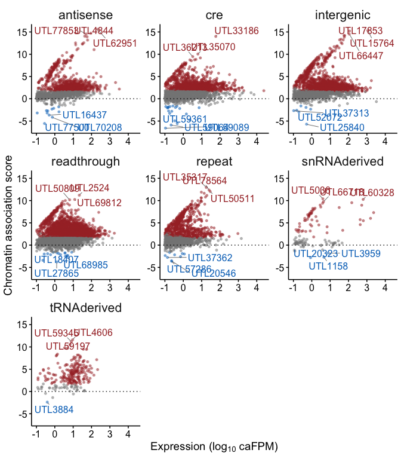
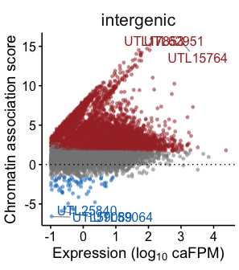
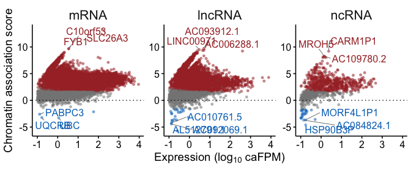
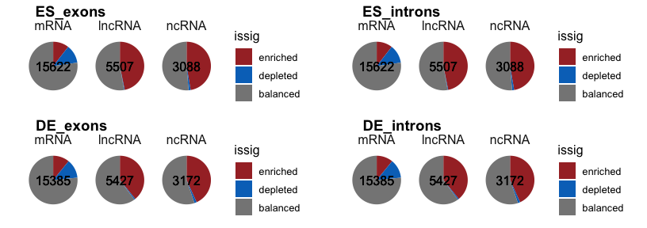
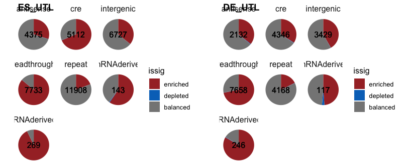
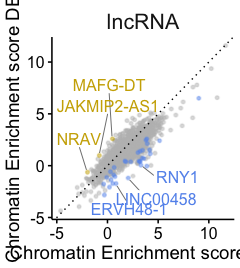

Vidualization : Chromatin Enrichment scores
================

Load info

``` r
allgenes <- read_parquet(here('../rdana/genes/data-output/allgenes_final.parquet'))
exprdata <- read_parquet(here('../rdana/carnas/data-output/expression.rnacharIndep.exonsScaling.Q255Q40.with_unannotated.parquet'))
chredata <- read_parquet(here('../rdana/carnas/data-output/chromation_association_scores.exonsScaling.Q255Q40.parquet'))
```

# Chromatin-assocation score scatter

``` r
plot_scatter_chrescore<- function(enr_data, ESorDE='ES', thr_enr=3, thr_p=0.05, thr_exp=0.1, ntop=4, nbottom=4, xloc=2.0, yloc=-2, extranames=c(), pw=1.9){
   enr_data %>%
    mutate(issig=factor(case_when((!!sym(paste0("Chromatin_association_score_padj.",ESorDE))<thr_p)  & (!!sym(paste0("Chromatin_association_score.",ESorDE)))>log(thr_enr, base=2) ~ "enriched",(!!sym(paste0("Chromatin_association_score_padj.",ESorDE))<thr_p)  & (!!sym(paste0("Chromatin_association_score.",ESorDE)))<(-log(thr_enr, base=2)) ~ "depleted", T ~ "balanced"), levels=c("enriched","depleted","balanced"))) %>% 
    dplyr::filter((!!sym(paste0("FPM.",ESorDE,".char"))>thr_exp)) %>%
    group_by(rna_type, issig) %>%
    arrange(desc(abs(!!sym(paste0("Chromatin_association_score.",ESorDE))))) %>%
    mutate(rnk = seq(1,n())) %>%
    ungroup() %>%
  ggplot(aes(x = log10(!!sym(paste0("FPM.",ESorDE,".char"))), y = !!sym(paste0("Chromatin_association_score.",ESorDE)), color=issig)) + 
  rasterise(geom_point(alpha=0.5, size=1, show.legend = FALSE),dev = 'ragg', dpi=300) +
  geom_abline(intercept = 0, slope = 0, col="black", linetype='dotted')+
  #geom_abline(intercept = log10(thr_enr), slope = 1, col="darkred", linetype='dotted', size=0.5)+
   # geom_abline(intercept = -log10(thr_enr), slope = 1, col="darkred", linetype='dotted', size=0.5)+
  ylab(expression("Chromatin association score"))+
  xlab(expression("Expression (log"[10]*" caFPM)"))+
  labs(color='Chromatin enrichement')+
    scale_color_manual(values=c(enriched="#A73030FF", depleted="#0073C2FF", balanced="#868686FF"))+

  geom_text_repel(aes(label=ifelse(((rnk<ntop & issig=="enriched") | (name %in% extranames)) | (rnk<nbottom & issig=="depleted"), name, "")),

                   size=12/.pt,
                   #force = 1,
                  #point.padding = 0.1,
                  max.iter = 10000,
                  nudge_x = 0,
                  nudge_y = 0 ,
                   min.segment.length = 0,
                  segment.size = 0.2,
                  segment.color = 'black',
                  #color='black',
                  show.legend=FALSE,
                  max.overlaps = Inf)+
  # xlab("log10(Mean Counts)")+
  # ylab("Log2FC (Chromatin/Total)")+
    
  theme_publish()+
  facet_rep_wrap(~rna_type, repeat.tick.labels=T) ->p
  
  p_fixed <- egg::set_panel_size(p=p, margin = unit(0, "null"), width=unit(pw, "in"), height=unit(pw, "in"))
  plot_grid(p_fixed)
}
```

## Intergenic details

``` r
thr_p = 0.05
thr_enr = 3

 enr_data <- chredata %>%
  dplyr::filter(annotation_type=='intergenic') 

for (cell in c("ES","DE")) {
plot_scatter_chrescore(enr_data, ESorDE=cell, thr_enr=3, thr_p=0.05, thr_exp=0.1, ntop=4, xloc=2.0, yloc=-2)

ggsave2(here(paste0('figures/carnas/chrescore.intergenicDETAILS.', cell, '.scatter.pdf')))
}
```

    ## Saving 7 x 10 in image
    ## Saving 7 x 10 in image

``` r
plot_scatter_chrescore(enr_data, ESorDE='ES', thr_enr=3, thr_p=0.05, thr_exp=0.1, xloc=2.0, yloc=-2, ntop = 4, pw=2.5)
```

<!-- -->

``` r
#ggsave2(here(paste0('figures/carnas/chrescore.exons.', 'ES', '.scatter.pdf')))
```

## Intergenic single panel

``` r
thr_p = 0.05
thr_enr = 3

 enr_data <- chredata %>%
  dplyr::filter(annotation_type=='intergenic')  %>%
   mutate(rna_type='intergenic')

for (cell in c("ES","DE")) {
plot_scatter_chrescore(enr_data, ESorDE=cell, thr_enr=3, thr_p=0.05, thr_exp=0.1, ntop=4, xloc=2.0, yloc=-2)

ggsave2(here(paste0('figures/carnas/chrescore.intergenic.', cell, '.scatter.pdf')))
}
```

    ## Saving 7 x 10 in image
    ## Saving 7 x 10 in image

``` r
plot_scatter_chrescore(enr_data, ESorDE='ES', thr_enr=3, thr_p=0.05, thr_exp=0.1, xloc=2.0, yloc=-2, ntop = 4, pw=2.5)
```

<!-- -->

``` r
#ggsave2(here(paste0('figures/carnas/chrescore.exons.', 'ES', '.scatter.pdf')))
```

## Exons

``` r
thr_p = 0.05
thr_enr = 3

enr_data = chredata %>%
  dplyr::filter(annotation_type=='exons', rna_type %in% c("mRNA","lncRNA","ncRNA"), ambiguous==0) %>%
  mutate(rna_type = factor(rna_type, levels = c("mRNA","lncRNA","ncRNA")))


for (cell in c("ES","DE")) {
plot_scatter_chrescore(enr_data, ESorDE=cell, thr_enr=3, thr_p=0.05, thr_exp=0.1, ntop=4, xloc=2.0, yloc=-2)

ggsave2(here(paste0('figures/carnas/chrescore.exons.', cell, '.scatter.pdf')))
}
```

    ## Saving 7 x 5 in image
    ## Saving 7 x 5 in image

``` r
plot_scatter_chrescore(enr_data, ESorDE='ES', thr_enr=3, thr_p=0.05, thr_exp=0.1, ntop=4, xloc=2.0, yloc=-2)
```

<!-- --> \##
Exons details

``` r
thr_p = 0.05
thr_enr = 3

enr_data = chredata %>%
  dplyr::filter(annotation_type=='exons', rna_type %in% c("mRNA","lncRNA","ncRNA"), ambiguous==0) %>%
  mutate(rna_type = factor(rna_subtype, levels = c("mRNA","lncRNA","snRNA","snoRNA","TEC","pseudogene","miRNA","ncRNA"))) %>%
  dplyr::filter(rna_type %in% c("mRNA","lncRNA","snRNA","snoRNA","TEC","pseudogene","miRNA","ncRNA"))


for (cell in c("ES","DE")) {
plot_scatter_chrescore(enr_data, ESorDE=cell, thr_enr=3, thr_p=0.05, thr_exp=0.1, ntop=4, xloc=2.0, yloc=-2)

ggsave2(here(paste0('figures/carnas/chrescore.exonsDETAILS.', cell, '.scatter.pdf')))
}
```

    ## Saving 7 x 14 in image
    ## Saving 7 x 14 in image

``` r
plot_scatter_chrescore(enr_data, ESorDE='ES', thr_enr=3, thr_p=0.05, thr_exp=0.1, ntop=4, xloc=2.0, yloc=-2)
```

<!-- -->

## Introns

``` r
thr_p = 0.05
thr_enr = 3

enr_data = chredata %>%
  dplyr::filter(annotation_type=='introns', rna_type %in% c("mRNA","lncRNA","ncRNA"), ambiguous==0) %>%
  mutate(rna_type = factor(rna_type, levels = c("mRNA","lncRNA","ncRNA")))


for (cell in c("ES","DE")) {
plot_scatter_chrescore(enr_data, ESorDE=cell, thr_enr=3, thr_p=0.05, thr_exp=0.1, ntop=4, xloc=2.0, yloc=-2)

ggsave2(here(paste0('figures/carnas/chrescore.introns.', cell, '.scatter.pdf')))
}
```

    ## Saving 7 x 5 in image
    ## Saving 7 x 5 in image

``` r
plot_scatter_chrescore(enr_data, ESorDE='ES', thr_enr=3, thr_p=0.05, thr_exp=0.1, ntop=4, xloc=2.0, yloc=-2)
```

<!-- -->

# Pie charts

``` r
plot_piechart_chaVSrna<- function(enr_data, ESorDE='ES', thr_enr=3, thr_p=0.05, thr_exp=0.1, ntop=5, xloc=2.0, yloc=-2){
  y<- enr_data %>%
    mutate(issig=factor(case_when((!!sym(paste0("Chromatin_association_score_padj.",ESorDE))<thr_p)  & (!!sym(paste0("Chromatin_association_score.",ESorDE)))>log(thr_enr, base=2) ~ "enriched",(!!sym(paste0("Chromatin_association_score_padj.",ESorDE))<thr_p)  & (!!sym(paste0("Chromatin_association_score.",ESorDE)))<(-log(thr_enr, base=2)) ~ "depleted", T ~ "balanced"), levels=c("enriched","depleted","balanced"))) %>% 
    dplyr::filter((!!sym(paste0("FPM.",ESorDE,".char"))>thr_exp)) %>%
dplyr::count(rna_type, issig) %>% group_by(rna_type) %>% mutate(n_percent=n/sum(n)*100, ntotal=sum(n)) %>% ungroup() 
  
  p<- y %>% group_by(rna_type) %>% mutate(issig=factor(issig, levels=rev(c("enriched","depleted","balanced")))) %>% arrange(desc(issig)) %>% mutate(cumulative=cumsum(n_percent), midpoint = cumulative - n_percent / 2, yang = 90-(midpoint/100*365), name=paste0("",n)) %>% ungroup()  %>% ggplot(aes(x="", y=n_percent, fill=issig)) +
  geom_col(width=1) + 
    coord_polar("y")+
    scale_fill_manual(values=c(enriched="#A73030FF", depleted="#0073C2FF", balanced="#868686FF"))+
   geom_text(aes(label=ntotal),  x=0.5, y=0,  size=12/.pt)+
  facet_wrap(~rna_type)+
  theme_minimal()+
  theme(
  axis.title.x = element_blank(),
  axis.title.y = element_blank(),
  panel.border = element_blank(),
  panel.grid=element_blank(),
  axis.ticks = element_blank(),
  axis.text.x=element_blank(),
   strip.text = element_text(size = 12),
  text = element_text(size=12))

p_fixed <- egg::set_panel_size(p=p, margin = unit(0, "null"), width=unit(0.8, "in"), height=unit(0.8, "in"))
plot_grid(p_fixed)

} 
```

## exons introns

``` r
for (cell in c("ES","DE")){
plot_piechart_chaVSrna(chredata %>%
  dplyr::filter(annotation_type=='exons', rna_type %in% c("mRNA","lncRNA","ncRNA"), ambiguous>-1) %>%
  mutate(rna_type = factor(rna_type, levels = c("mRNA","lncRNA","ncRNA"))), 
  ESorDE=cell, thr_enr=3, thr_p=0.05, thr_exp=0.1)
  ggsave2(here(paste0('figures/carnas/chrescore.exons.',cell, '.pie.pdf')))
  
plot_piechart_chaVSrna(chredata %>%
  dplyr::filter(annotation_type=='exons', rna_type %in% c("mRNA","lncRNA","ncRNA"), ambiguous>-1) %>%
  mutate(rna_type = factor(rna_type, levels = c("mRNA","lncRNA","ncRNA"))),
  ESorDE=cell, thr_enr=3, thr_p=0.05, thr_exp=0.1)
  ggsave2(here(paste0('figures/carnas/chrescore.introns.',cell, '.pie.pdf')))
  
}
```

    ## Saving 7 x 5 in image
    ## Saving 7 x 5 in image
    ## Saving 7 x 5 in image
    ## Saving 7 x 5 in image

``` r
plot_piechart_chaVSrna(chredata %>%
  dplyr::filter(annotation_type=='exons', rna_type %in% c("mRNA","lncRNA","ncRNA"), ambiguous>-1) %>%
  mutate(rna_type = factor(rna_type, levels = c("mRNA","lncRNA","ncRNA"))), 
  ESorDE=cell, thr_enr=3, thr_p=0.05, thr_exp=0.1)
```

<!-- -->

``` r
  ggsave2(here(paste0('figures/carnas/chrescore.exons.',cell, '.pie.pdf')))
```

    ## Saving 7 x 5 in image

``` r
plot_piechart_chaVSrna(chredata %>%
  dplyr::filter(annotation_type=='introns', rna_type %in% c("mRNA","lncRNA","ncRNA"), ambiguous>-1) %>%
  mutate(rna_type = factor(rna_type, levels = c("mRNA","lncRNA","ncRNA"))), 
  ESorDE=cell, thr_enr=3, thr_p=0.05, thr_exp=0.1)
```

<!-- -->

``` r
  ggsave2(here(paste0('figures/carnas/chrescore.exons.',cell, '.pie.pdf')))
```

    ## Saving 7 x 5 in image

## ncRNAs details

``` r
enr_data = chredata %>%
  dplyr::filter(rna_type %in% c("mRNA","lncRNA","ncRNA"), ambiguous==0) %>%
  mutate(rna_type = factor(rna_subtype, levels = c("mRNA","lncRNA","snRNA","snoRNA","TEC","pseudogene","miRNA","ncRNA"))) %>%
  dplyr::filter(rna_type %in% c("mRNA","lncRNA","snRNA","snoRNA","TEC","pseudogene","miRNA","ncRNA"))


for (cell in c("ES","DE")){
plot_piechart_chaVSrna(enr_data %>% dplyr::filter(annotation_type=='exons'), ESorDE=cell, thr_enr=3, thr_p=0.05, thr_exp=0.1)
  ggsave2(here(paste0('figures/carnas/chrescore.exonsDETAILS.',cell, '.pie.pdf')))
  
plot_piechart_chaVSrna(enr_data %>% dplyr::filter(annotation_type=='introns'), ESorDE=cell, thr_enr=3, thr_p=0.05, thr_exp=0.1)
  ggsave2(here(paste0('figures/carnas/chrescore.intronsDETAILS.',cell, '.pie.pdf')))
  
}
```

    ## Saving 7 x 5 in image
    ## Saving 7 x 5 in image
    ## Saving 7 x 5 in image
    ## Saving 7 x 5 in image

``` r
plot_piechart_chaVSrna(enr_data %>% dplyr::filter(annotation_type=='exons'), ESorDE='ES', thr_enr=3, thr_p=0.05, thr_exp=0.1)
```

<!-- -->

``` r
plot_piechart_chaVSrna(enr_data %>% dplyr::filter(annotation_type=='introns'), ESorDE='ES', thr_enr=3, thr_p=0.05, thr_exp=0.1)
```

<!-- -->

## Intergenic

``` r
enr_data = chredata %>%
  dplyr::filter(annotation_type %in% c("intergenic")) #%>%
  # mutate(rna_type = factor(rna_subtype, levels = c("mRNA","lncRNA","snRNA","snoRNA","TEC","pseudogene","miRNA","ncRNA"))) %>%
  # dplyr::filter(rna_type %in% c("mRNA","lncRNA","snRNA","snoRNA","TEC","pseudogene","miRNA","ncRNA"))


for (cell in c("ES","DE")){
plot_piechart_chaVSrna(enr_data , ESorDE=cell, thr_enr=3, thr_p=0.05, thr_exp=0.1)
  ggsave2(here(paste0('figures/carnas/chrescore.intergenicDETAIL.',cell, '.pie.pdf')))
}
```

    ## Saving 7 x 5 in image
    ## Saving 7 x 5 in image

``` r
plot_piechart_chaVSrna(enr_data , ESorDE='ES', thr_enr=3, thr_p=0.05, thr_exp=0.1)
```

<!-- -->

## Intergenic total

``` r
enr_data = chredata %>%
  dplyr::filter(annotation_type %in% c("intergenic")) %>%
  mutate(rna_type='intergenic')#%>%
  # mutate(rna_type = factor(rna_subtype, levels = c("mRNA","lncRNA","snRNA","snoRNA","TEC","pseudogene","miRNA","ncRNA"))) %>%
  # dplyr::filter(rna_type %in% c("mRNA","lncRNA","snRNA","snoRNA","TEC","pseudogene","miRNA","ncRNA"))


for (cell in c("ES","DE")){
plot_piechart_chaVSrna(enr_data , ESorDE=cell, thr_enr=3, thr_p=0.05, thr_exp=0.1)
  ggsave2(here(paste0('figures/carnas/chrescore.intergenic.',cell, '.pie.pdf')))
  
  
}
```

    ## Saving 7 x 5 in image
    ## Saving 7 x 5 in image

``` r
plot_piechart_chaVSrna(enr_data , ESorDE='ES', thr_enr=3, thr_p=0.05, thr_exp=0.1)
```

<!-- -->

# Diff chre score ES vs DE

``` r
plot_chre_DEvsES<- function(enr_data, thr_enr=2, thr_p=0.05, thr_exp=0.1, ntop=5, xloc=2.0, yloc=-2, extranames=c()){
enr_data %>%
     dplyr::filter(FPM.ES.char>thr_exp, FPM.DE.char>thr_exp, FPM.ES.rna>thr_exp, FPM.DE.rna>thr_exp) %>%
    mutate(issig=factor(case_when((Chromatin_association_score_DEvsES_padj<thr_p)  & (Chromatin_association_score_DEvsES_LFC>log(thr_enr, base=2)) ~ "DE",(Chromatin_association_score_DEvsES_padj<thr_p)  & (Chromatin_association_score_DEvsES_LFC<log(1/thr_enr, base=2)) ~ "ES", T ~ "none"), levels=c("DE","ES","none"))) %>% 
    group_by(issig, rna_type) %>%
   arrange(desc(abs(Chromatin_association_score_DEvsES_LFC))) %>%
    mutate(rnk = seq(1,n())) %>%
    ungroup() %>%
    arrange(desc(issig)) %>%
    #dplyr::filter((!!sym(paste0("FPM.",ESorDE,".char"))>thr_exp)) %>%
 

  
  ggplot(aes(x = Chromatin_association_score.ES, y = Chromatin_association_score.DE, color=issig)) + #y= log2FoldChange.ES+log2FoldChange
  rasterise(geom_point(alpha=0.5, size=1, show.legend = FALSE),dev = 'ragg', dpi=300) +
  geom_abline(intercept = 0, slope = 1, col="black", linetype='dotted')+
  #geom_abline(intercept = log10(thr_enr), slope = 1, col="darkred", linetype='dotted', size=0.5)+
   # geom_abline(intercept = -log10(thr_enr), slope = 1, col="darkred", linetype='dotted', size=0.5)+
  xlab("Chromatin Enrichment score ES")+
  ylab("Chromatin Enrichment score DE")+
     geom_text_repel(aes(label=ifelse((((rnk<ntop) & (issig!="none")) | (name %in% extranames)) , name, "")),
                   size=12/.pt,
                   force = 1,
                  point.padding = 0.1,
                  max.iter = 1000,
                  nudge_x = 0,
                  nudge_y = 0 ,
                   min.segment.length = 0,
                  segment.size = 0.2,
                  segment.color = 'black',
                  #color='black',
                  show.legend=FALSE,
                  max.overlaps = Inf)+
  # xlab("log10(Mean Counts)")+
  # ylab("Log2FC (Chromatin/Total)")+
  labs(color='Chromatin enrichement')+
   scale_color_manual(values=c(none='grey', ES="cornflowerblue", DE="gold3"))+
  # xlab("log10(Mean Counts)")+
  # ylab("Log2FC (Chromatin/Total)")+
    
  theme_publish()+
  facet_rep_wrap(~rna_type, repeat.tick.labels=T) ->p
  
  p_fixed <- egg::set_panel_size(p=p, margin = unit(0, "null"), width=unit(1.9, "in"), height=unit(1.9, "in"))
  plot_grid(p_fixed)
}
```

## Exons

``` r
plot_chre_DEvsES(chredata %>%
                   dplyr::filter(annotation_type=='exons', rna_type %in% c("mRNA","lncRNA","ncRNA"), ambiguous>-1) %>%
                   dplyr::mutate(rna_type =factor(rna_type, levels=c("mRNA","lncRNA","ncRNA"))) %>%
  dplyr::filter(annotation_type=='exons'), thr_enr=1.3, thr_p=0.05, thr_exp=0.1, ntop=4, xloc=2.0, yloc=-2)
```

<!-- -->

``` r
  ggsave2(here('figures/carnas/chrescore.DEvsES.exons.scatter.pdf'))
```

    ## Saving 8 x 5 in image

``` r
plot_chre_DEvsES(chredata %>%
                   dplyr::filter(annotation_type=='exons', rna_type %in% c("lncRNA"), ambiguous>-1) %>%
                   dplyr::mutate(rna_type =factor(rna_type, levels=c("lncRNA"))) %>%
  dplyr::filter(annotation_type=='exons'), thr_enr=1.3, thr_p=0.05, thr_exp=0.1, ntop=4, xloc=2.0, yloc=-2)
```

<!-- -->

``` r
  ggsave2(here('figures/carnas/chrescore.DEvsES.exonsLNCRNA.scatter.pdf'))
```

    ## Saving 7 x 5 in image

## Introns

``` r
plot_chre_DEvsES(chredata %>%
                   dplyr::filter(annotation_type=='introns', rna_type %in% c("mRNA","lncRNA","ncRNA"), ambiguous >-1) %>%
                   dplyr::mutate(rna_type =factor(rna_type, levels=c("mRNA","lncRNA","ncRNA"))) , thr_enr=1.3, thr_p=0.05, thr_exp=0.1, ntop=4, xloc=2.0, yloc=-2)
```

<!-- -->

``` r
  ggsave2(here('figures/carnas/chrescore.DEvsES.introns.scatter.pdf'))
```

    ## Saving 8 x 5 in image

## intergenic

``` r
plot_chre_DEvsES(chredata %>%
                   dplyr::filter(annotation_type=='intergenic') , thr_enr=1.3, thr_p=0.05, thr_exp=0.1, ntop=4, xloc=2.0, yloc=-2)
```

<!-- -->

``` r
  ggsave2(here('figures/carnas/chrescore.DEvsES.intergenic.scatter.pdf'))
```

    ## Saving 12 x 5 in image

# Pie char diff chre DE vs ES

``` r
plot_piechart_diffchre<- function(enr_data, thr_enr=1.3, thr_p=0.05, thr_exp=0.1, ntop=5, xloc=2.0, yloc=-2){
  y<- enr_data %>%
    mutate(issig=factor(case_when((Chromatin_association_score_DEvsES_padj<thr_p)  & (Chromatin_association_score_DEvsES_LFC>log(thr_enr, base=2)) ~ "DE",(Chromatin_association_score_DEvsES_padj<thr_p)  & (Chromatin_association_score_DEvsES_LFC<log(1/thr_enr, base=2)) ~ "ES", T ~ "none"), levels=c("DE","ES","none"))) %>% 
    dplyr::filter(FPM.ES.char>thr_exp, FPM.DE.char>thr_exp, FPM.ES.rna>thr_exp, FPM.DE.rna>thr_exp) %>%
    
dplyr::count(rna_type, issig) %>% group_by(rna_type) %>% mutate(n_percent=n/sum(n)*100, ntotal=sum(n)) %>% ungroup()
  
  ydeg <- y %>% dplyr::select(rna_type, issig, n)  %>% pivot_wider(names_from=issig, values_from=n, names_prefix = "sig_", values_fill=0) %>% mutate(ndeg=sig_ES+sig_DE) 
  
  y <- y %>% left_join(ydeg %>% dplyr::select(rna_type, ndeg))
  
  p<- y %>% group_by(rna_type) %>% mutate(issig=factor(issig, levels=rev(c("DE","ES","none")))) %>% arrange(desc(issig)) %>% mutate(cumulative=cumsum(n_percent), midpoint = cumulative - n_percent / 2, yang = 90-(midpoint/100*365), name=paste0("",n)) %>% ungroup()  %>% ggplot(aes(x="", y=n_percent, fill=issig)) +
  geom_col(width=1) + 
    coord_polar("y")+
    scale_fill_manual(values=c(none='grey', ES="cornflowerblue", DE="gold3"))+
   geom_text(aes(label=paste0(ntotal,"\n(", ndeg,")")),  x=0.5, y=0,  size=12/.pt)+
  facet_wrap(~rna_type)+
  theme_minimal()+
  theme(
  axis.title.x = element_blank(),
  axis.title.y = element_blank(),
  panel.border = element_blank(),
  panel.grid=element_blank(),
  axis.ticks = element_blank(),
  axis.text.x=element_blank(),
   strip.text = element_text(size = 12),
  text = element_text(size=12))

p_fixed <- egg::set_panel_size(p=p, margin = unit(0, "null"), width=unit(0.8, "in"), height=unit(0.8, "in"))
plot_grid(p_fixed)

} 
```

## exons

``` r
plot_piechart_diffchre(chredata %>%
                   dplyr::filter(annotation_type=='exons', rna_type %in% c("mRNA","lncRNA","ncRNA"), ambiguous>-1) %>%
                   dplyr::mutate(rna_type =factor(rna_type, levels=c("mRNA","lncRNA","ncRNA"))) %>%
  dplyr::filter(annotation_type=='exons'), thr_enr=1.3, thr_p=0.05, thr_exp=0.1, ntop=4, xloc=2.0, yloc=-2)
```

    ## Joining, by = "rna_type"

<!-- -->

``` r
ggsave2(here('figures/carnas/chrescore.DEvsES.exons.pie.pdf'))
```

    ## Saving 7 x 5 in image

## intergenic

``` r
plot_piechart_diffchre(chredata %>%
                   dplyr::filter(annotation_type=='intergenic') , thr_enr=1.3, thr_p=0.05, thr_exp=0.1, ntop=4, xloc=2.0, yloc=-2)
```

    ## Joining, by = "rna_type"

<!-- -->

``` r
ggsave2(here('figures/carnas/chrescore.DEvsES.intergenic.pie.pdf'))
```

    ## Saving 10 x 5 in image

## Introns

``` r
plot_piechart_diffchre(chredata %>%
                   dplyr::filter(annotation_type=='introns', rna_type %in% c("mRNA","lncRNA","ncRNA"), ambiguous>-1) %>%
                   dplyr::mutate(rna_type =factor(rna_type, levels=c("mRNA","lncRNA","ncRNA"))) %>%
  dplyr::filter(annotation_type=='introns'), thr_enr=1.3, thr_p=0.05, thr_exp=0.1, ntop=4, xloc=2.0, yloc=-2)
```

    ## Joining, by = "rna_type"

<!-- -->

``` r
ggsave2(here('figures/carnas/chrescore.DEvsES.introns.pie.pdf'))
```

    ## Saving 7 x 5 in image
