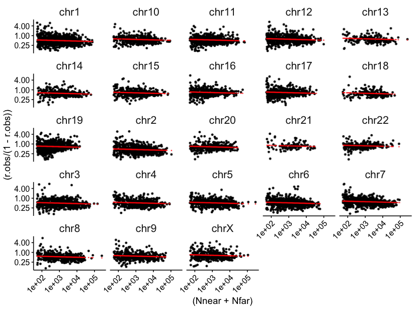
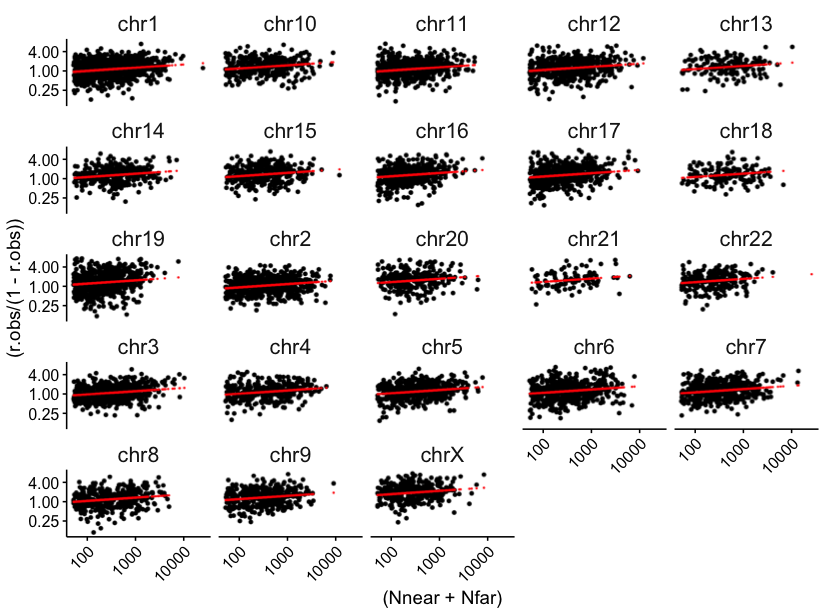

Visualization : GLM for delocalization scores
================

# Populate gene info

Load info about genes repeat contents and proximity

``` r
allgenes <- read_parquet(here('../rdana/genes/data-output/allgenes_final.parquet'))

transDeloc.exonsModel <- read_parquet(here('data-output/delocalization/','delocalization_scores.bysample.trans.exonsModel.parquet'))
transDeloc.intronsModel <- read_parquet(here('data-output/delocalization/','delocalization_scores.bysample.trans.intronsModel.parquet'))
```

# Visualize

``` r
plot_GLM <- function(glm_predictions){
   glm_predictions %>%
      ggplot(aes((Nnear+Nfar),(r.obs/(1-r.obs)))) + 
    rasterise(geom_point( lpha=0.3, size=1), dev = 'ragg', dpi=300) +
     rasterise(geom_point(aes((Nnear+Nfar), (r.prior/(1-r.prior))), color='red', alpha=1, size=0.2),  dev = 'ragg', dpi=300) +
    scale_x_continuous(trans='log10')+
    scale_y_continuous(trans='log2', limits = c(0.1,8))+
  
    facet_wrap(~chr)+
    theme_publish()+
    theme(axis.text.x = element_text(angle=45, hjust = 1))->p
  
  return(p)
}
```

Introns model

``` r
plot_GLM(transDeloc.intronsModel %>%
  
  dplyr::filter(sample=='ES_1', annotation_type=='introns') %>%
    dplyr::filter(rna_type=='mRNA', ambiguous==0) %>% 
  left_join(allgenes %>% dplyr::filter(annotation_type=='introns') %>% dplyr::select(GeneID, chr))) ->p
```

    ## Joining, by = "GeneID"

    ## Warning: Ignoring unknown parameters: lpha

``` r
fname="delocalization_GLM_introns_ES_rep1.pdf"
p_fixed<- prettysave(p, here('figures/delocalization', fname), panel.width=1.5, panel.height=0.7)
```

    ## Warning: Removed 54 rows containing missing values (geom_point).

    ## [1] "fig.width=8.6, fig.height=6.4"

``` r
plot_grid(p_fixed)
```

<!-- -->

Exons

``` r
plot_GLM(transDeloc.exonsModel %>%
  
  dplyr::filter(sample=='ES_1', annotation_type=='exons') %>%
    dplyr::filter(rna_type=='mRNA', ambiguous==0) %>% 
  left_join(allgenes %>% dplyr::filter(annotation_type=='exons') %>% dplyr::select(GeneID, chr))) ->p
```

    ## Joining, by = "GeneID"

    ## Warning: Ignoring unknown parameters: lpha

``` r
fname="delocalization_GLM_exons_ES_rep1.pdf"
p_fixed<- prettysave(p, here('figures/delocalization', fname), panel.width=1.5, panel.height=0.7)
```

    ## Warning: Removed 35 rows containing missing values (geom_point).

    ## [1] "fig.width=8.6, fig.height=6.4"

``` r
plot_grid(p_fixed)
```

<!-- -->
