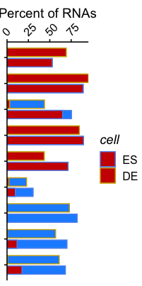
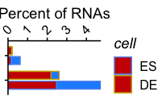
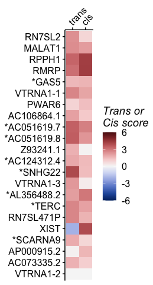
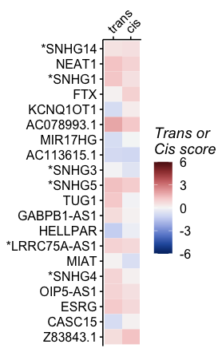
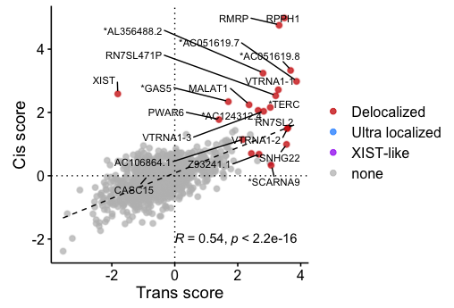
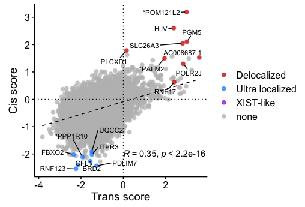
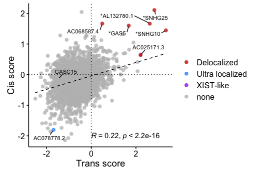
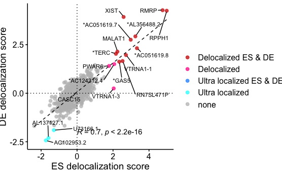

Visualization :delocalization scores
================

# Populate gene info

Load info about genes repeat contents and proximity

``` r
allgenes <- read_parquet(here('../rdana/genes/data-output/allgenes_final.parquet'))
exprdata <- read_parquet(here('../rdana/carnas/data-output/expression.rnacharIndep.exonsScaling.Q255Q40.with_unannotated.parquet'))

delocdata <- read_parquet(here('../rdana/cacoarse/data-output/delocalization_scores.exonsModel.parquet'))
```

``` r
deloc_df <- delocdata %>%
  left_join(exprdata %>% dplyr::select(GeneID,annotation_type, FPM.ES.char,FPM.DE.char) %>% 
              dplyr::rename(FPM_ES = FPM.ES.char, FPM_DE=FPM.DE.char) %>% pivot_longer(-c(GeneID, annotation_type), names_to = "cell", values_to="FPM", names_prefix="FPM_"), by = c("cell", "annotation_type","GeneID")) %>%
  mutate(deloc_score_type = factor(substr(deloc_score_type, 7, length(deloc_score_type)), levels = c("trans","cis"))) %>%
  mutate(rna_type = if_else(rna_type=='ncRNA', rna_subtype, rna_type))
```

``` r
deloc_df
```

    ## # A tibble: 242,505 × 19
    ##    deloc_score_type cell  GeneID      annotation_type name  rna_type rna_subtype
    ##    <fct>            <chr> <chr>       <chr>           <chr> <chr>    <chr>      
    ##  1 trans            DE    ENSG000002… exons           SNHG… lncRNA   lncRNA     
    ##  2 trans            DE    ENSG000002… exons           SNOR… snoRNA   snoRNA     
    ##  3 trans            DE    ENSG000002… exons           SNOR… snoRNA   snoRNA     
    ##  4 trans            DE    ENSG000002… exons           SNOR… snoRNA   snoRNA     
    ##  5 trans            DE    ENSG000002… exons           MIR4… miRNA    miRNA      
    ##  6 trans            DE    ENSG000002… exons           SCAR… snoRNA   snoRNA     
    ##  7 trans            DE    ENSG000002… exons           SNOR… snoRNA   snoRNA     
    ##  8 trans            DE    ENSG000002… exons           RNU5… snRNA    snRNA      
    ##  9 trans            DE    ENSG000002… exons           SNOR… snoRNA   snoRNA     
    ## 10 trans            DE    ENSG000002… exons           SNOR… snoRNA   snoRNA     
    ## # … with 242,495 more rows, and 12 more variables: ambiguous <dbl>,
    ## #   delocalization_score.calibrated <dbl>, delocalization_score.raw <dbl>,
    ## #   r.est <dbl>, r.obs <dbl>, Nnear <dbl>, Nfar <dbl>, p.high <dbl>,
    ## #   p.low <dbl>, p.high.corr <dbl>, p.low.corr <dbl>, FPM <dbl>

# Densities

``` r
plot_deloc_halfeye <- function(deloc){
p<- deloc %>%
  ggplot(aes(x=delocalization_score.calibrated, y=rna_type, color=cell))+
  stat_slab(aes(slab_color=cell), fill=NA, normalize="panels") +
  stat_pointinterval(point_interval = median_qi, .width = c(.75), interval_size=1, position = position_dodge(width = .2, preserve = "single"))+
  scale_color_manual(values=c( ES="cornflowerblue", DE="gold3"))+
  scale_color_manual(aesthetics = "slab_color", values=c( ES="cornflowerblue", DE="gold3"))+
  geom_vline(aes(xintercept = 0), linetype='dashed', color='black')+
  labs(x="Trans delocalization\nscore", y=NULL)+
scale_x_continuous(position = 'top')+

  guides(fill=FALSE, color=FALSE, slab_color=F)+
  #xlim(c(-4,5))+
  theme_publish()

return(p)
}
```

``` r
mytypes  <- c(c('mRNA','lncRNA','snRNA','snoRNA'),c("repeat","tRNAderived", "snRNAderived","cre","readthrough","antisense","intergenic"))

mydata <- deloc_df %>% 
  dplyr::filter(annotation_type %in% c('intergenic', 'exons'), FPM>1, deloc_score_type=='trans', rna_type %in% mytypes) %>%
  mutate(rna_type = factor(rna_type, levels = rev(mytypes)), cell=factor(cell, levels=c('ES','DE'))) 

p <- plot_deloc_halfeye(mydata) + labs(x="Trans delocalization\nscore", y=NULL)
```

    ## Warning: `guides(<scale> = FALSE)` is deprecated. Please use `guides(<scale> =
    ## "none")` instead.

``` r
fname="delocscore.density.byclass.intergenicANDexons.halfeye.trans.pdf"
p_fixed <- egg::set_panel_size(p, margin = unit(1, "in"), width=unit(1.5, "in"), height=unit(1.75*12/5, "in"))
plot_grid(p_fixed)
```

<!-- -->

``` r
ggsave2(here("figures/delocalization", fname), dpi=300)
```

    ## Saving 8 x 5 in image

``` r
mydata <- deloc_df %>% 
  dplyr::filter(annotation_type %in% c('intergenic', 'exons'), FPM>1, deloc_score_type=='cis', rna_type %in% mytypes) %>%
  mutate(rna_type = factor(rna_type, levels = rev(mytypes)), cell=factor(cell, levels=c('ES','DE'))) 

p <- plot_deloc_halfeye(mydata) + labs(x="Cis delocalization\nscore", y=NULL)
```

    ## Warning: `guides(<scale> = FALSE)` is deprecated. Please use `guides(<scale> =
    ## "none")` instead.

``` r
fname="delocscore.density.byclass.intergenicANDexons.halfeye.trans.pdf"
p_fixed <- egg::set_panel_size(p, margin = unit(1, "in"), width=unit(1.5, "in"), height=unit(1.75*12/5, "in"))
plot_grid(p_fixed)
```

<!-- -->

``` r
ggsave2(here("figures/delocalization", fname), dpi=300)
```

    ## Saving 8 x 5 in image

# Census of delocalized RNAs

``` r
plot_deloc_significant <- function(deloc){
 deloc %>%
  mutate(issig = case_when((p.high.corr<0.05) ~ 'broad', (p.low.corr<0.05) ~ 'tight' , T~'none')) %>%
  
  dplyr::count(annotation_type, rna_type, issig, cell) %>%
  group_by(rna_type, cell, annotation_type) %>%
  mutate(per = n/ sum(n)*100) %>%
  ungroup() %>%
  dplyr::filter(issig!="none") %>%
  mutate(issig = factor(issig, levels = c("tight","broad"))) %>%
  complete(crossing(rna_type, issig, cell), fill = list(per = 0)) %>%
  group_by(cell, rna_type) %>%
  mutate(per_total = sum(per)) %>%
  ungroup() %>%
  mutate(per2 = case_when(issig=="tight" ~ per_total, T ~ per)) %>%
  mutate(alpha2 = case_when(cell=='ES'~0.2, cell=='DE' ~ 1)) %>%
  ggplot(aes(x=rna_type, y=per2,  fill=issig, color=cell))+
    geom_col(data = . %>% dplyr::filter(issig=="tight"), fill='dodgerblue', width=0.8, position  = position_dodge2(padding = 0.2, width = 0.8), alpha=1)+
  geom_col(data = . %>% dplyr::filter(issig=="broad"), fill='red3', width=0.8, position  = position_dodge2(padding = 0.2, width = 0.8), alpha=1)+
  
    scale_color_manual(values=c( ES="cornflowerblue", DE="gold3"))+
    theme_publish() +
    #facet_wrap(~cell)+
    scale_y_continuous(position = 'right', expand = c(0,0)) + 
  coord_flip()+
   theme(legend.position = "right", legend.direction = "vertical", axis.text.x = element_text(angle=45, hjust=0)) +
  #scale_x_discrete(position = 'top')+
  theme(axis.text.y = element_blank())+
    labs(x=NULL, y = "Percent of RNAs") -> p
return(p)
}
```

## CIS

Without lncRNA mRNA

``` r
mytypes1  <- c(c('snRNA','snoRNA'),c("repeat","tRNAderived", "snRNAderived","cre","readthrough","antisense","intergenic"))

p<- plot_deloc_significant(deloc_df %>% 
  dplyr::filter(annotation_type %in% c('intergenic', 'exons'), FPM>1, deloc_score_type=='cis', rna_type %in% mytypes1) %>%
  mutate(rna_type = factor(rna_type, levels = rev(mytypes1)), cell=factor(cell, levels=c('ES','DE')))) 
  

p_fixed <- egg::set_panel_size(p, margin = unit(1, "in"), width=unit(1.2, "in"), height=unit(1.75*10/5, "in"))
plot_grid(p_fixed)
```

<!-- -->

``` r
fname="deloc.CIS.intergenicANDexons.hist.noLncMRNA.pdf"
ggsave2(here("figures/delocalization", fname), dpi=300)
```

    ## Saving 6 x 5 in image

lncRNA mRNA

``` r
mytypes1  <- c("mRNA","lncRNA")

p<- plot_deloc_significant(deloc_df %>% 
  dplyr::filter(annotation_type %in% c('intergenic', 'exons'), FPM>1, deloc_score_type=='cis', rna_type %in% mytypes1) %>%
  mutate(rna_type = factor(rna_type, levels = rev(mytypes1)), cell=factor(cell, levels=c('ES','DE')))) 
  

p_fixed <- egg::set_panel_size(p, margin = unit(1, "in"), width=unit(1.2, "in"), height=unit(1.75*2/5, "in"))
plot_grid(p_fixed)
```

<!-- -->

``` r
fname="deloc.CIS.intergenicANDexons.hist.LncMRNAonly.pdf"
ggsave2(here("figures/delocalization", fname), dpi=300)
```

    ## Saving 6 x 5 in image

## TRANS

Without lncRNA mRNA

``` r
mytypes1  <- c(c('snRNA','snoRNA'),c("repeat","tRNAderived", "snRNAderived","cre","readthrough","antisense","intergenic"))

p<- plot_deloc_significant(deloc_df %>% 
  dplyr::filter(annotation_type %in% c('intergenic', 'exons'), FPM>1, deloc_score_type=='trans', rna_type %in% mytypes1) %>%
  mutate(rna_type = factor(rna_type, levels = rev(mytypes1)), cell=factor(cell, levels=c('ES','DE')))) 
  

p_fixed <- egg::set_panel_size(p, margin = unit(1, "in"), width=unit(1.2, "in"), height=unit(1.75*10/5, "in"))
plot_grid(p_fixed)
```

<!-- -->

``` r
fname="deloc.TRANS.intergenicANDexons.hist.noLncMRNA.pdf"
ggsave2(here("figures/delocalization", fname), dpi=300)
```

    ## Saving 6 x 5 in image

lncRNA mRNA

``` r
mytypes1  <- c("mRNA","lncRNA")

p<- plot_deloc_significant(deloc_df %>% 
  dplyr::filter(annotation_type %in% c('intergenic', 'exons'), FPM>1, deloc_score_type=='trans', rna_type %in% mytypes1) %>%
  mutate(rna_type = factor(rna_type, levels = rev(mytypes1)), cell=factor(cell, levels=c('ES','DE')))) 
  

p_fixed <- egg::set_panel_size(p, margin = unit(1, "in"), width=unit(1.2, "in"), height=unit(1.75*2/5, "in"))
plot_grid(p_fixed)
```

<!-- -->

``` r
fname="deloc.TRANS.intergenicANDexons.hist.LncMRNAonly.pdf"
ggsave2(here("figures/delocalization", fname), dpi=300)
```

    ## Saving 6 x 5 in image

# Catalog LNCrnas

## Prepare data

``` r
x<- deloc_df %>% 
  dplyr::filter(annotation_type %in% c('exons'), FPM>1,  rna_type == 'lncRNA', ambiguous!=2) %>%
  mutate(cell=factor(cell, levels=c('ES','DE'))) %>%

  
  left_join(deloc_df %>% 
  dplyr::filter(annotation_type %in% c('exons'), FPM>1,  rna_type == 'lncRNA', deloc_score_type=='trans') %>% dplyr::select(GeneID, cell, p.high.corr) %>% dplyr::rename(p0 = p.high.corr) ,
            by=c("GeneID","cell")) %>%
  group_by(GeneID, cell) %>%
  mutate(p = min(p.high.corr, na.rm=T), psum=sum(p.high.corr, na.rm = F), np=n()) %>%
  ungroup() %>%
  group_by(GeneID) %>%
  mutate(p2 = min(p, na.rm=T), FPMmean = mean(FPM, na.rm=T)) %>%
  ungroup() %>%
  arrange(desc(FPMmean)) %>%
  dplyr::filter(p2<0.05) #%>% #, !is.nan(psum), np==2)
 
 
mygenesBB <- x %>% dplyr::select(GeneID) %>% unique() %>% pull(GeneID)

mygenesBB_top20 <- x %>% dplyr::select(GeneID, FPMmean) %>% unique() %>% arrange(desc(FPMmean)) %>% head(n=30) %>% pull(GeneID)
```

``` r
xtop20 = x %>% 
  dplyr::filter(GeneID %in% mygenesBB_top20) %>%
   mutate(GeneID = factor(GeneID, levels = rev(mygenesBB_top20))) %>%
  dplyr::select(GeneID, name, cell, FPM, deloc_score_type, p, p2, delocalization_score.calibrated, p.high.corr, FPMmean, ambiguous) %>%
  pivot_wider(names_from = cell, values_from = c(FPM, p, delocalization_score.calibrated, p.high.corr), values_fill = 0) %>%
  pivot_longer(cols = c(FPM_ES, p_ES, delocalization_score.calibrated_ES, p.high.corr_ES, FPM_DE, p_DE, delocalization_score.calibrated_DE, p.high.corr_DE), names_to = c(".value","cell"), names_pattern="(.*)_(..)")
```

## Plot ES

``` r
xtop20 %>% 
  dplyr::filter(cell=='ES') %>%
   #mutate(ENSG = forcats::fct_reorder(ENSG, (FPMmean))) %>%
  ggplot(aes(x=deloc_score_type, y=GeneID, fill=delocalization_score.calibrated))+
  scale_y_discrete(labels = function(x) {allgenes %>% dplyr::filter(annotation_type=='exons', GeneID %in% x) %>% mutate(GeneID = factor(GeneID, levels=x)) %>% arrange(GeneID) %>% mutate(name = ifelse(ambiguous==1, paste0("*",name), name)) %>% pull(name)})+
  #scale_x_discrete(position="top", labels = function(x) {x}) +
  scale_x_discrete(position="top")+
  geom_tile()+
  #geom_text(label="o", vjust=0, hjust=0, data = . %>% dplyr::filter(p.high.co))
  colorspace::scale_fill_continuous_diverging(palette = "Blue-Red 3", limits = c(-6,6))+
  theme_publish() +
  labs(fill="Trans or\nCis score")+
  theme(axis.title = element_blank(), axis.text.x.top = element_text(angle=45, hjust=0), legend.position = "right", legend.direction = "vertical")->p


fname="BBcatalog_top30.ES.pdf"
p_fixed <- egg::set_panel_size(p, margin = unit(1, "in"), width=unit(0.5, "in"), height=unit(4*22/20, "in"))
cowplot::plot_grid(p_fixed)
```

<!-- -->

``` r
ggsave2(here('figures/delocalization',fname), dpi=300)
```

    ## Saving 10 x 5 in image

## Plot DE

``` r
xtop20 %>% 
  dplyr::filter(cell=='DE') %>%
   #mutate(ENSG = forcats::fct_reorder(ENSG, (FPMmean))) %>%
  ggplot(aes(x=deloc_score_type, y=GeneID, fill=delocalization_score.calibrated))+
  scale_y_discrete(labels = function(x) {allgenes %>% dplyr::filter(annotation_type=='exons', GeneID %in% x) %>% mutate(GeneID = factor(GeneID, levels=x)) %>% arrange(GeneID) %>% mutate(name = ifelse(ambiguous==1, paste0("*",name), name)) %>% pull(name)})+
  #scale_x_discrete(position="top", labels = function(x) {x}) +
  scale_x_discrete(position="top")+
  geom_tile()+
  #geom_text(label="o", vjust=0, hjust=0, data = . %>% dplyr::filter(p.high.co))
  colorspace::scale_fill_continuous_diverging(palette = "Blue-Red 3", limits = c(-6,6))+
  theme_publish() +
  labs(fill="Trans or\nCis score")+
  theme(axis.title = element_blank(), axis.text.x.top = element_text(angle=45, hjust=0), legend.position = "right", legend.direction = "vertical")->p


fname="BBcatalog_top30.DE.pdf"
p_fixed <- egg::set_panel_size(p, margin = unit(1, "in"), width=unit(0.5, "in"), height=unit(4*22/20, "in"))
cowplot::plot_grid(p_fixed)
```

<!-- -->

``` r
ggsave2(here('figures/delocalization',fname), dpi=300)
```

    ## Saving 10 x 5 in image

## Plot expression

``` r
 xtop20 %>% 
  mutate(cell = factor(cell, levels = c("ES","DE"))) %>%
  dplyr::filter(deloc_score_type=='cis') %>%
  ggplot(aes(x=cell, y=GeneID, fill=log10(FPM)))+
  scale_x_discrete(position="top")+
  geom_tile()+
  #geom_text(label="o", vjust=0, hjust=0, data = . %>% dplyr::filter(p.high.co))
  colorspace::scale_fill_continuous_sequential(palette = "Heat", limits = c(-1,4))+
  theme_publish()+
  theme(axis.text.y = element_blank(), axis.line.y = element_blank(), axis.ticks.y = element_blank(), axis.title = element_blank(), axis.text.x.top = element_text(angle=45, hjust=0), legend.position = "right", legend.direction = "vertical") ->p

fname="BBcatalog.ESDE.expression.pdf"

p_fixed <- egg::set_panel_size(p, margin = unit(1, "in"), width=unit(0.5, "in"), height=unit(4*22/20, "in"))
plot_grid(p_fixed)
```

<!-- -->

``` r
ggsave2(here('figures/delocalization',fname), dpi=300)
```

    ## Saving 10 x 5 in image

## Plot most abundant

### Prepare data

``` r
x2 <- 
   deloc_df %>% 
  dplyr::filter(annotation_type %in% c('exons'), FPM>1,  rna_type == 'lncRNA', ambiguous!=2) %>%
  mutate(cell=factor(cell, levels=c('ES','DE'))) %>%

  
  left_join(deloc_df %>% 
  dplyr::filter(annotation_type %in% c('exons'), FPM>1,  rna_type == 'lncRNA', deloc_score_type=='trans') %>% dplyr::select(GeneID, cell, p.high.corr) %>% dplyr::rename(p0 = p.high.corr) ,
            by=c("GeneID","cell")) %>%
  group_by(GeneID, cell) %>%
  mutate(p = min(p.high.corr, na.rm=T), psum=sum(p.high.corr, na.rm = F), np=n()) %>%
  ungroup() %>%
  group_by(GeneID) %>%
  mutate(p2 = min(p, na.rm=T), FPMmean = mean(FPM, na.rm=T)) %>%
  ungroup() %>%
  arrange(desc(FPMmean)) %>%
  dplyr::filter(!GeneID %in% mygenesBB)
  #dplyr::filter(p2<0.05) #%>% #, !is.nan(psum), np==2)

# x2 <- tdscores_long  %>%
#   #dplyr::filter(rnatype %in% c('exons'), D==0, FPM>1) %>%
#    dplyr::filter(type_name.rep!="tRNA") %>%
#   
#  dplyr::filter(subtype3 %in% c("lncRNA"), rnatype=='exons',  FPM>0) %>%
#   dplyr::filter(D %in% c(0,1000000)) %>%
#   mutate(D = factor(D, levels = c(0,1000000))) %>%
#   left_join(tdscores_long %>% dplyr::filter(rnatype=='exons', D==0) %>% dplyr::select(ENSG, cell, p.high.corr) %>% dplyr::rename(p0 = p.high.corr) ,
#             by=c("ENSG","cell")) %>%
#   group_by(ENSG, cell) %>%
#   mutate(p = min(p.high.corr, na.rm=T), psum=sum(p.high.corr, na.rm = F), np=n()) %>%
#   ungroup() %>%
#   group_by(ENSG) %>%
#   mutate(p2 = min(p, na.rm=T), FPMmean = mean(FPM, na.rm=T)) %>%
#   ungroup() %>%
#   arrange(desc(FPMmean)) %>%

#   dplyr::filter(!ENSG %in% mygenesBB)

#mygenes <- x %>% dplyr::select(ENSG, FPM) %>% unique() %>% arrange(desc(FPM)) %>% pull(ENSG) %>% 


mygenesAbundant_top20 <- x2 %>% 
  dplyr::select(GeneID, FPMmean) %>% unique() %>% arrange(desc(FPMmean)) %>% head(n=20) %>% pull(GeneID)


x2 %>% 
  dplyr::filter(GeneID %in% mygenesAbundant_top20) %>%
   mutate(GeneID = forcats::fct_reorder(GeneID, (FPM))) %>%
  ggplot(aes(x=deloc_score_type, y=ENSG, fill=delocalization_score.calibrated))+
  scale_y_discrete(labels = function(x) {allgenes %>% dplyr::filter(GeneID %in% x, annotation_type=='exons') %>% mutate(GeneID = factor(GeneID, levels=x)) %>% arrange(GeneID) %>% mutate(name = ifelse(ambiguous==1, paste0("*",name), name)) %>% pull(name)})+
  scale_x_discrete(position="top") +
  geom_tile()+
  #geom_text(label="o", vjust=0, hjust=0, data = . %>% dplyr::filter(p.high.co))
  colorspace::scale_fill_continuous_diverging(palette = "Blue-Red 3", limits = c(-6,6))+
  theme_publish() +
  theme(axis.text.x.top = element_text(angle=45, hjust=0))->p


x2top20 = x2 %>% 
  dplyr::filter(GeneID %in% mygenesAbundant_top20) %>%
   mutate(GeneID = factor(GeneID, levels = rev(mygenesAbundant_top20))) %>%
  dplyr::select(GeneID, name, cell, FPM, deloc_score_type, p, p2, delocalization_score.calibrated, p.high.corr, FPMmean) %>%
  pivot_wider(names_from = cell, values_from = c(FPM, p, delocalization_score.calibrated, p.high.corr), values_fill = 0) %>%
  pivot_longer(cols = c(FPM_ES, p_ES, delocalization_score.calibrated_ES, p.high.corr_ES, FPM_DE, p_DE, delocalization_score.calibrated_DE, p.high.corr_DE), names_to = c(".value","cell"), names_pattern="(.*)_(..)")
```

### Most abundant ES

``` r
x2top20 %>% 
  dplyr::filter(cell=='ES') %>%
   #mutate(ENSG = forcats::fct_reorder(ENSG, (FPMmean))) %>%
  ggplot(aes(x=deloc_score_type, y=GeneID, fill=delocalization_score.calibrated))+
  scale_y_discrete(labels = function(x) {allgenes %>% dplyr::filter(annotation_type=='exons', GeneID %in% x) %>% mutate(GeneID = factor(GeneID, levels=x)) %>% arrange(GeneID) %>% mutate(name = ifelse(ambiguous==1, paste0("*",name), name)) %>% pull(name)})+
  #scale_x_discrete(position="top", labels = function(x) {x}) +
  scale_x_discrete(position="top")+
  geom_tile()+
  #geom_text(label="o", vjust=0, hjust=0, data = . %>% dplyr::filter(p.high.co))
  colorspace::scale_fill_continuous_diverging(palette = "Blue-Red 3", limits = c(-6,6))+
  theme_publish() +
  labs(fill="Trans or\nCis score")+
  theme(axis.title = element_blank(), axis.text.x.top = element_text(angle=45, hjust=0), legend.position = "right", legend.direction = "vertical")->p


fname="BBcatalog_mostAbundant.ES.pdf"
p_fixed <- egg::set_panel_size(p, margin = unit(1, "in"), width=unit(0.5, "in"), height=unit(4*20/20, "in"))
cowplot::plot_grid(p_fixed)
```

<!-- -->

``` r
ggsave2(here('figures/delocalization',fname), dpi=300)
```

    ## Saving 10 x 5 in image

### Most abundant DE

``` r
x2top20 %>% 
  dplyr::filter(cell=='DE') %>%
   #mutate(ENSG = forcats::fct_reorder(ENSG, (FPMmean))) %>%
  ggplot(aes(x=deloc_score_type, y=GeneID, fill=delocalization_score.calibrated))+
  scale_y_discrete(labels = function(x) {allgenes %>% dplyr::filter(annotation_type=='exons', GeneID %in% x) %>% mutate(GeneID = factor(GeneID, levels=x)) %>% arrange(GeneID) %>% mutate(name = ifelse(ambiguous==1, paste0("*",name), name)) %>% pull(name)})+
  #scale_x_discrete(position="top", labels = function(x) {x}) +
  scale_x_discrete(position="top")+
  geom_tile()+
  #geom_text(label="o", vjust=0, hjust=0, data = . %>% dplyr::filter(p.high.co))
  colorspace::scale_fill_continuous_diverging(palette = "Blue-Red 3", limits = c(-6,6))+
  theme_publish() +
  labs(fill="Trans or\nCis score")+
  theme(axis.title = element_blank(), axis.text.x.top = element_text(angle=45, hjust=0), legend.position = "right", legend.direction = "vertical")->p


fname="BBcatalog_mostAbundant.DE.pdf"
p_fixed <- egg::set_panel_size(p, margin = unit(1, "in"), width=unit(0.5, "in"), height=unit(4*20/20, "in"))
cowplot::plot_grid(p_fixed)
```

<!-- -->

``` r
ggsave2(here('figures/delocalization',fname), dpi=300)
```

    ## Saving 10 x 5 in image

``` r
 x2top20 %>% 
  mutate(cell = factor(cell, levels = c("ES","DE"))) %>%
  dplyr::filter(deloc_score_type=='cis') %>%
  ggplot(aes(x=cell, y=GeneID, fill=log10(FPM)))+
  scale_x_discrete(position="top")+
  geom_tile()+
  #geom_text(label="o", vjust=0, hjust=0, data = . %>% dplyr::filter(p.high.co))
  colorspace::scale_fill_continuous_sequential(palette = "Heat", limits = c(-1,4))+
  theme_publish()+
  theme(axis.text.y = element_blank(), axis.line.y = element_blank(), axis.ticks.y = element_blank(), axis.title = element_blank(), axis.text.x.top = element_text(angle=45, hjust=0), legend.position = "right", legend.direction = "vertical") ->p

fname="BBcatalog_mostAbundant.ESDE.expression.pdf"

p_fixed <- egg::set_panel_size(p, margin = unit(1, "in"), width=unit(0.5, "in"), height=unit(4*20/20, "in"))
plot_grid(p_fixed)
```

<!-- -->

``` r
ggsave2(here('figures/delocalization',fname), dpi=300)
```

    ## Saving 10 x 5 in image

# Trans vs cis

``` r
plot_cVSt <- function(d, nlabels = 10, extralabs=c()){
d %>%
    mutate(name = ifelse(ambiguous==1, paste0("*",name), name)) %>%
  dplyr::select(deloc_score_type, GeneID, name, delocalization_score.calibrated, FPM, p.high.corr, p.low.corr) %>%
  pivot_wider(names_from = deloc_score_type, values_from = c(delocalization_score.calibrated, p.high.corr, p.low.corr)) %>%
  dplyr::mutate(deloc = case_when((p.high.corr_cis<0.05) & (p.low.corr_trans<0.05) ~ "XIST-like", (p.high.corr_cis<0.05) & (p.high.corr_trans<0.05) ~ "Delocalized",  (p.high.corr_cis<0.05) | (p.high.corr_trans<0.05) ~ "Delocalized", (p.low.corr_cis<0.05) & (p.low.corr_trans<0.05) ~ "Ultra localized",  T ~"none")) %>% 
  group_by(deloc) %>%
  arrange(desc(abs(delocalization_score.calibrated_trans)+abs(delocalization_score.calibrated_cis))) %>%
  mutate(trnk = seq(1,n())) %>%
  ungroup() %>%
  #dplyr::rename(`TRANS` = tscore.)
  #dplyr::filter(FPM>0.1) %>%
  mutate(deloc=factor(deloc, levels = c("XIST-like","Delocalized","Ultra localized", "none"))) %>%
  arrange(desc(deloc)) %>%
    mutate(deloc=factor(deloc, levels = c("Delocalized","Ultra localized", "XIST-like","none"))) %>%
  ggplot(aes(x = delocalization_score.calibrated_trans, y=delocalization_score.calibrated_cis))+
  
  rasterise(geom_point(aes(color=deloc, group=NULL), alpha=0.75, size=2), dev="ragg", dpi=300)+
  geom_smooth(method = "lm", color='black', se = F, size=0.5, alpha=1, linetype='dashed')+
  ggpubr::stat_cor(method = "spearman", label.x = 0, label.y = -2) + 
  
  geom_text_repel(aes(label=lab),
                  data= . %>% 
                    dplyr::filter((deloc!="none") | (name %in% extralabs)) %>% mutate(lab = if_else((trnk<=nlabels) | (name %in% extralabs), name, "")) ,
                  size=3,
                   force = 10,
                  point.padding = 0.2,
                  box.padding =0.5,
                  max.iter = 10000,
                  nudge_x = 0,
                  nudge_y = 0 ,
                  #hjust=0,
                  #direction='y',
                   min.segment.length = 0.1,
                  seed = 42,
                  segment.size = 0.5,
                  #segment.color = 'firebrick',
                  fill = alpha(c("white"),0.1),
                  #color='red',
                  show.legend=FALSE,
                  max.overlaps = Inf)+
                  #xlim = c(-Inf,Inf),
                  #ylim=c(-Inf, Inf))+


  scale_color_manual(values = c(Delocalized = "red3", `Ultra localized` = "dodgerblue", `XIST-like`="purple", none="grey"))+ #`Weakly Delocalized`="deeppink1", 
  #colorspace::scale_color_continuous_sequential(palette = "Heat", limits = c(0,4))+
  #geom_abline()+
  geom_hline(yintercept = 0, linetype='dotted')+
  geom_vline(xintercept = 0, linetype='dotted')+
  #coord_cartesian(xlim=c(-3,3), ylim=c(-3,3), expand=F)+
  theme_publish() +
  labs(x="Trans score", y= "Cis score", color = "")+
  theme(legend.position = "right", 
        legend.direction = "vertical") ->p
  
  return(p)
  }
```

## lncRNA DE

``` r
p<- plot_cVSt(deloc_df  %>%
  dplyr::filter(annotation_type %in% c('exons'), rna_type=='lncRNA', cell=='DE', ambiguous!=2, FPM>1), nlabels=20, extralabs = c("CASC15"))
```

    ## Warning: Ignoring unknown parameters: fill

``` r
fname="transVsCisScore_scatter.lncrna.DE.pdf"
p_fixed <- egg::set_panel_size(p, margin = unit(1, "in"), width=unit(3, "in"), height=unit(3, "in"))
```

    ## `geom_smooth()` using formula 'y ~ x'

    ## Warning: Removed 33 rows containing non-finite values (stat_smooth).

    ## Warning: Removed 33 rows containing non-finite values (stat_cor).

    ## Warning: Removed 33 rows containing missing values (geom_point).

``` r
cowplot::plot_grid(p_fixed)
```

<!-- -->

``` r
ggsave2(here('figures/delocalization',fname), dpi=300)
```

    ## Saving 7 x 5 in image

lncRNA ES

``` r
p<- plot_cVSt(deloc_df  %>%
  dplyr::filter(annotation_type %in% c('exons'), rna_type=='lncRNA', cell=='ES', ambiguous!=2, FPM>1), nlabels=20, extralabs = c("CASC15"))
```

    ## Warning: Ignoring unknown parameters: fill

``` r
fname="transVsCisScore_scatter.lncrna.ES.pdf"
p_fixed <- egg::set_panel_size(p, margin = unit(1, "in"), width=unit(3, "in"), height=unit(3, "in"))
```

    ## `geom_smooth()` using formula 'y ~ x'

    ## Warning: Removed 51 rows containing non-finite values (stat_smooth).

    ## Warning: Removed 51 rows containing non-finite values (stat_cor).

    ## Warning: Removed 51 rows containing missing values (geom_point).

``` r
cowplot::plot_grid(p_fixed)
```

<!-- -->

``` r
ggsave2(here('figures/delocalization',fname), dpi=300)
```

    ## Saving 7 x 5 in image

mRNA ES

``` r
p<- plot_cVSt(deloc_df  %>%
  dplyr::filter(annotation_type %in% c('exons'), rna_type=='mRNA', cell=='ES', ambiguous!=2, FPM>1), nlabels=20, extralabs = c("CASC15"))
```

    ## Warning: Ignoring unknown parameters: fill

``` r
fname="transVsCisScore_scatter.mrna.ES.pdf"
p_fixed <- egg::set_panel_size(p, margin = unit(1, "in"), width=unit(3, "in"), height=unit(3, "in"))
```

    ## `geom_smooth()` using formula 'y ~ x'

    ## Warning: Removed 290 rows containing non-finite values (stat_smooth).

    ## Warning: Removed 290 rows containing non-finite values (stat_cor).

    ## Warning: Removed 290 rows containing missing values (geom_point).

``` r
cowplot::plot_grid(p_fixed)
```

<!-- -->

``` r
ggsave2(here('figures/delocalization',fname), dpi=300)
```

    ## Saving 7 x 5 in image

mRNA DE

``` r
p<- plot_cVSt(deloc_df  %>%
  dplyr::filter(annotation_type %in% c('exons'), rna_type=='mRNA', cell=='DE', ambiguous!=2, FPM>1), nlabels=20, extralabs = c("CASC15"))
```

    ## Warning: Ignoring unknown parameters: fill

``` r
fname="transVsCisScore_scatter.mrna.DE.pdf"
p_fixed <- egg::set_panel_size(p, margin = unit(1, "in"), width=unit(3, "in"), height=unit(3, "in"))
```

    ## `geom_smooth()` using formula 'y ~ x'

    ## Warning: Removed 98 rows containing non-finite values (stat_smooth).

    ## Warning: Removed 98 rows containing non-finite values (stat_cor).

    ## Warning: Removed 98 rows containing missing values (geom_point).

``` r
cowplot::plot_grid(p_fixed)
```

<!-- -->

``` r
ggsave2(here('figures/delocalization',fname), dpi=300)
```

    ## Saving 7 x 5 in image

mRNA introns ES

``` r
p<- plot_cVSt(deloc_df  %>%
  dplyr::filter(annotation_type %in% c('introns'), rna_type=='mRNA', cell=='ES', ambiguous!=2, FPM>1), nlabels=20, extralabs = c("CASC15"))
```

    ## Warning: Ignoring unknown parameters: fill

``` r
fname="transVsCisScore_scatter.mrnaINTRONS.ES.pdf"
p_fixed <- egg::set_panel_size(p, margin = unit(1, "in"), width=unit(3, "in"), height=unit(3, "in"))
```

    ## `geom_smooth()` using formula 'y ~ x'

    ## Warning: Removed 190 rows containing non-finite values (stat_smooth).

    ## Warning: Removed 190 rows containing non-finite values (stat_cor).

    ## Warning: Removed 190 rows containing missing values (geom_point).

``` r
cowplot::plot_grid(p_fixed)
```

<!-- -->

``` r
ggsave2(here('figures/delocalization',fname), dpi=300)
```

    ## Saving 7 x 5 in image

mRNA introns DE

``` r
p<- plot_cVSt(deloc_df  %>%
  dplyr::filter(annotation_type %in% c('introns'), rna_type=='mRNA', cell=='DE', ambiguous!=2, FPM>1), nlabels=20, extralabs = c("CASC15"))
```

    ## Warning: Ignoring unknown parameters: fill

``` r
fname="transVsCisScore_scatter.mrnaINTRONS.DE.pdf"
p_fixed <- egg::set_panel_size(p, margin = unit(1, "in"), width=unit(3, "in"), height=unit(3, "in"))
```

    ## `geom_smooth()` using formula 'y ~ x'

    ## Warning: Removed 75 rows containing non-finite values (stat_smooth).

    ## Warning: Removed 75 rows containing non-finite values (stat_cor).

    ## Warning: Removed 75 rows containing missing values (geom_point).

``` r
cowplot::plot_grid(p_fixed)
```

<!-- -->

``` r
ggsave2(here('figures/delocalization',fname), dpi=300)
```

    ## Saving 7 x 5 in image

lncRNA introns ES

``` r
p<- plot_cVSt(deloc_df  %>%
  dplyr::filter(annotation_type %in% c('introns'), rna_type=='lncRNA', cell=='ES', ambiguous!=2, FPM>1), nlabels=20, extralabs = c("CASC15"))
```

    ## Warning: Ignoring unknown parameters: fill

``` r
fname="transVsCisScore_scatter.lncrnaINTRONS.ES.pdf"
p_fixed <- egg::set_panel_size(p, margin = unit(1, "in"), width=unit(3, "in"), height=unit(3, "in"))
```

    ## `geom_smooth()` using formula 'y ~ x'

    ## Warning: Removed 186 rows containing non-finite values (stat_smooth).

    ## Warning: Removed 186 rows containing non-finite values (stat_cor).

    ## Warning: Removed 186 rows containing missing values (geom_point).

``` r
cowplot::plot_grid(p_fixed)
```

<!-- -->

``` r
ggsave2(here('figures/delocalization',fname), dpi=300)
```

    ## Saving 7 x 5 in image

lncRNA introns DE

``` r
p<- plot_cVSt(deloc_df  %>%
  dplyr::filter(annotation_type %in% c('introns'), rna_type=='lncRNA', cell=='DE', ambiguous!=2, FPM>1), nlabels=20, extralabs = c("CASC15"))
```

    ## Warning: Ignoring unknown parameters: fill

``` r
fname="transVsCisScore_scatter.lncrnaINTRONS.DE.pdf"
p_fixed <- egg::set_panel_size(p, margin = unit(1, "in"), width=unit(3, "in"), height=unit(3, "in"))
```

    ## `geom_smooth()` using formula 'y ~ x'

    ## Warning: Removed 59 rows containing non-finite values (stat_smooth).

    ## Warning: Removed 59 rows containing non-finite values (stat_cor).

    ## Warning: Removed 59 rows containing missing values (geom_point).

``` r
cowplot::plot_grid(p_fixed)
```

<!-- -->

``` r
ggsave2(here('figures/delocalization',fname), dpi=300)
```

    ## Saving 7 x 5 in image

INTERGENIC ES

``` r
p<- plot_cVSt(deloc_df  %>%
  dplyr::filter(annotation_type %in% c('intergenic'), !rna_type %in% c('snRNAderived','tRNAderived'), cell=='ES', ambiguous!=2, FPM>1), nlabels=20, extralabs = c("CASC15"))
```

    ## Warning: Ignoring unknown parameters: fill

``` r
fname="transVsCisScore_scatter.intergenic.ES.pdf"
p_fixed <- egg::set_panel_size(p, margin = unit(1, "in"), width=unit(3, "in"), height=unit(3, "in"))
```

    ## `geom_smooth()` using formula 'y ~ x'

    ## Warning: Removed 350 rows containing non-finite values (stat_smooth).

    ## Warning: Removed 350 rows containing non-finite values (stat_cor).

    ## Warning: Removed 350 rows containing missing values (geom_point).

``` r
cowplot::plot_grid(p_fixed)
```

<!-- -->

``` r
ggsave2(here('figures/delocalization',fname), dpi=300)
```

    ## Saving 7 x 5 in image

INTERGENIC DE

``` r
p<- plot_cVSt(deloc_df  %>%
  dplyr::filter(annotation_type %in% c('intergenic'), !rna_type %in% c('snRNAderived','tRNAderived'), cell=='DE', ambiguous!=2, FPM>1), nlabels=20, extralabs = c("CASC15"))
```

    ## Warning: Ignoring unknown parameters: fill

``` r
fname="transVsCisScore_scatter.intergenic.DE.pdf"
p_fixed <- egg::set_panel_size(p, margin = unit(1, "in"), width=unit(3, "in"), height=unit(3, "in"))
```

    ## `geom_smooth()` using formula 'y ~ x'

    ## Warning: Removed 243 rows containing non-finite values (stat_smooth).

    ## Warning: Removed 243 rows containing non-finite values (stat_cor).

    ## Warning: Removed 243 rows containing missing values (geom_point).

``` r
cowplot::plot_grid(p_fixed)
```

<!-- -->

``` r
ggsave2(here('figures/delocalization',fname), dpi=300)
```

    ## Saving 7 x 5 in image

# ES vs DE

``` r
plot_DEvsES <- function(d, nlabels = 10, extralabs=c()){
d %>%
     mutate(name = ifelse(ambiguous==1, paste0("*",name), name)) %>%
  dplyr::mutate(cell = factor(cell, levels = c('ES','DE'))) %>%
  dplyr::select(cell, GeneID, name, delocalization_score.calibrated, FPM, p.high.corr, p.low.corr) %>%
  pivot_wider(names_from = cell, values_from = c(FPM, delocalization_score.calibrated, p.high.corr, p.low.corr)) %>%
 dplyr::mutate(deloc = case_when((p.high.corr_ES<0.05) & (p.high.corr_DE<0.05) ~ "Delocalized ES & DE", p.high.corr_DE<0.05 ~ "Delocalized", p.high.corr_ES<0.05 ~ "Delocalized", (p.low.corr_ES<0.05) & (p.low.corr_DE<0.05) ~ "Ultra localized ES & DE", p.low.corr_DE<0.05 ~ "Ultra localized",  p.low.corr_ES<0.05 ~ "Ultra localized", T ~"none")) %>% 
  group_by(deloc) %>%
  arrange(desc(abs(delocalization_score.calibrated_ES)+abs(delocalization_score.calibrated_DE))) %>%
  mutate(trnk = seq(1,n())) %>%
  ungroup() %>%
 
    mutate(deloc=factor(deloc, levels = c("Delocalized ES & DE","Delocalized", "Ultra localized ES & DE", "Ultra localized","none"))) %>%
     arrange(desc(deloc)) %>%
  ggplot(aes(x = delocalization_score.calibrated_ES, y=delocalization_score.calibrated_DE))+
  
  rasterise(geom_point(aes(color=deloc, group=NULL), alpha=0.75, size=2), dev="ragg", dpi=300)+
  geom_smooth(method = "lm", color='black', se = F, size=0.5, alpha=1, linetype='dashed')+
  ggpubr::stat_cor(method = "spearman", label.x = 0, label.y = -2) + 
  
  geom_text_repel(aes(label=lab),
                  data= . %>% 
                    dplyr::filter((deloc!="none") | (name %in% extralabs)) %>% mutate(lab = if_else((trnk<=nlabels) | (name %in% extralabs), name, "")) ,
                  size=3,
                   force = 10,
                  point.padding = 0.2,
                  box.padding =0.5,
                  max.iter = 10000,
                  nudge_x = 0,
                  nudge_y = 0 ,
                  #hjust=0,
                  #direction='y',
                   min.segment.length = 0.1,
                  seed = 42,
                  segment.size = 0.5,
                  #segment.color = 'firebrick',
                  fill = alpha(c("white"),0.1),
                  #color='red',
                  show.legend=FALSE,
                  max.overlaps = Inf)+
                  #xlim = c(-Inf,Inf),
                  #ylim=c(-Inf, Inf))+


  scale_color_manual(values=c(`Delocalized ES & DE`='red3', `Delocalized`="deeppink1", `Ultra localized ES & DE`='dodgerblue', `Ultra localized`="cyan", none="grey"))+
  #colorspace::scale_color_continuous_sequential(palette = "Heat", limits = c(0,4))+
  #geom_abline()+
  geom_hline(yintercept = 0, linetype='dotted')+
  geom_vline(xintercept = 0, linetype='dotted')+
  #coord_cartesian(xlim=c(-3,3), ylim=c(-3,3), expand=F)+
  theme_publish() +
  labs(x="ES delocalization score", y= "DE delocalization score", color = "")+
  theme(legend.position = "right", 
        legend.direction = "vertical") ->p
  
  return(p)
  }
```

``` r
p<- plot_DEvsES(deloc_df  %>%
  dplyr::filter(annotation_type %in% c('intergenic'), !rna_type %in% c('snRNAderived','tRNAderived'), deloc_score_type=='trans', ambiguous!=2, FPM>1), nlabels=20, extralabs = c("CASC15"))
```

    ## Warning: Ignoring unknown parameters: fill

``` r
fname="ESVsDE_transDelocScore_scatter.intergenic.pdf"
p_fixed <- egg::set_panel_size(p, margin = unit(1, "in"), width=unit(3, "in"), height=unit(3, "in"))
```

    ## `geom_smooth()` using formula 'y ~ x'

    ## Warning: Removed 4369 rows containing non-finite values (stat_smooth).

    ## Warning: Removed 4369 rows containing non-finite values (stat_cor).

    ## Warning: Removed 4369 rows containing missing values (geom_point).

    ## Warning: Removed 2368 rows containing missing values (geom_text_repel).

``` r
cowplot::plot_grid(p_fixed)
```

<!-- -->

``` r
ggsave2(here('figures/delocalization',fname), dpi=300)
```

    ## Saving 7 x 5 in image

``` r
p<- plot_DEvsES(deloc_df  %>%
  dplyr::filter(annotation_type %in% c('exons'), rna_type == c('lncRNA'), deloc_score_type=='trans', ambiguous!=2, FPM>1), nlabels=20, extralabs = c("CASC15"))
```

    ## Warning: Ignoring unknown parameters: fill

``` r
fname="ESVsDE_transDelocScore_scatter.lncRNA.pdf"
p_fixed <- egg::set_panel_size(p, margin = unit(1, "in"), width=unit(3, "in"), height=unit(3, "in"))
```

    ## `geom_smooth()` using formula 'y ~ x'

    ## Warning: Removed 556 rows containing non-finite values (stat_smooth).

    ## Warning: Removed 556 rows containing non-finite values (stat_cor).

    ## Warning: Removed 556 rows containing missing values (geom_point).

    ## Warning: Removed 5 rows containing missing values (geom_text_repel).

``` r
cowplot::plot_grid(p_fixed)
```

<!-- -->

``` r
ggsave2(here('figures/delocalization',fname), dpi=300)
```

    ## Saving 7 x 5 in image

``` r
p<- plot_DEvsES(deloc_df  %>%
  dplyr::filter(annotation_type %in% c('exons'), rna_type == c('lncRNA'), deloc_score_type=='cis', ambiguous!=2, FPM>1), nlabels=20, extralabs = c("CASC15"))
```

    ## Warning: Ignoring unknown parameters: fill

``` r
fname="ESVsDE_cisDelocScore_scatter.lncRNA.pdf"
p_fixed <- egg::set_panel_size(p, margin = unit(1, "in"), width=unit(3, "in"), height=unit(3, "in"))
```

    ## `geom_smooth()` using formula 'y ~ x'

    ## Warning: Removed 560 rows containing non-finite values (stat_smooth).

    ## Warning: Removed 560 rows containing non-finite values (stat_cor).

    ## Warning: Removed 560 rows containing missing values (geom_point).

    ## Warning: Removed 1 rows containing missing values (geom_text_repel).

``` r
cowplot::plot_grid(p_fixed)
```

<!-- -->

``` r
ggsave2(here('figures/delocalization',fname), dpi=300)
```

    ## Saving 7 x 5 in image
