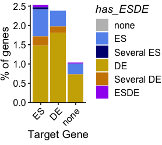

# Setup

## Load genes and delocalization scores

```r
allgenes <- read_parquet(here('../rdana/genes/data-output/allgenes_final.parquet'))

delocdata <- read_parquet(here('../rdana/cacoarse/data-output/delocalization_scores.exonsModel.parquet')) #delocalization score
tscores <- delocdata %>%
  dplyr::filter(deloc_score_type=='deloc_trans') %>%
  dplyr::select(GeneID, cell, annotation_type, delocalization_score.calibrated, p.high.corr) %>%
  dplyr::mutate(isbb = case_when(p.high.corr<0.05 ~ T, T~F))  

bb <- tscores %>% dplyr::filter(isbb==T) %>% pull(GeneID) %>% unique() # keep track of borad binders to remove in all plots
```


## Load and simplify expression data 


```r
exprdata <- read_parquet(here('../rdana/carnas/data-output/expression.rnacharIndep.exonsScaling.Q255Q40.with_unannotated.parquet')) #expression
```


```r
cleanup_expression <- function(edata, genedata, p_enr = 0.05, thr_enr = 3){
  exprdata <- edata  %>%
    dplyr::select(annotation_type, GeneID, padj.char, padj.rna, FPM.ES.char, FPM.DE.char, FPM.ES.rna, FPM.DE.rna, log2FoldChange.char, log2FoldChange.rna) %>%
    dplyr::rename(FPM.char.ES = FPM.ES.char, FPM.char.DE = FPM.DE.char, FPM.rna.ES = FPM.ES.rna, FPM.rna.DE = FPM.DE.rna) %>%
    mutate(across(starts_with('FPM'),  ~replace_na(.x, 0))) %>%
    mutate(deg.rna = case_when((log2FoldChange.rna>log2(thr_enr)) & (padj.rna<p_enr) ~ 'DE', (log2FoldChange.rna<log2(1/thr_enr)) & (padj.rna<p_enr) ~ 'ES', T~'none'),
           deg.char = case_when((log2FoldChange.char>log2(thr_enr)) & (padj.char<p_enr) ~ 'DE', (log2FoldChange.char<log2(1/thr_enr)) & (padj.char<p_enr) ~ 'ES', T~'none')) %>%
    mutate(across(starts_with("deg"), function (h) factor(h, levels=c("ES","DE","none"))))

  #Figure out threshold for expression levels by using all protein coding across cells quartiles
  #Compute decile of expression for RNA and char separately, eliminating zeros
  FPM.char.ntiles <- exprdata %>%
    left_join(genedata %>% dplyr::select(GeneID, annotation_type, rna_type)) %>%
    pivot_longer(starts_with("FPM"), names_pattern = "(.*)\\.(..)", names_to=c(".value", "cell")) %>%
    dplyr::filter(FPM.char>0, !is.na(FPM.char), rna_type=='mRNA', annotation_type=='exons') %>%
    pull(FPM.char) %>%
    quantile(., probs = seq(0, 1, length=11))

  FPM.char.ntiles[1]<- -Inf
  FPM.char.ntiles[11]<- Inf

  FPM.rna.ntiles <- exprdata %>%
        left_join(genedata %>% dplyr::select(GeneID, annotation_type, rna_type)) %>%
    pivot_longer(starts_with("FPM"), names_pattern = "(.*)\\.(..)", names_to=c(".value", "cell")) %>%
    dplyr::filter(FPM.rna>0, !is.na(FPM.rna), rna_type=='mRNA', annotation_type=='exons') %>%
    pull(FPM.rna) %>%
    quantile(., probs = seq(0, 1, length=11))

  FPM.rna.ntiles[1]<- -Inf
  FPM.rna.ntiles[11]<- Inf

  #Add the decile info to exprdata
  exprdata <- exprdata %>%
    mutate(across(starts_with("FPM.char"), ~cut(., FPM.char.ntiles, right=F, labels=F), .names = "decile{col}"),
           across(starts_with("FPM.rna"), ~cut(., FPM.rna.ntiles, right=F, labels=F), .names = "decile{col}"))

  return(exprdata)
}
```


```r
exprdata_clean <- cleanup_expression(exprdata, allgenes, p_enr = 0.05, thr_enr = 3)
```

```
## Joining, by = c("annotation_type", "GeneID")
## Joining, by = c("annotation_type", "GeneID")
```


## Load contactome

```r
load_deseq <- function(data_root="data/forDEseq2022-04-10/deseqOUT", interval_name="5MbCover", cistrans = list(cis = "cisDecay_withbias", trans = "dnabias_leak"), cellOrModel = "Cell"){

  l_eix = list(exons = c("exons","exons"), introns = c("introns","introns"), intergenic = c("intergenic","exons"))

deseq_out <- bind_rows(
  sapply(names(cistrans), function(h) {bind_rows(lapply(l_eix, function(x){ read_parquet(here(data_root,paste0(interval_name,".", x[[1]],".",cistrans[[h]],".",x[[2]],"Model.",h, "_DESEQout_",cellOrModel,"Enrich_withgeneinfo.parquet")))}), .id='rnatype')}, simplify=F), .id='cistrans')
  

deseq_out <- deseq_out %>%
  dplyr::rename(GeneID.src=ENSG.src, GeneID.tgt=ENSG.tgt, annotation_type.src=rnatype) %>%
  dplyr::select(-c(name.src, name.tgt, type_coarse.src))
return(deseq_out)

}


   
longify_contactome <- function(deseq_out, genedata, tgt_def_file=NULL){
  out <- 
    deseq_out %>%
    dplyr::select(cistrans, annotation_type.src, GeneID.src, GeneID.tgt, delta, pvalue.ES.int, padj.ES.int, pvalue.DE.int, padj.DE.int, log2FoldChange.ES.int, log2FoldChange.DE.int, starts_with("Nraw")) %>%
      dplyr::rename_with(.fn =  function(h) {stringr::str_remove(h, "\\.int$")}, .cols=ends_with(".int")) %>%
   pivot_longer(-c(cistrans, annotation_type.src, GeneID.src, GeneID.tgt, delta), names_to=c(".value","cell"), names_pattern="(.*)\\.(..)")
  
  out <- out %>%
      inner_join(genedata %>% rename_all(function(x) paste0(x,".src")), by=c('GeneID.src','annotation_type.src'))
  
  if (!is.null(tgt_def_file)){
    tgt_genes_names <- read_parquet(tgt_def_file) %>%
      dplyr::rename(GeneID = ENSG ) %>%
    rename_all(function(x) paste0(x,".tgt"))
    
    out<- out %>% left_join(tgt_genes_names, by='GeneID.tgt')
  }
  
  return(out)
} 

get_delta <- function(src_start, src_stop, tgt_start, tgt_stop){
  out<- (-pmin(src_stop-tgt_start,0)-pmax(src_start-tgt_stop,0))
  return(out)
}
```


```r
deseq_out_genes_Cell <- load_deseq(data_root="../rdana/contactome/data/forDEseq2022-03-14/deseqOUT", interval_name="mRNAp10kbpM90kbp", cistrans = list(cis = "cisDecay_withbias", trans = "dnabias_noleak"),  cellOrModel='Cell')
```

## Simplify contactome


```r
add_e_info <- function(cts, edata){ # to applut after adding gene info!)
  
edata2 <- edata %>%
  rename_with(.cols = ends_with(".char"), .fn = ~ paste0(.x, ".ED")) %>%
  rename_with(.cols = ends_with(".rna"), .fn = ~ paste0(.x, ".ED"))
  
  
out <- cts %>%
    left_join(edata2 %>% rename_with(.fn = ~ paste0(.x, ".src")), 
              by=c("GeneID.src","annotation_type.src")) %>%
    separate(GeneID.tgt, c("GeneIDnodot.tgt"), sep="\\.", remove = F, extra = "drop") %>%
     left_join(edata2 %>% 
                 dplyr::filter(annotation_type=='exons') %>%
                 dplyr::select(-annotation_type) %>%
                 rename_with(.fn = ~ paste0(.x, ".tgt")) %>%
                 separate(GeneID.tgt, c("GeneIDnodot.tgt"), sep="\\.", remove = T, extra = "drop"), 
              by=c("GeneIDnodot.tgt")) %>% 
  dplyr::select(-GeneIDnodot.tgt)

return(out)
}


simplify_contactome_cell <- function(deseq_out, genedata, edata, tgt_def_file=NULL){
  out <- 
    deseq_out %>%
      dplyr::select(GeneID.src, GeneID.tgt, annotation_type.src, cistrans, ends_with(".int"))
  
  out <- out %>%
      inner_join(genedata %>% rename_all(function(x) paste0(x,".src")), by=c('GeneID.src','annotation_type.src'))
  
  if (!is.null(tgt_def_file)){
    tgt_genes_names <- read_parquet(tgt_def_file) %>%
      dplyr::rename(GeneID = ENSG ) %>%
    rename_all(function(x) paste0(x,".tgt"))
    
    out<- out %>% left_join(tgt_genes_names, by='GeneID.tgt')
  }
  
  out <- add_e_info(out, edata)
  return(out)
} 
```


```r
contactome_simple <- simplify_contactome_cell(deseq_out_genes_Cell, 
                                                        allgenes %>% dplyr::select(GeneID, annotation_type, name, chr, start, stop, rna_type, rna_subtype),
                                                        exprdata_clean,
                                                        tgt_def_file =  here('../rdana/contactome/data-raw/tgt_genes_names_promoters.parquet')
                        ) %>%
  relocate(name.src, rna_type.src, rna_subtype.src) %>%
  dplyr::mutate(delta = case_when((chr.src==chr.tgt) ~ get_delta(start.src, stop.src, prime5.tgt, prime5.tgt), T ~ Inf))
```


```r
thr_enr = 1.3
p_enr = 0.05 

contactome_simple_long <- contactome_simple %>%
  dplyr::filter((FPM.char.ES.src + FPM.char.DE.src)>0.2, (FPM.rna.ES.tgt + FPM.rna.DE.tgt)>0.2) %>% 
  dplyr::select(annotation_type.src, cistrans, name.src, name.tgt, GeneID.tgt,GeneID.src, rna_type.src, rna_subtype.src, log2FoldChange.obs.int, log2FoldChange.exp.int, padj.obs.int, padj.exp.int, deg.char.ED.src, deg.rna.ED.tgt, deg.obs.int, deg.exp.int) %>%
   separate(GeneID.tgt, c("GeneIDnodot.tgt"), sep="\\.", remove = F, extra = "drop") %>%
  rename_with(.cols = -starts_with("name"), .fn = ~ sub("\\.int$", "", .x)) %>%
  pivot_longer(-c("annotation_type.src", "cistrans", "name.src","name.tgt","GeneID.tgt","GeneID.src","GeneIDnodot.tgt", "deg.char.ED.src","deg.rna.ED.tgt","rna_type.src", "rna_subtype.src"), names_pattern = "(.*)\\.(...)", names_to=c(".value", "sequencing")) %>%
  mutate(deg = case_when((log2FoldChange>log2(thr_enr)) & (padj<p_enr) ~ 'DE', (log2FoldChange<log2(1/thr_enr)) & (padj<p_enr) ~ 'ES', T~'none')) %>%
  mutate(deg = factor(deg, levels = c("none","DE","ES")), sequencing = factor(sequencing, levels=c("obs","exp"))) %>%
  dplyr::filter(deg.rna.ED.tgt %in% c("none","ES","DE")) %>%
  dplyr::mutate(across(c(deg, deg.char.ED.src, deg.rna.ED.tgt), ~ factor(.x, levels=c("ES","DE","none")))) 
```


# Scatter plots


```r
scatter_src_vs_contact <- function(d, thr_enr=1, p_enr = 0.05){

d %>%
  
  mutate(deg.obs.int = case_when((log2FoldChange.obs.int>log2(thr_enr)) & (padj.obs.int<p_enr) ~ 'DE', (log2FoldChange.obs.int<log2(1/thr_enr)) & (padj.obs.int<p_enr) ~ 'ES', T~'none')) %>%
    mutate(deg.rna.ED.tgt = case_when((log2FoldChange.rna.ED.tgt>log2(thr_enr)) & (padj.rna.ED.tgt<p_enr) ~ 'DE', (log2FoldChange.rna.ED.tgt<log2(1/thr_enr)) & (padj.rna.ED.tgt<p_enr) ~ 'ES', T~'none')) %>%
     mutate(deg.char.ED.src = case_when((log2FoldChange.char.ED.src>log2(thr_enr)) & (padj.char.ED.src<p_enr) ~ 'DE', (log2FoldChange.char.ED.src<log2(1/thr_enr)) & (padj.char.ED.src<p_enr) ~ 'ES', T~'none')) %>%
  ggplot(aes(x=log2FoldChange.obs.int, y=log2FoldChange.char.ED.src, color=deg.obs.int))+
   scale_color_manual(values=c(none='black', ES="cornflowerblue", DE="gold3"))+
   rasterise(geom_point(alpha=0.5, size=1), dev="ragg", dpi=300) +
  #colorspace::scale_color_continuous_diverging(palette = "Blue-Red 2")+
  #geom_abline(intercept = 0, slope = 1, col="black", linetype="dotted")+
  geom_hline(yintercept = 0, col="black", linetype="dotted", size=0.5) +
  geom_vline(xintercept = 0, col="black", linetype="dotted", size=0.5)+
  geom_abline()+

theme_publish()+
  scale_y_continuous(expand = c(0,0)) +
  theme(legend.position = "right", legend.direction = "vertical")+
  labs(y='LFC ncRNA', x="LFC contact", color='Contact')+
  theme(legend.position = "right", legend.direction = "vertical", axis.text.x = element_text(angle=45, hjust=1))->p
return(p)

}

scatter_tgt_vs_contact <- function(d, thr_enr=1, p_enr = 0.05){

d %>%
  
  mutate(deg.obs.int = case_when((log2FoldChange.obs.int>log2(thr_enr)) & (padj.obs.int<p_enr) ~ 'DE', (log2FoldChange.obs.int<log2(1/thr_enr)) & (padj.obs.int<p_enr) ~ 'ES', T~'none')) %>%
    mutate(deg.rna.ED.tgt = case_when((log2FoldChange.rna.ED.tgt>log2(thr_enr)) & (padj.rna.ED.tgt<p_enr) ~ 'DE', (log2FoldChange.rna.ED.tgt<log2(1/thr_enr)) & (padj.rna.ED.tgt<p_enr) ~ 'ES', T~'none')) %>%
     mutate(deg.char.ED.src = case_when((log2FoldChange.char.ED.src>log2(thr_enr)) & (padj.char.ED.src<p_enr) ~ 'DE', (log2FoldChange.char.ED.src<log2(1/thr_enr)) & (padj.char.ED.src<p_enr) ~ 'ES', T~'none')) %>%
  ggplot(aes(x=log2FoldChange.obs.int, y=log2FoldChange.rna.ED.tgt, color=deg.obs.int))+
   scale_color_manual(values=c(none='black', ES="cornflowerblue", DE="gold3"))+
   rasterise(geom_point(alpha=0.5, size=1), dev="ragg", dpi=300) +
  #colorspace::scale_color_continuous_diverging(palette = "Blue-Red 2")+
  #geom_abline(intercept = 0, slope = 1, col="black", linetype="dotted")+
  geom_hline(yintercept = 0, col="black", linetype="dotted", size=0.5) +
  geom_vline(xintercept = 0, col="black", linetype="dotted", size=0.5)+
  geom_abline()+

theme_publish()+
  scale_y_continuous(expand = c(0,0)) +
  theme(legend.position = "right", legend.direction = "vertical")+
  labs(y='LFC target gene', x="LFC contact", color='Contact')+
  theme(legend.position = "right", legend.direction = "vertical", axis.text.x = element_text(angle=45, hjust=1))->p
return(p)

}
```


```r
d<- contactome_simple %>% dplyr::filter(cistrans!='cis2', annotation_type.src=='exons', rna_type.src=='lncRNA', padj.obs.int<0.05) %>%
                              bind_rows(contactome_simple %>% dplyr::filter(cistrans!='cis2', annotation_type.src=='intergenic', !rna_type.src %in% c('tRNAderived','snRNAderived'), padj.obs.int<0.05))
                                        
p <- scatter_tgt_vs_contact(d, thr_enr=1, p_enr = 0.05)

fname <- 'scatter_LCFtargetVSLFCcontact.pdf'
p_fixed<- prettysave(p, here('figures/genesContactome', fname), panel.width=2, panel.height=2)
```

```
## Warning: Removed 7259 rows containing missing values (geom_point).
```

```
## [1] "fig.width=3.6, fig.height=2.7"
```

```r
plot_grid(p_fixed)
```

<!-- -->


```r
p <- scatter_src_vs_contact(d, thr_enr=1, p_enr = 0.05)

fname <- 'scatter_LCFncRNAVSLFCcontact.pdf'
p_fixed<- prettysave(p, here('figures/genesContactome', fname), panel.width=2, panel.height=2)
```

```
## [1] "fig.width=3.5, fig.height=2.7"
```

```r
plot_grid(p_fixed)
```

<!-- -->


```r
d %>% 
  ggplot(aes(x=log2FoldChange.exp.int, y=log2FoldChange.obs.int, color=log2FoldChange.char.ED.src))+
   #scale_color_manual(values=c(none='black', ES="cornflowerblue", DE="gold3"))+
   geom_point(alpha=0.5, size=0.5) +
  colorspace::scale_color_continuous_diverging(palette = "Blue-Red 2")+
  #geom_abline(intercept = 0, slope = 1, col="black", linetype="dotted")+
  geom_hline(yintercept = 0, col="black", linetype="dotted", size=0.5) +
  geom_vline(xintercept = 0, col="black", linetype="dotted", size=0.5)+
  geom_abline()+

theme_publish()+
  scale_y_continuous(expand = c(0,0)) + 
  theme(legend.position = "right", legend.direction = "vertical")+
  labs(x='LFC contact expected', y="LFC contact observed", color='LFC\nsource')+
  theme(legend.position = "right", legend.direction = "vertical", axis.text.x = element_text(angle=45, hjust=1))->p

fname <- "scatter_LCFobsVSLFCmodel.pdf"
p_fixed<- prettysave(p, here('figures/genesContactome', fname), panel.width=2, panel.height=2)
```

```
## [1] "fig.width=3.4, fig.height=2.7"
```

```r
plot_grid(p_fixed)
```

<!-- -->


# Simple bar plots

```r
count_cases_tgt <- function(d, thr_enr=1, p_enr = 0.05){

out <- d %>%
  mutate(deg.obs.int = case_when((log2FoldChange.obs.int>log2(thr_enr)) & (padj.obs.int<p_enr) ~ 'DE', (log2FoldChange.obs.int<log2(1/thr_enr)) & (padj.obs.int<p_enr) ~ 'ES', T~'none')) %>%
    mutate(deg.rna.ED.tgt = case_when((log2FoldChange.rna.ED.tgt>log2(thr_enr))  ~ 'DE', (log2FoldChange.rna.ED.tgt<log2(1/thr_enr))  ~ 'ES', T~'none')) %>%
     mutate(deg.char.ED.src = case_when((log2FoldChange.char.ED.src>log2(thr_enr))~ 'DE', (log2FoldChange.char.ED.src<log2(1/thr_enr)) ~ 'ES', T~'none')) %>%
    dplyr::count(deg.obs.int, deg.rna.ED.tgt) %>%
  dplyr::filter(deg.rna.ED.tgt!='none') %>%
    group_by(deg.obs.int) %>%
    mutate(per = n/sum(n)*100) %>%
    ungroup()
  return(out)
}


count_cases_src <- function(d, thr_enr=1, p_enr = 0.05){

out <- d %>%
  mutate(deg.obs.int = case_when((log2FoldChange.obs.int>log2(thr_enr)) & (padj.obs.int<p_enr) ~ 'DE', (log2FoldChange.obs.int<log2(1/thr_enr)) & (padj.obs.int<p_enr) ~ 'ES', T~'none')) %>%
    mutate(deg.rna.ED.tgt = case_when((log2FoldChange.rna.ED.tgt>log2(thr_enr))  ~ 'DE', (log2FoldChange.rna.ED.tgt<log2(1/thr_enr))  ~ 'ES', T~'none')) %>%
     mutate(deg.char.ED.src = case_when((log2FoldChange.char.ED.src>log2(thr_enr))~ 'DE', (log2FoldChange.char.ED.src<log2(1/thr_enr)) ~ 'ES', T~'none')) %>%
    dplyr::count(deg.obs.int, deg.char.ED.src) %>%
  dplyr::filter(deg.char.ED.src!='none') %>%
    group_by(deg.obs.int) %>%
    mutate(per = n/sum(n)*100) %>%
    ungroup()
  return(out)
}
```


```r
count_cases_tgt(contactome_simple %>% dplyr::filter(cistrans!='cis2', annotation_type.src=='exons', rna_type.src=='lncRNA', padj.obs.int<0.05) , thr_enr=1, p_enr = 0.05)
```

```
## # A tibble: 4 × 4
##   deg.obs.int deg.rna.ED.tgt     n   per
##   <chr>       <chr>          <int> <dbl>
## 1 DE          DE               195  60.9
## 2 DE          ES               125  39.1
## 3 ES          DE                25  37.3
## 4 ES          ES                42  62.7
```


```r
theselevels <- c("ESDE","Several ES", "ES", "Several DE", "DE","none")
plot_connection_stats <- function(d, ngenes_bydeg){
 d %>%
            dplyr::select(GeneID.tgt, deg, deg.rna.ED.tgt) %>%
            group_by(GeneID.tgt, deg.rna.ED.tgt) %>%
            summarize(has_ESDE = case_when((sum(deg=='ES')>0) & (sum(deg=='DE')>0) ~ 'ESDE', (sum(deg=='ES')>1) ~ 'Several ES', (sum(deg=='DE')>1) ~ 'Several DE', (sum(deg=='ES')>0) ~ 'ES', (sum(deg=='DE')>0) ~ 'DE', T ~ 'none')
                      ) %>%
            ungroup() %>%
            mutate(has_ESDE = factor(has_ESDE, levels = theselevels), deg.rna.ED.tgt = factor( deg.rna.ED.tgt, levels =theselevels)) %>%
            
            #dplyr::rename(Interaction=has_ESDE,`Gene target`=deg.rna.ED.tgt) %>%
  dplyr::count(deg.rna.ED.tgt, has_ESDE) %>%
   ungroup() %>%
   left_join(ngenes_bydeg, by=c("deg.rna.ED.tgt"="deg.rna")) %>%
           group_by(deg.rna.ED.tgt) %>%
            mutate(per = n/n_deg*100) %>%
  dplyr:: filter(has_ESDE!="none") %>%
  ggplot(aes(x=deg.rna.ED.tgt , y=per, fill=has_ESDE)) +
           geom_col()+
          scale_fill_manual(values=c(none='grey', ES="cornflowerblue", `Several ES`="navyblue", DE="gold3", `Several DE`="orange3", ESDE="purple"))+
  theme_publish()+
   scale_y_continuous(expand = c(0,0)) + 
   theme(legend.position = "right", legend.direction = "vertical", axis.text.x = element_text(angle=45, hjust=1)) +
    labs(x='Target Gene', y = "% of genes") ->p
  
  return(p)
}
```


Fgure out number of tgt gene in each categorie

```r
tgtgenes <- read_parquet(here('../rdana/contactome/data-raw/tgt_genes_names_promoters.parquet')) %>%
  dplyr::select(ENSG) %>%
  separate(ENSG, c("GeneIDnodot"), sep="\\.", remove = T, extra = "drop") %>%
  left_join(exprdata_clean %>% 
             dplyr::filter(annotation_type=='exons') %>%
             dplyr::select(-annotation_type) %>%
             separate(GeneID, c("GeneIDnodot"), sep="\\.", remove = T, extra = "drop"), 
              by=c("GeneIDnodot")) %>%
  dplyr::mutate(deg.rna = replace_na(deg.rna, "none"), deg.char = replace_na(deg.char, "none"))


ngenes_bydeg <-  tgtgenes %>%
  dplyr::count(deg.rna,name = "n_deg") %>%
  mutate(per_deg = n_deg/sum(n_deg)*100)

ngenes_bydeg
```

```
## # A tibble: 3 × 3
##   deg.rna n_deg per_deg
##   <fct>   <int>   <dbl>
## 1 ES       1696    8.45
## 2 DE       1217    6.07
## 3 none    17152   85.5
```


```r
p <- plot_connection_stats(contactome_simple_long %>% 
                               dplyr::filter(cistrans=='cis', sequencing=='obs', annotation_type.src=='exons', rna_type.src == 'lncRNA', !GeneID.src %in% bb), ngenes_bydeg)
```

```
## `summarise()` has grouped output by 'GeneID.tgt'. You can override using the
## `.groups` argument.
```

```r
fname <- "simplebarplot_tgt_lncRNA.pdf"
p_fixed<- prettysave(p, here('figures/genesContactome', fname), panel.width=1, panel.height=1.75)
```

```
## [1] "fig.width=2.9, fig.height=2.6"
```

```r
plot_grid(p_fixed)
```

<!-- -->


```r
p <- plot_connection_stats(contactome_simple_long %>% 
                               dplyr::filter(cistrans=='cis', sequencing=='obs', annotation_type.src=='intergenic',!rna_type.src %in% c("snRNAderived","sRNAderived","tRNAderived"), !GeneID.src %in% bb), ngenes_bydeg)
```

```
## `summarise()` has grouped output by 'GeneID.tgt'. You can override using the
## `.groups` argument.
```

```r
fname <- "simplebarplot_tgt_allUTL.pdf"
p_fixed<- prettysave(p, here('figures/genesContactome', fname), panel.width=1, panel.height=1.75)
```

```
## [1] "fig.width=3, fig.height=2.6"
```

```r
plot_grid(p_fixed)
```

<!-- -->

```r
p <- plot_connection_stats(contactome_simple_long %>% 
                               dplyr::filter(cistrans=='cis', sequencing=='obs', annotation_type.src=='intergenic', rna_type.src=='cre', !GeneID.src %in% bb), ngenes_bydeg)
```

```
## `summarise()` has grouped output by 'GeneID.tgt'. You can override using the
## `.groups` argument.
```

```r
fname <- "simplebarplot_tgt_cre.pdf"
p_fixed<- prettysave(p, here('figures/genesContactome', fname), panel.width=1, panel.height=1.75)
```

```
## [1] "fig.width=3, fig.height=2.6"
```

```r
plot_grid(p_fixed)
```

<!-- -->

```r
p <- plot_connection_stats(contactome_simple_long %>% 
                               dplyr::filter(cistrans=='cis', sequencing=='obs', annotation_type.src=='intergenic', rna_type.src=='repeat', !GeneID.src %in% bb), ngenes_bydeg)
```

```
## `summarise()` has grouped output by 'GeneID.tgt'. You can override using the
## `.groups` argument.
```

```r
fname <- "simplebarplot_tgt_repeat.pdf"
p_fixed<- prettysave(p, here('figures/genesContactome', fname), panel.width=1, panel.height=1.75)
```

```
## [1] "fig.width=3, fig.height=2.6"
```

```r
plot_grid(p_fixed)
```

<!-- -->

# Lollipos


```r
lightblue="#85A1C9"
darkblue="#165BBF"

lightyellow ="#EAD88B"
darkyellow="#E0B810"

plot_top_differential <- function(d, ntop=20){
top_connect <- d %>%
    dplyr::select(GeneID.src, name.src, name.tgt, padj.obs.int,  log2FoldChange.obs.int,padj.exp.int,  log2FoldChange.exp.int, delta, deg.char.ED.src,deg.rna.ED.tgt, start.src) %>%
    rename_with(.cols = -c(GeneID.src, name.src, name.tgt,delta, deg.char.ED.src,deg.rna.ED.tgt, start.src), .fn = ~ sub("\\.int$", "", .x)) %>%
    pivot_longer( -c(GeneID.src, name.src, name.tgt, delta,  deg.char.ED.src,deg.rna.ED.tgt, start.src), names_pattern = "(.*)\\.(...)", names_to=c(".value", "sequencing")) %>%
    mutate(deg = case_when((log2FoldChange>log2(thr_enr)) & (padj<p_enr) ~ 'obs', (log2FoldChange<log2(1/thr_enr)) & (padj<p_enr) ~ 'exp', T~"none")) %>%
    mutate(padj = replace_na(padj,1)) %>%
  group_by(sequencing) %>%
  arrange(padj) %>%
  slice_head(n=ntop)  %>%
  ungroup() %>%
  mutate(intx = paste0(name.src,"_",name.tgt)) 

myconnect <- top_connect %>% dplyr::filter(sequencing=='obs') %>% dplyr::pull(intx) %>% unique()
lvls = top_connect %>% dplyr::filter(intx %in% myconnect) %>% dplyr::select(intx, padj) %>% group_by(intx) %>% arrange(padj) %>% slice_head(n=1) %>% pull(intx)
lvls_labs = top_connect %>% dplyr::filter(intx %in% myconnect) %>% dplyr::select(intx, padj, name.src) %>% group_by(intx) %>% arrange(padj) %>% slice_head(n=1) %>% pull(name.src)

nrow=length(lvls)

top_connect <- top_connect %>% mutate(intx = factor(intx, levels = lvls))

 top_connect %>% 
   mutate(delta2 = pmax(1000, abs(delta))) %>%
   mutate(x2 = if_else(sequencing=='obs', delta2*1, delta2*1.4)) %>%
   ggplot(aes(x=delta2, y=intx, color=sequencing))+
   geom_segment(aes(xend =delta2, yend = intx, x=1000), show.legend = F)+
   geom_point(aes(x=x2), size=2)+

   geom_text(aes(label = name.tgt, x=2e6, color=deg.rna.ED.tgt), hjust="left", show.legend = F, data = . %>% group_by(intx) %>% slice_head(n=1))+
   geom_text(aes(label = name.src, x=1e3, color=deg.char.ED.src), hjust="right", show.legend = F, nudge_x = -0.5, data = . %>% group_by(intx) %>% slice_head(n=1))+
   scale_x_continuous(trans='log10',position = "top", expand = c(0,0), breaks =c(1e3, 1e4, 1e5, 1e6), labels = c(1, 10, 100, 1000))+
   scale_y_discrete(limits = rev(lvls), labels = NULL)+ #rev(lvls_labs))+
   geom_vline(xintercept = c(1,10,100, 1000)*1000, linetype='dotted')+
   
   labs(x="ncRNA-gene distance [kbp]", y="")+
   scale_color_manual(values=c(obs="navyblue", exp="purple", none="black", ES=darkblue, DE=darkyellow))+
   #scale_x_discrete() 
   theme_publish()+
   coord_cartesian(xlim = c(1e3, 3e6), clip = "off")->p
 
 return(p)

  }
```


```r
plot_top_differential(contactome_simple %>% 
  dplyr::filter(annotation_type.src=='exons', rna_type.src=='lncRNA', cistrans=='cis', deg.obs.int=='ES') %>% dplyr::filter(!GeneID.src %in% bb), 20) ->p

fname <- "lollipopDifferentialES_top20_lncRNAs.pdf"
p_fixed<- prettysave(p, here('figures/genesContactome', fname), panel.width=1.4, panel.height=2.8*nrow(p$data)/40)
```

```
## Warning: Removed 8 rows containing missing values (geom_segment).
```

```
## Warning: Removed 8 rows containing missing values (geom_point).
```

```
## Warning: Removed 1 rows containing missing values (geom_text).
## Removed 1 rows containing missing values (geom_text).
```

```
## [1] "fig.width=1.8, fig.height=3.7"
```

```r
plot_grid(p_fixed)
```

<!-- -->


```r
plot_top_differential(contactome_simple %>% 
  dplyr::filter(annotation_type.src=='exons', rna_type.src=='lncRNA', cistrans=='cis', deg.obs.int=='DE') %>% dplyr::filter(!GeneID.src %in% bb), 20) ->p

fname <- "lollipopDifferentialDE_top20_lncRNAs.pdf"
p_fixed<- prettysave(p, here('figures/genesContactome', fname), panel.width=1.4, panel.height=2.8*nrow(p$data)/40)
```

```
## Warning: Removed 2 rows containing missing values (geom_segment).
```

```
## Warning: Removed 2 rows containing missing values (geom_point).
```

```
## Warning: Removed 1 rows containing missing values (geom_text).
## Removed 1 rows containing missing values (geom_text).
```

```
## [1] "fig.width=1.8, fig.height=3.7"
```

```r
plot_grid(p_fixed)
```

<!-- -->
# Percent differentially enriched


```r
thr_enr=1.3
p_enr = 0.05

cts_interaction_diff <- contactome_simple %>% 
dplyr::select(annotation_type.src, GeneID.src, rna_type.src, rna_subtype.src, name.src, name.tgt, padj.obs.int, padj.exp.int, log2FoldChange.obs.int, log2FoldChange.exp.int, delta, deg.char.ED.src,deg.rna.ED.tgt, start.src) %>%
  dplyr::filter(name.src != name.tgt) %>%
  dplyr::filter(!GeneID.src %in% bb) %>%
    rename_with(.cols = -c(annotation_type.src, GeneID.src, rna_type.src, rna_subtype.src, name.src, name.tgt,delta, deg.char.ED.src,deg.rna.ED.tgt, start.src), .fn = ~ sub("\\.int$", "", .x)) %>%
    pivot_longer( -c(annotation_type.src, GeneID.src, rna_type.src, rna_subtype.src, name.src, name.tgt, delta,  deg.char.ED.src,deg.rna.ED.tgt, start.src), names_pattern = "(.*)\\.(...)", names_to=c(".value", "sequencing")) %>%
    mutate(deg = case_when((log2FoldChange>log2(thr_enr)) & (padj<p_enr) ~ 'DE', (log2FoldChange<log2(1/thr_enr)) & (padj<p_enr) ~ 'ES', T~"none")) %>%
  #dplyr::filter(deg=='obs') %>%
  dplyr::count(sequencing, deg, annotation_type.src, rna_type.src) %>%
  group_by(sequencing, annotation_type.src, rna_type.src) %>%
   mutate(nint = sum(n)) %>%
  #dplyr::filter(rnatype!='intergenic') %>%
  group_by(sequencing, annotation_type.src, rna_type.src) %>%
  mutate(per = n/sum(n)*100) %>%
  ungroup() %>%
  dplyr::filter(deg!='none') %>%
  arrange(desc(per))
```


```r
plot_PercentDifferentential  <- function(cts_diff){

cts_diff %>%
ggplot(aes(x=rna_type.src, y=per, fill=deg))+
  geom_col()+
  theme_publish() +
  scale_y_continuous(expand = c(0,0)) + 
 theme(legend.position = "right", legend.direction = "vertical", axis.text.x = element_text(angle=45, hjust=1)) +
  labs(x=NULL, y = "% interactions") +
 scale_fill_manual(values=c( ES="cornflowerblue", DE="gold3"))+
  lemon::facet_rep_wrap(~annotation_type.src+sequencing, scales = "free", nrow=1)->p
return(p)
}
```


```r
plot_PercentDifferentential(
cts_interaction_diff %>% dplyr::filter(annotation_type.src %in% c("exons","introns"), rna_type.src %in% c("ncRNA","mRNA","lncRNA")) %>%
  mutate(sequencing= factor(sequencing, levels = c("obs","exp")), rnatype=factor(annotation_type.src, levels = c("exons","introns")), rna_type.src = forcats::fct_relevel(rna_type.src, "mRNA","lncRNA","ncRNA")) 
) ->p

fname <- "barplot_NinteractionDifferential_per_TSSp10m90kb_ei.pdf"
p_fixed<- prettysave(p, here('figures/genesContactome', fname), panel.width=0.2*3, panel.height=0.8)
```

```
## [1] "fig.width=4.8, fig.height=2.2"
```

```r
plot_grid(p_fixed)
```

<!-- -->


```r
mylevels = c("repeat", "cre","readthrough","antisense","intergenic")

plot_PercentDifferentential(
cts_interaction_diff %>% dplyr::filter(annotation_type.src %in% c("intergenic"), rna_type.src %in% mylevels) %>%
  mutate(sequencing= factor(sequencing, levels = c("obs","exp")), rnatype=factor(annotation_type.src, levels = c("exons","introns")), rna_type.src = forcats::fct_relevel(rna_type.src, mylevels)) 
) ->p

fname <- "barplot_NinteractionDifferential_per_TSSp10m90kb_intergenic.pdf"
p_fixed<- prettysave(p, here('figures/genesContactome', fname), panel.width=0.2*5, panel.height=0.8)
```

```
## [1] "fig.width=3.7, fig.height=2.4"
```

```r
plot_grid(p_fixed)
```

<!-- -->

# Num ncRNAs with differential contacts


```r
thr_enr=1.3
p_enr = 0.05

cts_ncrna_diff <- contactome_simple %>% 
dplyr::select(annotation_type.src, GeneID.src, rna_type.src, rna_subtype.src, name.src, name.tgt, padj.obs.int, padj.exp.int, log2FoldChange.obs.int, log2FoldChange.exp.int, delta, deg.char.ED.src,deg.rna.ED.tgt, start.src) %>%
  dplyr::filter(name.src != name.tgt) %>%
  dplyr::filter(!GeneID.src %in% bb) %>%
    rename_with(.cols = -c(annotation_type.src, GeneID.src, rna_type.src, rna_subtype.src, name.src, name.tgt,delta, deg.char.ED.src,deg.rna.ED.tgt, start.src), .fn = ~ sub("\\.int$", "", .x)) %>%
    pivot_longer( -c(annotation_type.src, GeneID.src, rna_type.src, rna_subtype.src, name.src, name.tgt, delta,  deg.char.ED.src,deg.rna.ED.tgt, start.src), names_pattern = "(.*)\\.(...)", names_to=c(".value", "sequencing")) %>%
    mutate(deg = case_when((log2FoldChange>log2(thr_enr)) & (padj<p_enr) ~ 'DE', (log2FoldChange<log2(1/thr_enr)) & (padj<p_enr) ~ 'ES', T~"none")) %>%
  dplyr::filter(deg!='none') %>%
  group_by(GeneID.src, sequencing, rna_type.src) %>%
  slice_head(n=1) %>%
  ungroup() %>%
  dplyr::count(sequencing, annotation_type.src, rna_type.src) %>%
  arrange(desc(n))

  cts_ncrna_diff
```

```
## # A tibble: 25 × 4
##    sequencing annotation_type.src rna_type.src     n
##    <chr>      <chr>               <chr>        <int>
##  1 exp        introns             mRNA          4317
##  2 obs        introns             mRNA          3380
##  3 exp        intergenic          readthrough   1319
##  4 obs        intergenic          readthrough   1001
##  5 exp        exons               mRNA           751
##  6 exp        introns             lncRNA         646
##  7 exp        intergenic          cre            639
##  8 obs        exons               mRNA           542
##  9 obs        introns             lncRNA         519
## 10 obs        intergenic          cre            497
## # … with 15 more rows
```


```r
plot_Ndifferentential <- function(cts_diff){
  cts_diff %>%
    ggplot(aes(x=rna_type.src, y=n))+
    geom_col()+
    theme_publish() +
    scale_y_continuous(expand = c(0,0)) + 
   theme(legend.position = "right", legend.direction = "vertical", axis.text.x = element_text(angle=45, hjust=1)) +
    labs(x=NULL, y = " # RNAs") +
   #scale_fill_manual(values=c( ES="cornflowerblue", DE="gold3"))+
    lemon::facet_rep_wrap(~annotation_type.src, scales = "free", nrow=1)->p
  
  return(p)
}
```


lncRNA and ncRNA

```r
plot_Ndifferentential(
  cts_ncrna_diff %>% dplyr::filter(annotation_type.src %in% c("exons","introns"), rna_type.src %in% c("ncRNA","lncRNA")) %>%
  mutate(sequencing= factor(sequencing, levels = c("obs","exp")), rnatype=factor(annotation_type.src, levels = c("exons","introns")), rna_type.src = forcats::fct_relevel(rna_type.src, "lncRNA","ncRNA")) %>%
  dplyr::filter(sequencing=='obs')) ->p

fname <- "barplot_NrnaDifferential_per_TSSp10m90kb_ei.pd"
p_fixed<- prettysave(p, here('figures/genesContactome', fname), panel.width=0.2*2, panel.height=0.8)
```

```
## [1] "fig.width=1.9, fig.height=1.9"
```

```r
plot_grid(p_fixed)
```

<!-- -->
mRNA

```r
plot_Ndifferentential(
  cts_ncrna_diff %>% dplyr::filter(annotation_type.src %in% c("exons","introns"), rna_type.src %in% c("mRNA")) %>%
  mutate(sequencing= factor(sequencing, levels = c("obs","exp")), rnatype=factor(annotation_type.src, levels = c("exons","introns")), rna_type.src = forcats::fct_relevel(rna_type.src, "mRNA")) %>%
  dplyr::filter(sequencing=='obs')) ->p

fname <- "barplot_NrnaDifferential_per_TSSp10m90kb_ei_mRNA.pd"
p_fixed<- prettysave(p, here('figures/genesContactome', fname), panel.width=0.2*1, panel.height=0.8)
```

```
## [1] "fig.width=1.7, fig.height=1.8"
```

```r
plot_grid(p_fixed)
```

<!-- -->


```r
mylevels = c("repeat", "cre","readthrough","antisense","intergenic")

plot_Ndifferentential(
  cts_ncrna_diff %>% dplyr::filter(annotation_type.src %in% c("intergenic"), rna_type.src %in% mylevels) %>%
  mutate(sequencing= factor(sequencing, levels = c("obs","exp")), rna_type.src = forcats::fct_relevel(rna_type.src,mylevels)) %>%
  dplyr::filter(sequencing=='obs')) ->p

fname <- "barplot_NrnaDifferential_per_TSSp10m90kb_intergenic.pd"
p_fixed<- prettysave(p, here('figures/genesContactome', fname), panel.width=0.2*4, panel.height=0.8)
```

```
## [1] "fig.width=1.6, fig.height=2.1"
```

```r
plot_grid(p_fixed)
```

<!-- -->

# Volcano Cell


```r
plot_volcano_cellEnrich<- function(data, n_rnk=7){
  x<- data %>%
    dplyr::select(name.src, name.tgt, log2FoldChange.obs.int, log2FoldChange.exp.int, padj.obs.int, padj.exp.int, deg.obs.int, deg.exp.int) %>%
    rename_with(.cols = -starts_with("name"), .fn = ~ sub("\\.int$", "", .x)) %>%
    pivot_longer(-starts_with("name"), names_pattern = "(.*)\\.(...)", names_to=c(".value", "sequencing")) %>%
    mutate(padj = replace_na(padj,1), sequencing = factor(sequencing, levels=c("obs","exp"))) %>%

    group_by(sequencing, deg) %>%
    arrange(padj) %>%
    mutate(rnk = seq(n())) %>%
    ungroup()

  x %>% ggplot(aes(x=log2FoldChange, y=-log10(padj)))+
    scale_color_manual(values=c(none='black', ES="cornflowerblue", DE="gold3"))+
    rasterize(geom_point(aes(color=deg), alpha=0.5, size=1), dev = 'ragg', dpi=300) +
    #geom_abline(intercept = 0, slope = 1, col="black", linetype="dotted")+
    geom_hline(yintercept = 0, col="black", linetype="dotted", size=0.5) +
    geom_vline(xintercept = 0, col="black", linetype="dotted", size=0.5)+

    geom_text_repel(aes(label=ifelse((rnk<n_rnk & deg!="none") ,paste0(as.character(name.src), "_",as.character(name.tgt)), "")),
                   data=. %>% dplyr::filter((rnk<n_rnk & deg!="none")),
                   size=12/.pt,
                   #force = 1,
                  #point.size=NA,
                  seed = 42, 
                  box.padding = 0.5,
                  #max.iter = 1000,
                  #nudge_x = -0.5,
                  #nudge_y = 0.5 ,
                   min.segment.length = 0,
                  #segment.size = 0.2,
                  segment.color = 'black',
                  color='black',
                  show.legend=FALSE,
                  max.time=10,
                  max.iter = 1e6,
                  max.overlaps = Inf)+
    facet_wrap(~sequencing)+
    theme_publish()+
    scale_y_continuous(expand = c(0,0)) +
    theme(legend.position = "right", legend.direction = "vertical")+
    labs(x='Log2 Fold Change (DE/ES)', y="-log10(padj)")+
    theme(legend.position = "right", legend.direction = "vertical", axis.text.x = element_text(angle=45, hjust=1)) ->p#+
  #ylim(c(0,10))

  return(p)
}
```


```r
p<- plot_volcano_cellEnrich(contactome_simple %>% dplyr::filter(annotation_type.src=='exons', rna_type.src=='lncRNA') %>% dplyr::filter(!GeneID.src %in% bb), n_rnk=6)
fname <- "volcano_lncRNAs_cellenrich_TSSp10m90kb_exons.pdf"
p_fixed<- prettysave(p, here('figures/genesContactome', fname), panel.width=3.5, panel.height=3.5)
```

```
## [1] "fig.width=8.6, fig.height=4.5"
```

```r
plot_grid(p_fixed)
```

<!-- -->


```r
p<- plot_volcano_cellEnrich(contactome_simple %>% dplyr::filter(annotation_type.src=='intergenic', !rna_type.src %in% c('snRNAderived','tRNAderived','sRNAderived')) %>% dplyr::filter(!GeneID.src %in% bb) %>%
                              left_join(allgenes %>% dplyr::filter(annotation_type=='intergenic') %>% dplyr::select(GeneID, closest_protein) %>% dplyr::rename(GeneID.src=GeneID)) %>%
                               mutate(name.src=paste0(name.src,"_",rna_subtype.src)) , n_rnk=6)
```

```
## Joining, by = "GeneID.src"
```

```r
fname <- "volcano_lncRNAs_cellenrich_TSSp10m90kb_intergenic.pdf"
p_fixed<- prettysave(p, here('figures/genesContactome', fname), panel.width=3.5, panel.height=3.5)
```

```
## [1] "fig.width=8.6, fig.height=4.6"
```

```r
plot_grid(p_fixed)
```

<!-- -->


# Enrichement

## Frequency maps

```r
make_tally_1 <- function(cts_long, shf_map=NULL){
  
  out <-cts_long %>% dplyr::filter(name.src!=name.tgt, deg!="none") 
  if (!is.null(shf_map)){
    out<- out %>% left_join(shf_map, by="GeneIDnodot.tgt") %>%
     mutate(deg.rna.ED.tgt = factor(deg.rna.shuffle, levels=c("ES","DE","none"))) %>% dplyr::filter(name.src!=name.tgt)
  }
  
  out <-out %>% dplyr::filter(name.src!=name.tgt, deg!="none", deg.rna.ED.tgt!="none") %>%
  dplyr::count(sequencing, cistrans, annotation_type.src, rna_type.src, deg, deg.rna.ED.tgt) %>%
  mutate(across(c(deg), ~ factor(.x, levels = c("ES","DE"))))  %>%
  mutate(across(c(deg.rna.ED.tgt), ~ factor(.x, levels = c("ES","DE"))))  %>%
  group_by(sequencing, cistrans, annotation_type.src, rna_type.src, deg) %>%
  mutate(ntot=sum(n), per0 = n/sum(n)*100, lk = interaction(deg, deg.rna.ED.tgt), lk = factor(lk, levels = rev(c("ES.ES","DE.DE","ES.DE","DE.ES")))) %>%
  ungroup()
  
  return(out)
}


plot_tally <- function(t, lm=c(0,100),md=50, types_to_plot = c("mRNA","mRNA_introns", "lncRNA","lncRNA_introns", "cre","repeat", "intergenic","geneproximal","antisense")){
  t %>% 
  mutate(rna_type_ei= case_when(annotation_type.src=="introns" ~ paste0(rna_type.src,"_introns"), T ~ rna_type.src)) %>%
  dplyr::filter(rna_type_ei %in% types_to_plot) %>%
    mutate(rna_type_ei = factor(rna_type_ei, levels = types_to_plot)) %>%

  ggplot(aes(x=rna_type_ei, y = lk, fill=per0))+
  geom_tile()+
  theme_publish()+
  colorspace::scale_fill_continuous_diverging(
    palette = "Purple-Green", rev = FALSE,
    mid=md,
    limits = lm,
    #breaks = c(0, 50, 100),
    #labels = c("0", "50", "100"),
    name = "correlation",
    guide = guide_colorbar(
      direction = "horizontal",
      label.position = "bottom",
      title.position = "top",
      barwidth = grid::unit(140, "pt"),
      barheight = grid::unit(17.5, "pt"),
      ticks.linewidth = 1
    ))+
  theme( axis.text.x = element_text(angle=45, hjust=1)) ->p
  return(p)
}
```


```r
p<- plot_tally(make_tally_1(contactome_simple_long %>% dplyr::filter(cistrans=='cis', sequencing=='obs')) %>%
                 mutate(lk = factor(lk, levels = rev(c("ES.ES","ES.DE","DE.DE","DE.ES")))), lm=c(0,100), md=50)
fname <- "influence_map_observed_v2.pdf"
p_fixed<- prettysave(p, here('figures/genesContactome', fname), panel.width=0.25*9, panel.height=0.25*4)
```

```
## [1] "fig.width=3.2, fig.height=3.2"
```

```r
plot_grid(p_fixed)
```

<!-- -->

## Enrichment histograms

Get the right genes 

```r
data_int <- exprdata_clean %>% 
  dplyr::filter((decileFPM.rna.DE+decileFPM.rna.ES)>1, annotation_type=='exons') %>%
  dplyr::select(GeneID, deg.rna) %>%
  left_join(allgenes %>% dplyr::filter(annotation_type=='exons') %>% dplyr::select(GeneID,rna_type, chr), by='GeneID') %>%
  dplyr::filter(rna_type=='mRNA') %>%
  dplyr::select(-rna_type) %>%
  separate(GeneID, c("GeneIDnodot.tgt"), sep="\\.", remove = T, extra = "drop") %>%
  group_by(chr) %>%
  nest()

y0 <- lapply(data_int$data, function(x) pull(x,"deg.rna"))
#yperm <- lapply(y0, function(x) sample(x,length(x)))
idxs <- unlist(lapply(data_int$data, function(x) x %>% pull(GeneIDnodot.tgt)))
```


```r
make_tally_4<- function(cts_long, y0, idxs, n_shuf=1){
  
  d <- cts_long %>% 
    dplyr::filter(name.src!=name.tgt, deg!="none") %>%
    dplyr::select(sequencing, cistrans, annotation_type.src, GeneIDnodot.tgt, rna_type.src, deg, deg.rna.ED.tgt) %>%
      dplyr::filter(GeneIDnodot.tgt %in% idxs) %>%
      mutate(deg.rna.ED.tgt.shuffle = deg.rna.ED.tgt)
    
  d_ixs <- match(d %>% pull("GeneIDnodot.tgt"), idxs)
  #yperm <- lapply(y0, function(x) sample(x,length(x)))
  
  l = as.list(seq(n_shuf))
  for (i in seq(n_shuf)){
    #print(i)
    yperm <- unlist(lapply(y0, function(x) sample(x,length(x))))
    d[,"deg.rna.ED.tgt.shuffle"] = yperm[d_ixs]
    l[[i]] <- d %>%
      dplyr::count(sequencing, cistrans, annotation_type.src, rna_type.src, deg, deg.rna.ED.tgt.shuffle) %>%
      dplyr::mutate(lk = factor(interaction(deg, deg.rna.ED.tgt.shuffle),levels = rev(c("ES.ES","DE.DE","ES.DE","DE.ES","ES.none","DE.none")))) %>%
       mutate(lk = case_when(lk %in% c("DE.DE","ES.ES") ~ "pos", lk %in% c("ES.DE","DE.ES") ~ "neg", T ~ "neutral")) %>%
      group_by(sequencing, cistrans, annotation_type.src, rna_type.src, lk) %>%
      summarise(n=sum(n), .groups="drop") %>%
      group_by(sequencing, cistrans, annotation_type.src, rna_type.src) %>%
      transmute(lk = lk, per0 = n/sum(n)*100) %>%
      ungroup() 
  }
  
 
  l<- bind_rows(l, .id = "perm.id") %>%
  group_by(sequencing, cistrans, annotation_type.src, rna_type.src, lk) %>% 
    nest() %>%
    mutate(dataq = map(data, function(h){ tibble::enframe(quantile(h %>% pull("per0"), probs = c(0.05, 0.5, 0.95))) %>% mutate(name = stringr::str_remove(name,"%")) %>% pivot_wider(names_from = name, names_prefix = "qi_", values_from = value) %>% mutate(per0 = mean(h %>% pull("per0")))})) %>%
    dplyr::select(-data) %>%
    unnest(dataq) %>%
  ungroup()

  
  d <- d %>%
  dplyr::count(sequencing, cistrans, annotation_type.src, rna_type.src, deg, deg.rna.ED.tgt)  %>%
  dplyr::mutate(lk = factor(interaction(deg, deg.rna.ED.tgt),levels = rev(c("ES.ES","DE.DE","ES.DE","DE.ES","ES.none","DE.none")))) %>%
       mutate(lk = case_when(lk %in% c("DE.DE","ES.ES") ~ "pos", lk %in% c("ES.DE","DE.ES") ~ "neg", T ~ "neutral")) %>%
  group_by(sequencing, cistrans, annotation_type.src, rna_type.src, lk) %>%
      summarise(n=sum(n), .groups="drop") %>%
      group_by(sequencing, cistrans, annotation_type.src, rna_type.src) %>%
      transmute(lk = lk,ntot=sum(n), per0 = n/sum(n)*100) %>%
      ungroup() 
  out <- list(obs=d, simu=l)
  return(out)
}
```


```r
cts_enrichment_table <- make_tally_4(contactome_simple_long, y0, idxs, n_shuf=10000)
```


```r
cts_enrichment_table_final <- cts_enrichment_table$obs %>% 
  left_join(cts_enrichment_table$simu %>% dplyr::rename(per0_mean=per0), by=c("sequencing", "cistrans", "annotation_type.src", "rna_type.src", "lk")) %>%
  mutate(enr = per0/per0_mean, ebp = per0/(qi_5), ebm = per0/(qi_95)) %>%
  dplyr::filter(ntot>10)
```


```r
plot_enr_1 <- function(d, types_to_plot = c("mRNA","mRNA_introns", "lncRNA","lncRNA_introns", "cre","repeat", "intergenic","readthrough","antisense","smallRNA")){
  
d %>%
  #dplyr::filter((rnatype!="introns") | (subtype4.src=="lncRNA"))%>%
  mutate(rna_type_ei= case_when(annotation_type.src=="introns" ~ paste0(rna_type.src,"_introns"), T ~ rna_type.src)) %>%
  
  dplyr::filter(rna_type_ei %in% types_to_plot) %>%
    mutate(rna_type_ei = factor(rna_type_ei, levels = types_to_plot)) %>%
  mutate(lk = factor(lk, levels = c("pos","neg","neutral"))) %>%
  ggplot(aes(x=rna_type_ei, y = log2(enr), ymin=log2(ebm), ymax = log2(ebp), fill=lk)) +
  geom_col(position = position_dodge())+
  geom_errorbar(width=.2, position = position_dodge(.9))+
    scale_fill_manual(values = c(pos = "darkred", neg = "blue2", neutral = "grey50"))+
  theme_publish()+
  theme( axis.text.x = element_text(angle=45, hjust=1),legend.position = "right", legend.direction = "vertical")+
  scale_y_continuous(expand = c(0,0))+
labs(x=NULL, y = "Contacts Enrichment (log2)", fill="Influence") ->p

return(p)
}
```


```r
p<- plot_enr_1(cts_enrichment_table_final %>% dplyr::filter(sequencing=='obs', cistrans=='cis')) + ggtitle("Data cis")
fname <- "enrichment_observed.pdf"
p_fixed<- prettysave(p, here('figures/genesContactome', fname), panel.width=2.5, panel.height=1.5)
```

```
## [1] "fig.width=4.2, fig.height=2.9"
```

```r
plot_grid(p_fixed)
```

<!-- -->

```r
#ggsave2(here("figures/fig7_enrichment_observed.pdf"), dpi=300)
```


```r
p<- plot_enr_1(cts_enrichment_table_final %>% dplyr::filter(sequencing=='exp', cistrans=='cis')) + ggtitle("Model cis")
fname <- "enrichment_observed_MODEL.pdf"
p_fixed<- prettysave(p, here('figures/genesContactome', fname), panel.width=2.5, panel.height=1.5)
```

```
## [1] "fig.width=4.2, fig.height=2.9"
```

```r
plot_grid(p_fixed)
```

<!-- -->

```r
#ggsave2(here("figures/fig7_enrichment_observed.pdf"), dpi=300)
```


```r
p<- plot_enr_1(cts_enrichment_table_final %>% dplyr::filter(sequencing=='obs', cistrans=='trans'), 
               types_to_plot = c("mRNA", "mRNA_introns","lncRNA", "lncRNA_introns","cre","repeat", "intergenic","geneproximal","antisense")) + ggtitle("Data trans")
fname <- "enrichment_observed_TRANS.pdf"
p_fixed<- prettysave(p, here('figures/genesContactome', fname), panel.width=2.5, panel.height=1.5)
```

```
## [1] "fig.width=4.1, fig.height=2.9"
```

```r
plot_grid(p_fixed)
```

<!-- -->


