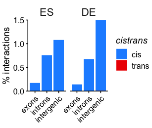
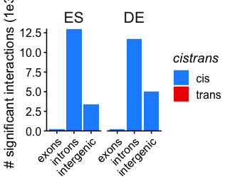
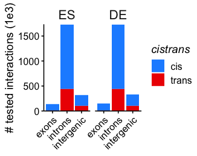
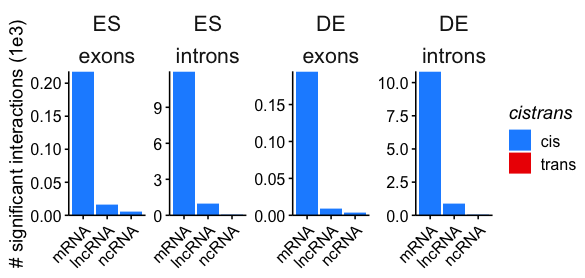
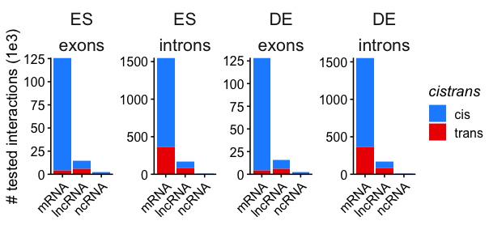
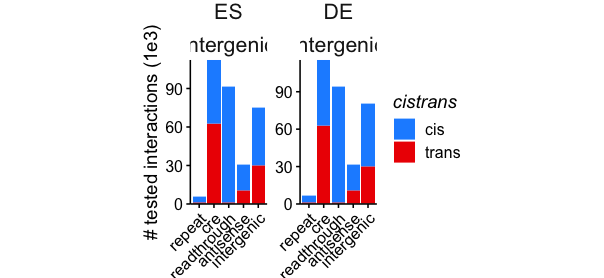
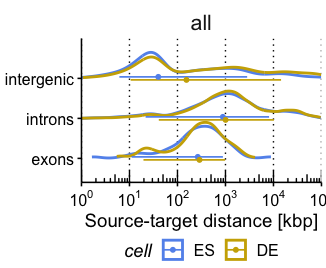
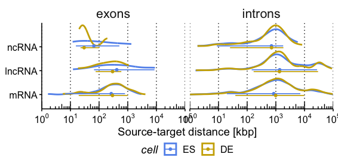

Visualization : Comparison to model
================

# Setup

``` r
allgenes <- read_parquet(here('../rdana/genes/data-output/allgenes_final.parquet'))
exprdata <- read_parquet(here('../rdana/carnas/data-output/expression.rnacharIndep.exonsScaling.Q255Q40.with_unannotated.parquet')) #expression


delocdata <- read_parquet(here('../rdana/cacoarse/data-output/delocalization_scores.exonsModel.parquet')) #delocalization score
tscores <- delocdata %>%
  dplyr::filter(deloc_score_type=='deloc_trans') %>%
  dplyr::select(GeneID, cell, annotation_type, delocalization_score.calibrated, p.high.corr) %>%
  dplyr::mutate(isbb = case_when(p.high.corr<0.05 ~ T, T~F))  
```

``` r
load_deseq <- function(data_root="data/forDEseq2022-04-10/deseqOUT", interval_name="5MbCover", cistrans = list(cis = "cisDecay_withbias", trans = "dnabias_leak")){

  l_eix = list(exons = c("exons","exons"), introns = c("introns","introns"), intergenic = c("intergenic","introns"))

deseq_out <- bind_rows(
  sapply(names(cistrans), function(h) {bind_rows(lapply(l_eix, function(x){ read_parquet(here(data_root,paste0(interval_name,".", x[[1]],".",cistrans[[h]],".",x[[2]],"Model.",h, "_DESEQout_ModelEnrich_withgeneinfo.parquet")))}), .id='rnatype')}, simplify=F), .id='cistrans')
  

deseq_out <- deseq_out %>%
  dplyr::rename(GeneID.src=ENSG.src, GeneID.tgt=ENSG.tgt, annotation_type.src=rnatype) %>%
  dplyr::select(-c(name.src, type.src))
return(deseq_out)

}


   
longify_contactome <- function(deseq_out, genedata, tgt_def_file=NULL){
  out <- 
    deseq_out %>%
    dplyr::select(cistrans, annotation_type.src, GeneID.src, GeneID.tgt, delta, pvalue.ES.int, padj.ES.int, pvalue.DE.int, padj.DE.int, log2FoldChange.ES.int, log2FoldChange.DE.int, starts_with("Nraw")) %>%
      dplyr::rename_with(.fn =  function(h) {stringr::str_remove(h, "\\.int$")}, .cols=ends_with(".int")) %>%
   pivot_longer(-c(cistrans, annotation_type.src, GeneID.src, GeneID.tgt, delta), names_to=c(".value","cell"), names_pattern="(.*)\\.(..)")
  
  out <- out %>%
      inner_join(genedata %>% rename_all(function(x) paste0(x,".src")), by=c('GeneID.src','annotation_type.src'))
  
  if (!is.null(tgt_def_file)){
    tgt_genes_names <- read_parquet(tgt_def_file) %>%
      dplyr::rename(GeneID = ENSG ) %>%
    rename_all(function(x) paste0(x,".tgt"))
    
    out<- out %>% left_join(tgt_genes_names, by='GeneID.tgt')
  }
  
  return(out)
} 

get_delta <- function(src_start, src_stop, tgt_start, tgt_stop){
  out<- (-pmin(src_stop-tgt_start,0)-pmax(src_start-tgt_stop,0))
  return(out)
}
```

# Load contactome

``` r
deseq_out_100kb <- load_deseq(data_root="../rdana/contactome/data/forDEseq2022-04-10/deseqOUT", interval_name="100kbCover", cistrans = list(cis = "cisDecay_withbias", trans = "dnabias_noleak"))
```

``` r
contactome_100kb <- longify_contactome(deseq_out_100kb , allgenes %>% dplyr::select(GeneID, annotation_type, name, chr, start, stop, rna_type, rna_subtype), tgt_def_file =  here('../rdana/contactome/data-raw/100kb_cover.parquet')) %>%
  mutate(issig = case_when((padj<0.05) & (log2FoldChange>0) ~ T, T~F)) %>%
  relocate(name.src, rna_type.src, rna_subtype.src) %>%
  dplyr::mutate(delta = case_when((chr.src==chr.tgt) ~ get_delta(start.src, stop.src, prime5.tgt, prime5.tgt), T ~ Inf))
```

# Intractions census

## By annotation type

### Significant interactions percent

``` r
sigint_census <- contactome_100kb %>% 
  left_join(tscores, by = c("cell"="cell","annotation_type.src"="annotation_type", "GeneID.src"="GeneID")) %>%
  dplyr::filter(isbb==F) %>% 
  dplyr::count(cell, annotation_type.src, issig, cistrans) %>%
  group_by(cell, annotation_type.src) %>%
  mutate( nint_cistrans = sum(n)) %>%
  group_by(cell, annotation_type.src, cistrans) %>%
  mutate(per = n/nint_cistrans*100, nint = sum(n)) %>%
  ungroup() %>%
  
  arrange(desc(per))
  
  
sigint_census %>%
  mutate(cell= factor(cell, levels = c("ES","DE")), annotation_type.src=factor(annotation_type.src, levels = c("exons","introns","intergenic")),
         cistrans=factor(cistrans)) %>%
  dplyr::filter(issig==T) %>%
  ggplot(aes(x=annotation_type.src, y=per, fill=cistrans))+
    geom_col()+
    scale_fill_manual(values=c( cis="dodgerblue", trans="red2"))+
    theme_publish() +
    scale_y_continuous(expand = c(0,0)) + 
   theme(legend.position = "right", legend.direction = "vertical", axis.text.x = element_text(angle=45, hjust=1)) +
    labs(x=NULL, y = "% interactions") +
    facet_wrap(~cell)->p

fname <- "interactions_barplot_100kb_eix_percent.pdf"
p_fixed<- prettysave(p, here('figures/model', fname), panel.width=0.8, panel.height=1.5)
```

    ## [1] "fig.width=3.2, fig.height=2.7"

``` r
plot_grid(p_fixed)
```

<!-- -->

### Significant interactions

``` r
sigint_census %>%
  mutate(cell= factor(cell, levels = c("ES","DE")), annotation_type.src=factor(annotation_type.src, levels = c("exons","introns","intergenic")),
         cistrans=factor(cistrans)) %>%
  dplyr::filter(issig==T) %>%
  ggplot(aes(x=annotation_type.src, y=n/1e3, fill=cistrans))+
    geom_col()+
    scale_fill_manual(values=c( cis="dodgerblue", trans="red2"))+
    theme_publish() +
    scale_y_continuous(expand = c(0,0)) + 
   theme(legend.position = "right", legend.direction = "vertical", axis.text.x = element_text(angle=45, hjust=1)) +
    labs(x=NULL, y = "# significant interactions (1e3)") +
    facet_wrap(~cell)->p

fname <- "interactions_barplot_100kb_eix_Nsig.pdf"
p_fixed<- prettysave(p, here('figures/model', fname), panel.width=0.8, panel.height=1.5)
```

    ## [1] "fig.width=3.3, fig.height=2.7"

``` r
plot_grid(p_fixed)
```

<!-- --> \###
Tested interactions

``` r
sigint_census %>%
  mutate(cell= factor(cell, levels = c("ES","DE")), annotation_type.src=factor(annotation_type.src, levels = c("exons","introns","intergenic")),
         cistrans=factor(cistrans)) %>%
  dplyr::filter(issig==F) %>%
  ggplot(aes(x=annotation_type.src, y=nint/1e3, fill=cistrans))+
    geom_col()+
    scale_fill_manual(values=c( cis="dodgerblue", trans="red2"))+
    theme_publish() +
    scale_y_continuous(expand = c(0,0)) + 
   theme(legend.position = "right", legend.direction = "vertical", axis.text.x = element_text(angle=45, hjust=1)) +
    labs(x=NULL, y = "# tested interactions (1e3)") +
    facet_wrap(~cell)->p

fname <- "interactions_barplot_100kb_eix_N.pdf"
p_fixed<- prettysave(p, here('figures/model', fname), panel.width=0.8, panel.height=1.5)
```

    ## [1] "fig.width=3.4, fig.height=2.7"

``` r
plot_grid(p_fixed)
```

<!-- --> \## By
subtype

``` r
sigint_census_subtype <- contactome_100kb %>% 
  left_join(tscores, by = c("cell"="cell","annotation_type.src"="annotation_type", "GeneID.src"="GeneID")) %>%
  dplyr::filter(isbb==F) %>% 
  dplyr::count(cell, annotation_type.src, issig, cistrans, rna_type.src) %>%
  group_by(cell, annotation_type.src, rna_type.src) %>%
  mutate( nint_cistrans = sum(n)) %>%
  group_by(cell, annotation_type.src, rna_type.src, cistrans) %>%
  mutate(per = n/nint_cistrans*100, nint = sum(n)) %>%
  ungroup() %>%
  
  arrange(desc(per))
```

### Significant interactions

``` r
sigint_census_subtype %>%
  dplyr::filter(issig==T) %>% 
    dplyr::filter(annotation_type.src %in% c("exons","introns"), rna_type.src %in% c("ncRNA","mRNA","lncRNA")) %>%
  mutate(cell= factor(cell, levels = c("ES","DE")), annotation_type.src=factor(annotation_type.src, levels = c("exons","introns","intergenic")),
         cistrans=factor(cistrans), rna_type.src = forcats::fct_relevel(rna_type.src, "mRNA","lncRNA","ncRNA")) %>%
  ggplot(aes(x=rna_type.src, y=n/1e3, fill=cistrans))+
    geom_col()+
    scale_fill_manual(values=c( cis="dodgerblue", trans="red2"))+
    theme_publish() +
    scale_y_continuous(expand = c(0,0)) + 
   theme(legend.position = "right", legend.direction = "vertical", axis.text.x = element_text(angle=45, hjust=1)) +
    labs(x=NULL, y = "# significant interactions (1e3)") +
    lemon::facet_rep_wrap(~cell+annotation_type.src, scales = "free", nrow=1)->p

fname <- "interactions_barplot_100kb_eixSubtypes_Nsig.pdf"
p_fixed<- prettysave(p, here('figures/model', fname), panel.width=0.8, panel.height=1.5)
```

    ## [1] "fig.width=6.1, fig.height=2.9"

``` r
plot_grid(p_fixed)
```

<!-- -->

### Tested interactions

``` r
sigint_census_subtype %>%
  dplyr::filter(issig==F) %>% 
    dplyr::filter(annotation_type.src %in% c("exons","introns"), rna_type.src %in% c("ncRNA","mRNA","lncRNA")) %>%
  mutate(cell= factor(cell, levels = c("ES","DE")), annotation_type.src=factor(annotation_type.src, levels = c("exons","introns","intergenic")),
         cistrans=factor(cistrans), rna_type.src = forcats::fct_relevel(rna_type.src, "mRNA","lncRNA","ncRNA")) %>%
  ggplot(aes(x=rna_type.src, y=nint/1e3, fill=cistrans))+
    geom_col()+
    scale_fill_manual(values=c( cis="dodgerblue", trans="red2"))+
    theme_publish() +
    scale_y_continuous(expand = c(0,0)) + 
   theme(legend.position = "right", legend.direction = "vertical", axis.text.x = element_text(angle=45, hjust=1)) +
    labs(x=NULL, y = "# tested interactions (1e3)") +
    lemon::facet_rep_wrap(~cell+annotation_type.src, scales = "free", nrow=1)->p

fname <- "interactions_barplot_100kb_eixSubtypes_N.pdf"
p_fixed<- prettysave(p, here('figures/model', fname), panel.width=0.8, panel.height=1.5)
```

    ## [1] "fig.width=6.3, fig.height=2.9"

``` r
plot_grid(p_fixed)
```

<!-- --> \###
Significant interactions percent

``` r
sigint_census_subtype %>%
  dplyr::filter(issig==T) %>% 
    dplyr::filter(annotation_type.src %in% c("exons","introns"), rna_type.src %in% c("ncRNA","mRNA","lncRNA")) %>%
  mutate(cell= factor(cell, levels = c("ES","DE")), annotation_type.src=factor(annotation_type.src, levels = c("exons","introns","intergenic")),
         cistrans=factor(cistrans), rna_type.src = forcats::fct_relevel(rna_type.src, "mRNA","lncRNA","ncRNA")) %>%
  ggplot(aes(x=rna_type.src, y=per, fill=cistrans))+
    geom_col()+
    scale_fill_manual(values=c( cis="dodgerblue", trans="red2"))+
    theme_publish() +
    scale_y_continuous(expand = c(0,0)) + 
   theme(legend.position = "right", legend.direction = "vertical", axis.text.x = element_text(angle=45, hjust=1)) +
    labs(x=NULL, y = "# tested interactions (1e3)") +
    lemon::facet_rep_wrap(~cell+annotation_type.src, scales = "free", nrow=1)->p

fname <- "interactions_barplot_100kb_eixSubtypes_percent.pdf"
p_fixed<- prettysave(p, here('figures/model', fname), panel.width=0.8, panel.height=1.5)
```

    ## [1] "fig.width=6.1, fig.height=2.9"

``` r
plot_grid(p_fixed)
```

<!-- -->

### Significant interactions INTERGENIC

``` r
mylevels = c("repeat", "cre","readthrough","antisense","intergenic")
sigint_census_subtype %>%
  dplyr::filter(issig==T) %>% 
    dplyr::filter(annotation_type.src %in% c("intergenic"), rna_type.src %in% mylevels) %>%
  mutate(cell= factor(cell, levels = c("ES","DE")),
         cistrans=factor(cistrans), rna_type.src = factor(rna_type.src,levels = mylevels)) %>%
  ggplot(aes(x=rna_type.src, y=n/1e3, fill=cistrans))+
    geom_col()+
    scale_fill_manual(values=c( cis="dodgerblue", trans="red2"))+
    theme_publish() +
    scale_y_continuous(expand = c(0,0)) + 
   theme(legend.position = "right", legend.direction = "vertical", axis.text.x = element_text(angle=45, hjust=1)) +
    labs(x=NULL, y = "# significant interactions (1e3)") +
    lemon::facet_rep_wrap(~cell+annotation_type.src, scales = "free", nrow=1)->p

fname <- "interactions_barplot_100kb_intergenicSubtypes_Nsig.pdf"
p_fixed<- prettysave(p, here('figures/model', fname), panel.width=0.8, panel.height=1.5)
```

    ## [1] "fig.width=3.5, fig.height=3.1"

``` r
plot_grid(p_fixed)
```

<!-- -->

### Tested interactions INTERGENIC

``` r
sigint_census_subtype %>%
  dplyr::filter(issig==F) %>% 
    dplyr::filter(annotation_type.src %in% c("intergenic"), rna_type.src %in% mylevels) %>%
  mutate(cell= factor(cell, levels = c("ES","DE")),
         cistrans=factor(cistrans), rna_type.src = factor(rna_type.src,levels = mylevels)) %>%
  ggplot(aes(x=rna_type.src, y=nint/1e3, fill=cistrans))+
    geom_col()+
    scale_fill_manual(values=c( cis="dodgerblue", trans="red2"))+
    theme_publish() +
    scale_y_continuous(expand = c(0,0)) + 
   theme(legend.position = "right", legend.direction = "vertical", axis.text.x = element_text(angle=45, hjust=1)) +
    labs(x=NULL, y = "# tested interactions (1e3)") +
    lemon::facet_rep_wrap(~cell+annotation_type.src, scales = "free", nrow=1)->p

fname <- "interactions_barplot_100kb_intergenicSubtypes_N.pdf"
p_fixed<- prettysave(p, here('figures/model', fname), panel.width=0.8, panel.height=1.5)
```

    ## [1] "fig.width=3.4, fig.height=3.1"

``` r
plot_grid(p_fixed)
```

<!-- -->

### Significant interactions percent INTERGENIC

``` r
sigint_census_subtype %>%
  dplyr::filter(issig==T) %>% 
    dplyr::filter(annotation_type.src %in% c("intergenic"), rna_type.src %in% mylevels) %>%
  mutate(cell= factor(cell, levels = c("ES","DE")),
         cistrans=factor(cistrans), rna_type.src = factor(rna_type.src,levels = mylevels)) %>%
  ggplot(aes(x=rna_type.src, y=per, fill=cistrans))+
    geom_col()+
    scale_fill_manual(values=c( cis="dodgerblue", trans="red2"))+
    theme_publish() +
    scale_y_continuous(expand = c(0,0)) + 
   theme(legend.position = "right", legend.direction = "vertical", axis.text.x = element_text(angle=45, hjust=1)) +
    labs(x=NULL, y = "# tested interactions (1e3)") +
    lemon::facet_rep_wrap(~cell+annotation_type.src, scales = "free", nrow=1)->p

fname <- "interactions_barplot_100kb_intergenicSubtypes_percent.pdf"
p_fixed<- prettysave(p, here('figures/model', fname), panel.width=0.8, panel.height=1.5)
```

    ## [1] "fig.width=3.5, fig.height=3.1"

``` r
plot_grid(p_fixed)
```

<!-- -->

# Generate table

``` r
contactome_100kb_sigtable <- contactome_100kb %>%
  left_join(tscores, by = c("cell"="cell","annotation_type.src"="annotation_type", "GeneID.src"="GeneID")) %>%
  dplyr::filter(issig == T) %>%
  dplyr::filter(isbb==F) %>%
  dplyr::select(-isbb) %>%
  relocate(name.src, .after=delta) %>%
  relocate(cell, .after=annotation_type.src) %>%
  relocate(c(chr.src, chr.tgt), .after = Nraw.obs) %>%
  relocate(rna_type.src, .after=name.src) %>%
   mutate(rna_type.src = factor(rna_type.src, levels = c("lncRNA","ncRNA","mRNA","snRNA","cre","intergenic","readthrough","antisense","repeat","snRNAderived","tRNAderived")), annotation_type.src=factor(annotation_type.src, levels = c("exons","intergenic","introns"))) %>%
  arrange(annotation_type.src, rna_type.src, padj) %>%
  left_join(exprdata %>% dplyr::select(GeneID ,annotation_type, starts_with("FPM")) %>% 
              dplyr::rename(FPM.rna.ES = FPM.ES.rna, FPM.rna.DE = FPM.DE.rna, FPM.char.ES = FPM.ES.char, FPM.char.DE = FPM.DE.char) %>% pivot_longer(starts_with("FPM"), names_pattern="(.*)\\.(..)", names_to=c(".value","cell"))  %>% rename_with(.fn =  function(h) {paste0(h, ".src")}, .cols=-c(cell)), by=c("cell","GeneID.src","annotation_type.src"))
```

``` r
contactome_100kb_sigtable %>% openxlsx::write.xlsx(here('data-output', 'contacts_over_model_100kb.xlsx'))
```

# How far are the interactions

``` r
plot_distance_distrib <- function(contacts){
  contacts %>%
ggplot(aes(y = y , x = log10(abs(delta)/1e3), color=cell)) +
  stat_slab(aes(slab_color=cell), fill=NA, normalize="panels") +
 stat_pointinterval(point_interval = median_qi, .width = c(.75), interval_size=1, position = position_dodge(width = .15, preserve = "single"))+
    #facet_wrap(~sequencing)+
  scale_color_manual(values=c(ES="cornflowerblue", DE="gold3"))+
  scale_color_manual(aesthetics = "slab_color", values=c(ES="cornflowerblue", DE="gold3"))+
  theme_publish() + 
  scale_x_continuous(limits = c(0,5), breaks = seq(0,5,1),expand=c(0,0), labels = scales::math_format(10^.x))+ #scales::math_format
  annotation_logticks(sides = "b")+
  theme(panel.grid.major.x = element_line(size = 0.5, linetype = "dotted"))+
  labs(x="Source-target distance [kbp]", y=NULL)+
  facet_wrap(~z)->p
  
  return(p)
}
```

``` r
p <- plot_distance_distrib(
  contactome_100kb_sigtable %>% 
    dplyr::filter(cistrans=='cis')  %>%
    mutate(annotation_type.src =factor(annotation_type.src, levels= c("exons","introns","intergenic"))) %>%
    mutate(y=annotation_type.src) %>%
    mutate(z = 'all'))
  

fname <- "interactions_distance_100kb_eix.pdf"
p_fixed<- prettysave(p, here('figures/model', fname), panel.width=2.5, panel.height=0.5*3)
```

    ## Warning: Removed 463 rows containing missing values (stat_slabinterval).
    ## Removed 463 rows containing missing values (stat_slabinterval).

    ## [1] "fig.width=3.4, fig.height=2.8"

``` r
plot_grid(p_fixed)
```

<!-- -->

``` r
p <- plot_distance_distrib(
  contactome_100kb%>% 
    dplyr::filter(cistrans=='cis')  %>%
    mutate(annotation_type.src =factor(annotation_type.src, levels= c("exons","introns","intergenic"))) %>%
    mutate(y=annotation_type.src) %>%
    mutate(z = 'all'))
  

fname <- "interactions_distance_100kb_eix-all.pdf"
p_fixed<- prettysave(p, here('figures/model', fname), panel.width=2.5, panel.height=0.5*3)
```

    ## Warning: Removed 118182 rows containing missing values (stat_slabinterval).
    ## Removed 118182 rows containing missing values (stat_slabinterval).

    ## [1] "fig.width=3.4, fig.height=2.8"

``` r
plot_grid(p_fixed)
```

<!-- -->

``` r
p <- plot_distance_distrib(
  contactome_100kb_sigtable %>% 
    dplyr::filter(cistrans=='cis', rna_type.src %in% c("mRNA","lncRNA","ncRNA"))  %>%
    mutate(rna_type.src =factor(rna_type.src, levels= c("mRNA","lncRNA","ncRNA"))) %>%
    mutate(y=rna_type.src, z=annotation_type.src))

fname <- "interactions_distance_100kb_eiSubtypes.pdf"
p_fixed<- prettysave(p, here('figures/model', fname), panel.width=2.5, panel.height=1.5)
```

    ## Warning: Removed 155 rows containing missing values (stat_slabinterval).
    ## Removed 155 rows containing missing values (stat_slabinterval).

    ## [1] "fig.width=5.9, fig.height=2.8"

``` r
plot_grid(p_fixed)
```

<!-- -->

``` r
p <- plot_distance_distrib(
  contactome_100kb %>% 
    dplyr::filter(cistrans=='cis', rna_type.src %in% c("mRNA","lncRNA","ncRNA"))  %>%
    mutate(rna_type.src =factor(rna_type.src, levels= c("mRNA","lncRNA","ncRNA"))) %>%
    mutate(y=rna_type.src, z=annotation_type.src))

fname <- "interactions_distance_100kb_eiSubtypes-all.pdf"
p_fixed<- prettysave(p, here('figures/model', fname), panel.width=2.5, panel.height=1.5)
```

    ## Warning: Removed 4996 rows containing missing values (stat_slabinterval).

    ## Warning: Removed 102782 rows containing missing values (stat_slabinterval).

    ## Warning: Removed 4996 rows containing missing values (stat_slabinterval).

    ## Warning: Removed 102782 rows containing missing values (stat_slabinterval).

    ## [1] "fig.width=5.9, fig.height=2.8"

``` r
plot_grid(p_fixed)
```

<!-- -->

``` r
mylevels = c("repeat", "cre","readthrough","antisense","intergenic")

p <- plot_distance_distrib(
  contactome_100kb_sigtable %>% 
    dplyr::filter(cistrans=='cis', rna_type.src %in% mylevels)  %>%
    mutate(rna_type.src =factor(rna_type.src, levels= mylevels)) %>%
    mutate(y=rna_type.src, z=annotation_type.src))

fname <- "interactions_distance_100kb_xSubtypes.pdf"
p_fixed<- prettysave(p, here('figures/model', fname), panel.width=2.5, panel.height=2.5)
```

    ## Warning: Removed 308 rows containing missing values (stat_slabinterval).
    ## Removed 308 rows containing missing values (stat_slabinterval).

    ## [1] "fig.width=3.6, fig.height=3.8"

``` r
plot_grid(p_fixed)
```

<!-- -->

``` r
mylevels = c("repeat", "cre","readthrough","antisense","intergenic")

p <- plot_distance_distrib(
  contactome_100kb %>% 
    dplyr::filter(cistrans=='cis', rna_type.src %in% mylevels)  %>%
    mutate(rna_type.src =factor(rna_type.src, levels= mylevels)) %>%
    mutate(y=rna_type.src, z=annotation_type.src))

fname <- "interactions_distance_100kb_xSubtypes-all.pdf"
p_fixed<- prettysave(p, here('figures/model', fname), panel.width=2.5, panel.height=2.5)
```

    ## Warning: Removed 9738 rows containing missing values (stat_slabinterval).
    ## Removed 9738 rows containing missing values (stat_slabinterval).

    ## [1] "fig.width=3.6, fig.height=3.8"

``` r
plot_grid(p_fixed)
```

<!-- -->

## Fraction at distance

``` r
fraction_at_distance <- function(contacts){
  out <- contacts %>%
    mutate(below10Mb = abs(delta)<10e6, below100kb=abs(delta)<100e3) %>%
    group_by(cell, x) %>%
    summarize(n = n(), n_below10Mb = sum(below10Mb), n_below100kb = sum(below100kb), per_below10Mb = n_below10Mb/n*100, per_below100kb = n_below100kb/n*100)
  
  return(out)
}
```

``` r
fraction_at_distance (contactome_100kb %>% 
  left_join(tscores, by = c("cell"="cell","annotation_type.src"="annotation_type", "GeneID.src"="GeneID")) %>%
  dplyr::filter(isbb==F, cistrans=='cis', issig==T)  %>%
    mutate(x = annotation_type.src))
```

    ## `summarise()` has grouped output by 'cell'. You can override using the
    ## `.groups` argument.

    ## # A tibble: 6 × 7
    ## # Groups:   cell [2]
    ##   cell  x              n n_below10Mb n_below100kb per_below10Mb per_below100kb
    ##   <chr> <chr>      <int>       <int>        <int>         <dbl>          <dbl>
    ## 1 DE    exons        208         208           52         100             25  
    ## 2 DE    intergenic  4986        4079         2285          81.8           45.8
    ## 3 DE    introns    11757       10193         1799          86.7           15.3
    ## 4 ES    exons        239         239           66         100             27.6
    ## 5 ES    intergenic  3433        3169         2031          92.3           59.2
    ## 6 ES    introns    13030       11575         2425          88.8           18.6

``` r
fraction_at_distance (contactome_100kb %>% 
  left_join(tscores, by = c("cell"="cell","annotation_type.src"="annotation_type", "GeneID.src"="GeneID")) %>%
  dplyr::filter(isbb==F, cistrans=='cis', issig==T)  %>%
    mutate(x = paste0(annotation_type.src, "_", rna_type.src)))
```

    ## `summarise()` has grouped output by 'cell'. You can override using the
    ## `.groups` argument.

    ## # A tibble: 25 × 7
    ## # Groups:   cell [2]
    ##    cell  x               n n_below10Mb n_below100kb per_below10Mb per_below100kb
    ##    <chr> <chr>       <int>       <int>        <int>         <dbl>          <dbl>
    ##  1 DE    exons_lncR…     9           9            3         100             33.3
    ##  2 DE    exons_mRNA    195         195           46         100             23.6
    ##  3 DE    exons_ncRNA     4           4            3         100             75  
    ##  4 DE    intergenic…   320         314          187          98.1           58.4
    ##  5 DE    intergenic…  1514         742          209          49.0           13.8
    ##  6 DE    intergenic…   659         584          170          88.6           25.8
    ##  7 DE    intergenic…  2465        2411         1707          97.8           69.2
    ##  8 DE    intergenic…    23          23            9         100             39.1
    ##  9 DE    intergenic…     1           1            1         100            100  
    ## 10 DE    intergenic…     4           4            2         100             50  
    ## # … with 15 more rows
